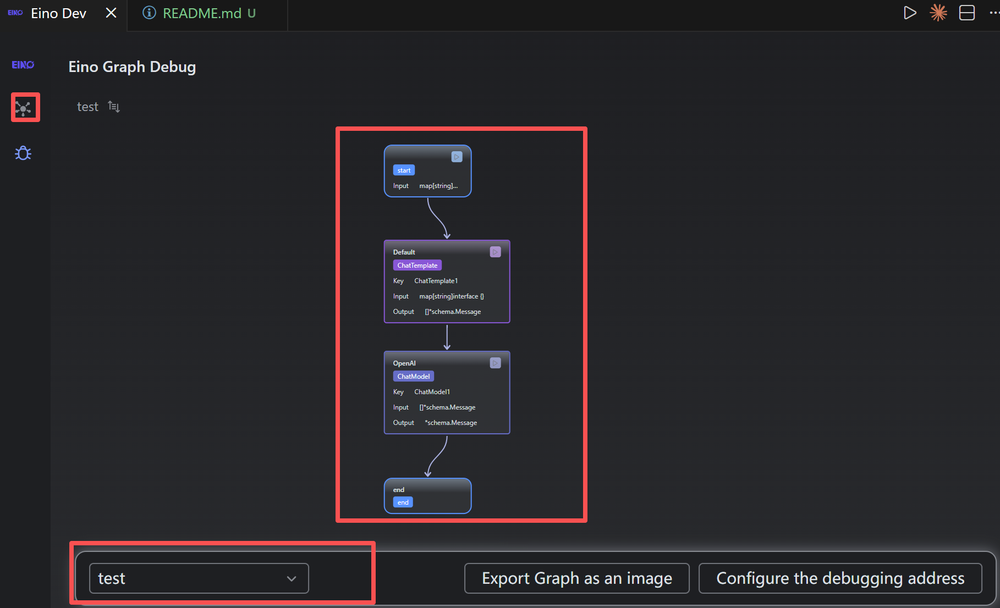
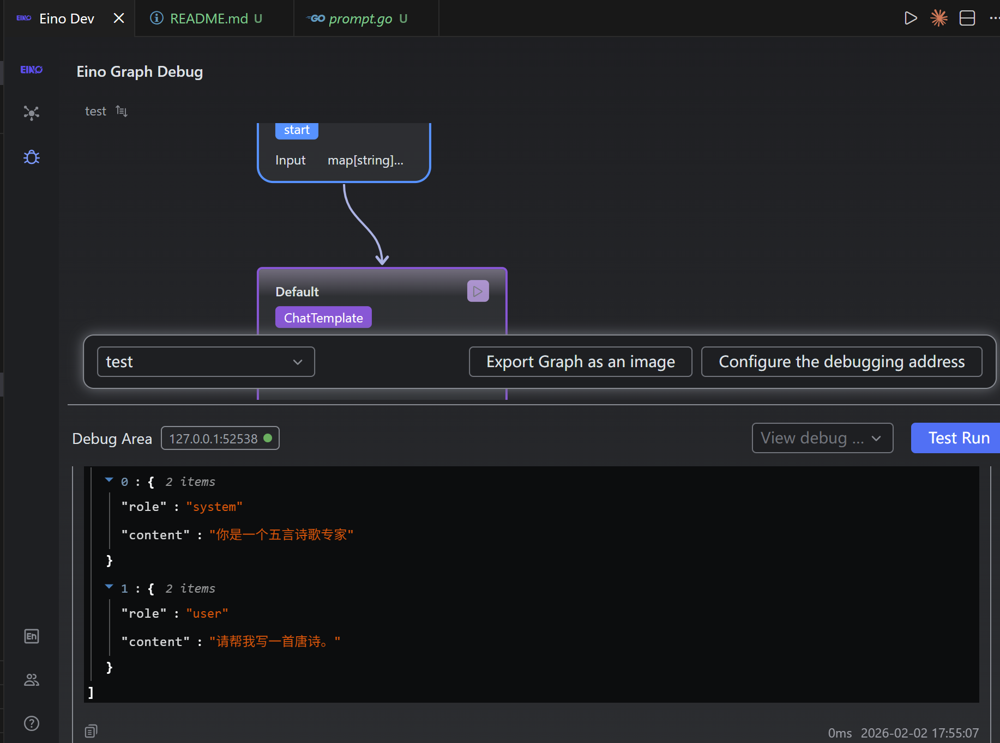

# 如何运行

## 插件安装
vscode 中安装eino dev插件

## 编排一个界面


## debug
1.代码参考debug/main.go

2.运行测试
```json
{
  "role": {
  "_value": "五言诗歌专家",
  "_eino_go_type": "string"
  },
  "task":{
  "_value": "写一首唐诗",
  "_eino_go_type": "string"
  }
}

```
