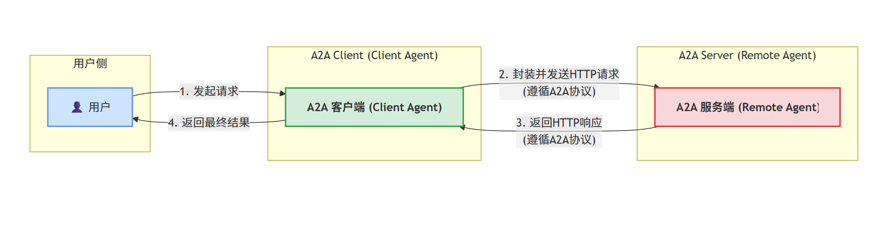
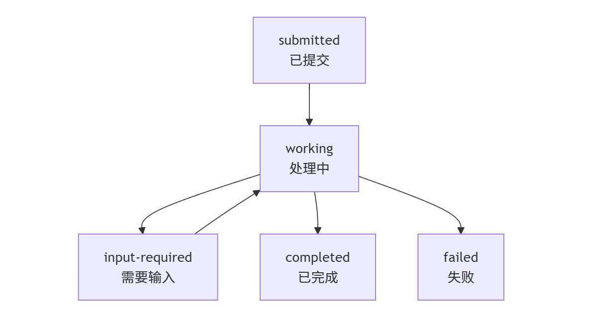
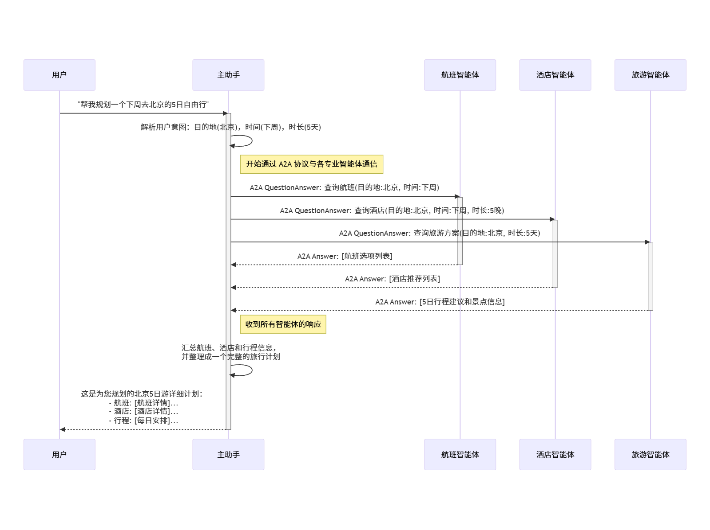
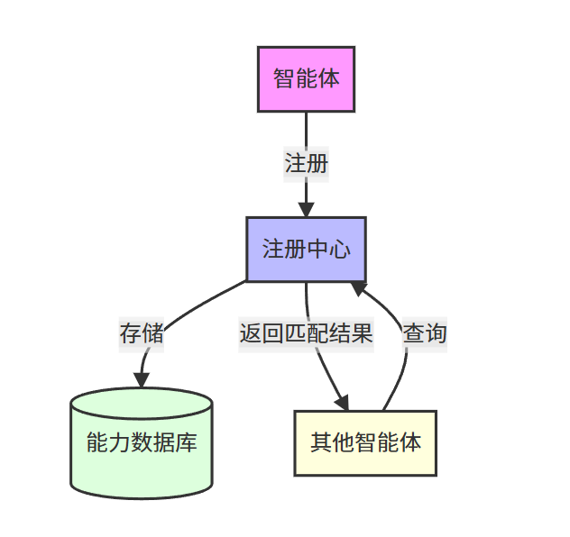

# a2a
A2A是Agent2Agent协议，是Agent智能体之间通信的标准协议，由谷歌在2025年4月份推出。它允许构建在不同框架、语言和平台上的AI Agent进行有效的通信和协作，而无需暴露其内部状态、内存或专有工具。


# 角色
在A2A协议中，主要有两个角色：

A2A Client，也可以称为Client Agent，一般直接面向用户，用户发起请求后，由Client Agent执行业务逻辑

A2A Server，也可以称为Remote Agent，接收来自A2A Client的请求，进行任务处理，并返回结果给A2A Client

说明：A2A Client和A2A Server之间，使用HTTP通信，Server提供的接口需要符合A2A协议的定义。



# 基础通信元素
## Agent Card
智能体名片，JSON格式的元数据文档，主要用于描述A2A服务端的完整信息，可以通过一个URL获得，通常URL定义为/.well-known/agent.json

具体包含以下信息：

智能体身份（名称、描述）
服务端点URL和版本
支持的A2A能力（流式传输、推送通知）
具体技能列表
认证要求
```json
{
  "name": "智能旅行助手",
  "description": "专业的旅行规划和预订服务",
  "provider": "TravelTech Inc.",
  "url": "https://api.travelagent.com/a2a",
  "version": "1.0.0",
  "capabilities": ["streaming", "pushNotifications"],
  "authentication": {
    "schemes": ["Bearer"]
  },
  "skills": [
    {
      "id": "flight-booking",
      "name": "航班预订",
      "description": "搜索和预订国际航班",
      "inputModes": ["text", "data"],
      "outputModes": ["text", "data"]
    }
  ]
}
```

以下为Card的定义：

```go
type AgentProvider struct {
	// Organization 是组织或实体的名称。
	Organization string `json:"organization"`
	// URL 是提供商组织网站或相关联系页面的 URL。
	URL string `json:"url"`
}

type AgentCapabilities struct {
	// Streaming 如果为 `true`，则 Agent 支持通过服务器发送事件 (SSE) 来实现 `message/stream` 和 `tasks/resubscribe` 的实时更新。默认值为 `false`。
	Streaming bool `json:"streaming,omitempty"`
	// PushNotifications 如果为 `true`，则 Agent 支持通过 webhook 实现 `tasks/pushNotificationConfig/set` 和 `tasks/pushNotificationConfig/get`，以进行异步任务更新。默认值为 `false`。
	PushNotifications bool `json:"pushNotifications,omitempty"`
	// StateTransitionHistory 如果为 `true`，Agent 可能会在 `Task` 对象中包含详细的状态变更历史记录（此为未来增强功能，具体实现机制待定）。默认值为 `false`。
	StateTransitionHistory bool `json:"stateTransitionHistory,omitempty"`
}

// AgentSkill 定义了 Agent 提供的特定技能或能力。
type AgentSkill struct {
	// ID 是技能的唯一标识符。
	ID string `json:"id"`
	// Name 是技能的人类可读名称。
	Name string `json:"name"`
	// Description 是技能的可选描述。
	Description *string `json:"description"`
	// Tags 是与技能关联的可选标签列表，用于分类。
	Tags []string `json:"tags"`
	// Examples 是技能的示例输入或用例的可选列表。
	Examples []string `json:"examples,omitempty"`
	// InputModes 是此技能支持的可选输入模式列表。
	InputModes []string `json:"inputModes,omitempty"`
	// OutputModes 是此技能支持的可选输出模式列表。
	OutputModes []string `json:"outputModes,omitempty"`
}

// AgentCard 传达了有关 A2A Server 的关键信息：
// - 整体身份和描述性信息。
// - 服务端点 URL。
// - 支持的 A2A 协议能力（如流式传输、推送通知）。
// - 认证要求。
// - 默认的输入/输出内容类型（MIME 类型）。
// - Agent 提供的具体技能列表。
type AgentCard struct {
	/**
	 * 此 Agent 支持的 A2A 协议版本。
	 * @default "0.2.5"
	 */
	ProtocolVersion string `json:"protocolVersion"`
	/**
	 * Agent 的人类可读名称。
	 * 示例："食谱 Agent"
	 */
	Name string `json:"name"`
	/**
	 * Agent 的人类可读描述。用于帮助用户和其他 Agent 理解该 Agent 的功能。
	 * 示例："一个帮助用户处理食谱和烹饪的 Agent。"
	 */
	Description string `json:"description"`
	/**
	 * Agent 托管的 URL 地址。这代表了 Agent 声明的首选端点。
	 */
	URL string `json:"url"`
	/**
	 * 首选端点的传输协议。如果为空，则默认为 JSONRPC。
	 */
	PreferredTransport string `json:"preferredTransport,omitempty"`
	/**
	 * 声明支持的其他传输协议。客户端可以使用任何支持的传输协议。
	 */
	// AdditionalInterfaces AgentInterface[] `json:"additionalInterfaces,omitempty"` todo: support?
	/** Agent 图标的 URL。 */
	IconUrl string `json:"iconUrl,omitempty"`
	/** Agent 的服务提供商。 */
	Provider *AgentProvider `json:"provider,omitempty"`
	/**
	 * Agent 的版本，格式由提供商定义。
	 * @TJS-examples ["1.0.0"]
	 */
	Version string `json:"version"`
	/**
	 * Agent 文档的 URL。
	 */
	DocumentationURL string `json:"documentationUrl,omitempty"`
	/** Agent 支持的可选能力。 */
	Capabilities AgentCapabilities `json:"capabilities"`
	/** 用于与此 Agent 进行身份验证的安全方案详情。 */
	SecuritySchemes map[string]*spec.SecurityScheme `json:"securitySchemes,omitempty"`
	/** 与此 Agent 通信的安全要求。 */
	Security map[string][]string `json:"security,omitempty"`
	/**
	 * Agent 在所有技能中支持的交互模式集。此设置可被单个技能覆盖。
	 * 支持的输入媒体类型。
	 */
	DefaultInputModes []string `json:"defaultInputModes"`
	/** 支持的输出媒体类型。 */
	DefaultOutputModes []string `json:"defaultOutputModes"`
	/** 技能是 Agent 可以执行的能力单元。 */
	Skills []AgentSkill `json:"skills"`
	/**
	 * 如果 Agent 支持在用户通过身份验证后提供扩展的 Agent Card，则为 true。
	 * 如果未指定，则默认为 false。
	 */
	SupportsAuthenticatedExtendedCard bool `json:"supportsAuthenticatedExtendedCard,omitempty"`
}
```

## Task
Task由客户端创建，发送给服务端后，由服务端进行处理后然后返回结果。代表了一个完整的端到端的协议实例，用来跟踪一个特定目标的完整生命周期。
说明：用项目来进行比喻，比如启动了一个申请毕业证的项目，这个申请毕业证的流程都被封装在这个Task中

Task有以下几种状态：

submitted: 任务已提交。
working: 任务正在处理中。
input-required: 任务需要客户端提供额外输入。
completed: 任务已成功完成。
canceled: 任务已被取消。
rejected：任务已拒绝。
failed: 任务执行失败。
unknown: 任务状态未知。


注意：
每个任务都有唯一的ID标识
任务是有状态的
多个任务可以通过可选的 sessionId 归属于同一个会话，方便管理相关的交互
具备持续交互性，比如：画一个风筝-> 将风筝画成红色 -> 将风筝画成黑色等等
维护历史记录

定义：
```go
// ResponseKind 定义了响应的类型
type ResponseKind string

const (
	ResponseKindTask           ResponseKind = "task"            // 响应类型为“任务”
	ResponseKindMessage        ResponseKind = "message"         // 响应类型为“消息”
	ResponseKindArtifactUpdate ResponseKind = "artifact-update" // 响应类型为“工件更新”
	ResponseKindStatusUpdate   ResponseKind = "status-update"   // 响应类型为“状态更新”
)

// TaskState 代表了 A2A 协议中一个任务的状态
type TaskState string

const (
	// TaskStateSubmitted: 任务已提交。服务器已收到任务并确认，但尚未开始主动处理。
	TaskStateSubmitted TaskState = "submitted"
	// TaskStateWorking: 处理中。智能体（Agent）正在主动处理该任务。
	TaskStateWorking TaskState = "working"
	// TaskStateInputRequired: 需要输入。智能体需要客户端/用户提供额外输入才能继续。（任务已暂停）
	TaskStateInputRequired TaskState = "input-required"
	// TaskStateCompleted: 已完成。任务成功完成。（最终状态）
	TaskStateCompleted TaskState = "completed"
	// TaskStateCanceled: 已取消。任务已被客户端或可能被服务器取消。（最终状态）
	TaskStateCanceled TaskState = "canceled"
	// TaskStateFailed: 已失败。任务因处理过程中的错误而终止。（最终状态）
	TaskStateFailed TaskState = "failed"
	// TaskStateRejected: 已拒绝。任务已被远程智能体拒绝。（最终状态）
	TaskStateRejected TaskState = "rejected"
	// TaskStateAuthRequired: 需要认证。需要客户端/用户进行身份验证才能继续。（任务已暂停）
	TaskStateAuthRequired TaskState = "auth-required"
	// TaskStateUnknown: 未知。无法确定任务的状态（例如，任务ID无效或已过期）。（从客户端对此ID的视角来看，这实际上是一个最终状态）
	TaskStateUnknown TaskState = "unknown"
)

// TaskStatus 代表了一个任务的状态信息
type TaskStatus struct {
	// 任务当前的生命周期状态。
	State TaskState `json:"state"`
	// 一个与当前状态关联的可选消息。
	// 这可能是智能体的进度更新、请求更多输入的提示、最终结果的摘要或一条错误消息。
	Message *Message `json:"message,omitempty"`
	// 服务器记录此状态的日期和时间（强烈推荐使用 UTC）。
	// 格式：ISO 8601 `date-time` 字符串（例如："2023-10-27T10:00:00Z"）。
	Timestamp string `json:"timestamp,omitempty"`
}

// Task 代表一个完整的任务对象
type Task struct {
	// 任务的唯一标识符。此ID由服务器生成。
	// 它应具有足够的唯一性（例如，UUID v4）。
	ID string `json:"id"`
	// 服务器生成的ID，用于在多次交互中保持上下文对齐。
	// 这对于在多个、连续或相关的任务之间维护上下文非常有用。
	ContextID string `json:"contextId"` // todo: 如何指定相关任务...

	// 任务的当前状态，包括其生命周期状态、一个可选的关联消息以及时间戳。
	Status TaskStatus `json:"status"`
	// 智能体为此任务生成的输出（工件）数组。
	// 此数组可以增量填充，尤其是在流式传输期间。
	// 工件代表了任务的实际产出成果。
	Artifacts []*Artifact `json:"artifacts,omitempty"`
	// 一个可选的、在此任务内交换的近期消息数组，
	// 按时间顺序排列（最旧的在前）。
	// 如果客户端通过 `TaskSendParams` 或 `TaskQueryParams` 中的 `historyLength` 参数请求，则会包含此历史记录。
	History []*Message `json:"history,omitempty"` // todo: status 和 history 之间有什么关系？
	// 与任务关联的任意键值元数据。
	// 键（Keys）应为字符串；值（values）可以是任何有效的JSON类型（字符串、数字、布尔、数组、对象）。
	// 这可用于存储特定于应用程序的数据、追踪信息等。
	Metadata map[string]any `json:"metadata,omitempty"`

	// Kind string = "task" todo
}

func (t *Task) isSendResponse()                 {}
func (t *Task) isSendStreamingMessageResponse() {}

// TaskContent 代表任务的主要内容部分
type TaskContent struct {
	// 任务的当前状态，包括其生命周期状态、一个可选的关联消息以及时间戳。
	Status TaskStatus `json:"status"`
	// 智能体为此任务生成的输出（工件）数组。
	// 此数组可以增量填充，尤其是在流式传输期间。
	// 工件代表了任务的实际产出成果。
	Artifacts []*Artifact `json:"artifacts,omitempty"`
	// 一个可选的、在此任务内交换的近期消息数组，
	// 按时间顺序排列（最旧的在前）。
	// 如果客户端通过 `TaskSendParams` 或 `TaskQueryParams` 中的 `historyLength` 参数请求，则会包含此历史记录。
	History []*Message `json:"history,omitempty"` // todo: status 和 history 之间有什么关系？
	// 与任务关联的任意键值元数据。
	// 键（Keys）应为字符串；值（values）可以是任何有效的JSON类型（字符串、数字、布尔、数组、对象）。
	// 这可用于存储特定于应用程序的数据、追踪信息等。
	Metadata map[string]any `json:"metadata,omitempty"`
}

func (t *TaskContent) EnsureRequiredFields() {
    // ... （函数实现代码，无需翻译）
}

// TaskStatusUpdateEvent 代表一个任务状态更新的事件
type TaskStatusUpdateEvent struct {
	// 正在更新的任务ID。
	TaskID string `json:"taskId"`
	// 该任务关联的上下文ID。
	ContextID string `json:"contextId"`

	// 任务的新的状态对象。
	Status TaskStatus `json:"status"`
	// 如果为 `true`，此 `TaskStatusUpdateEvent` 表示当前 `message/stream` 交互周期的最终状态更新。
	// 这意味着任务已达到终止或暂停状态，并且服务器不期望为*此特定*的 `stream` 请求发送更多更新。
	// 服务器通常在发送 `final: true` 的事件后关闭 SSE (Server-Sent Events) 连接。
	// 如果省略，默认为 `false`。
	Final bool `json:"final"`
	// 针对此特定状态更新事件的任意元数据。
	Metadata map[string]any `json:"metadata,omitempty"`
}

func (t *TaskStatusUpdateEvent) isSendStreamingMessageResponse() {}

// TaskStatusUpdateEventContent 代表任务状态更新事件的内容
type TaskStatusUpdateEventContent struct {
	// 任务的新的状态对象。
	Status TaskStatus `json:"status"`
	// 如果为 `true`，此 `TaskStatusUpdateEvent` 表示当前 `message/stream` 交互周期的最终状态更新。
	// 这意味着任务已达到终止或暂停状态，并且服务器不期望为*此特定*的 `stream` 请求发送更多更新。
	// 服务器通常在发送 `final: true` 的事件后关闭 SSE 连接。
	// 如果省略，默认为 `false`。
	Final bool `json:"final"`
	// 针对此特定状态更新事件的任意元数据。
	Metadata map[string]any `json:"metadata,omitempty"`
}

func (t *TaskStatusUpdateEventContent) EnsureRequiredFields() {
    // ... （函数实现代码，无需翻译）
}

func (t *TaskStatusUpdateEventContent) isResponseEvent() {}

// TaskArtifactUpdateEvent 代表任务工件更新的事件
type TaskArtifactUpdateEvent struct {
	// 与生成的工件部分相关联的任务ID。
	TaskID string `json:"taskId"`
	// 该任务关联的上下文ID。
	ContextID string `json:"contextId"`

	// 工件数据。这可能是一个完整的工件或一个增量块。
	// 客户端使用 `artifact.artifactId`、`append`、`lastChunk` 在其一侧正确组装或更新工件。
	Artifact Artifact `json:"artifact"`
	/** 指示此工件是否附加到前一个工件之后。如果工件是完整的，则省略此字段。 */
	Append bool `json:"append,omitempty"`
	/** 指示这是否是工件的最后一个数据块。如果工件是完整的，则省略此字段。 */
	LastChunk bool `json:"lastChunk,omitempty"` // todo: Append 和 LastChunk 有什么区别，如果 LastChunk 意味着全部结束的话
	// 针对此特定工件更新事件的任意元数据。
	Metadata map[string]any `json:"metadata,omitempty"`
	// type discriminator, literal value
	// Kind string = "artifact-update" todo (类型甄别器，字面值)
}

// TaskArtifactUpdateEventContent 代表任务工件更新事件的内容
type TaskArtifactUpdateEventContent struct {
	// 工件数据。这可能是一个完整的工件或一个增量块。
	// 客户端使用 `artifact.artifactId`、`append`、`lastChunk` 在其一侧正确组装或更新工件。
	Artifact Artifact `json:"artifact"`
	/** 指示此工件是否附加到前一个工件之后。如果工件是完整的，则省略此字段。 */
	Append bool `json:"append,omitempty"`
	/** 指示这是否是工件的最后一个数据块。如果工件是完整的，则省略此字段。 */
	LastChunk bool `json:"lastChunk,omitempty"` // todo: Append 和 LastChunk 有什么区别，如果 LastChunk 意味着全部结束的话
	// 针对此特定工件更新事件的任意元数据。
	Metadata map[string]any `json:"metadata,omitempty"`
}

func (t *TaskArtifactUpdateEventContent) EnsureRequiredFields() {
    // ... （函数实现代码，无需翻译）
}

// TaskQueryParams 代表查询任务时使用的参数
type TaskQueryParams struct {
	// 要检索的任务ID。
	ID string `json:"id"`
	// 可选：如果提供了一个正整数 `N`，服务器应在响应的 `Task.history` 字段中包含该任务（按时间顺序）的最后 `N` 条消息。
	// 如果为 `0` 或省略，则不明确请求历史记录。
	HistoryLength *int `json:"historyLength,omitempty"`
	// 针对此特定 `tasks/get` 请求的任意元数据。
	Metadata map[string]any `json:"metadata,omitempty"`
}

// TaskIDParams
// 用于 task/cancel (取消任务), tasks/pushNotificationConfig/get (获取推送通知配置) 和 tasks/resubscribe (重新订阅)
type TaskIDParams struct {
	// 操作所适用的任务ID（例如，取消任务、获取推送通知配置）。
	ID string `json:"id"`
	// 针对此特定请求的任意元数据。
	Metadata map[string]any `json:"metadata,omitempty"`
}

// TaskPushNotificationConfig
// 用于 tasks/pushNotificationConfig/set (设置推送通知配置) 并由 tasks/pushNotificationConfig/get 返回
type TaskPushNotificationConfig struct {
	// 正在配置或检索推送通知设置的任务ID。
	TaskID string `json:"taskId"`
	// 推送通知的配置详情。
	// 当用作 `set` 的参数时，这提供了要应用的配置。
	// 当用作 `get` 的结果时，这反映了当前活动的配置（服务器可能会省略密钥等敏感信息）。
	PushNotificationConfig PushNotificationConfig `json:"pushNotificationConfig"`
}
```

## Message
消息，代表客户端与服务端之间的一次信息交换。

角色区分: user（客户端发送）或agent（服务端发送）
内容载体: 包含一个或多个Part对象
唯一标识: 每条消息都有发送方设置的messageId
元数据 (Metadata): 可选的元数据字段，用于携带额外信息。

定义：
```go
// Role 定义了消息发送者的角色
type Role string

const (
	RoleUser  Role = "user"   // 角色为“用户”
	RoleAgent Role = "agent"  // 角色为“智能体”
)

// Message 代表一条消息
type Message struct {
	// 指示消息的发送者：
	// "user" 表示消息源自 A2A 客户端（代表最终用户或系统行事）。
	// "agent" 表示消息源自 A2A 服务器（远程智能体）。
	Role Role `json:"role"`

	// 一个数组，包含消息的内容，分解为一个或多个片段（Part）。
	// 一条消息必须（MUST）至少包含一个片段。
	// 使用多个部分可以实现丰富的多模态内容（例如，文本配图像）。
	Parts []Part `json:"parts"`

	// 与消息关联的任意键值元数据。
	// 键（Keys）应（SHOULD）为字符串；值（values）可以是任何有效的JSON类型。
	// 可用于存储时间戳、来源标识符、语言代码等。
	Metadata map[string]any `json:"metadata,omitempty"`

	// 此消息作为上下文提示引用的任务列表。
	ReferenceTaskIDs []string `json:"referenceTaskIDs,omitempty"`

	// 由消息创建者生成的消息标识符。
	MessageID string `json:"messageId"`

	// 当前消息所关联的任务标识符。
	TaskID *string `json:"taskId,omitempty"`

	// 消息所关联的上下文标识符。
	ContextID *string `json:"contextId,omitempty"`
}
```

## Part
片段，Part是构成Message或者Artifact的原子内容单元。也就是内容载体，每一个Part都包含一段具体的内容。
Part类型	用途	示例
TextPart	纯文本内容	指令、问题、回答
FilePart	文件传输	文档、图片、数据文件
DataPart	结构化数据	JSON表单、参数、机器可读信息

定义：
```go
// PartKind 定义了消息片段的类型
type PartKind string

const (
	PartKindText PartKind = "text" // 文本片段
	PartKindFile PartKind = "file" // 文件片段
	PartKindData PartKind = "data" // 数据片段
)

// Part 代表消息中的一个组成部分
type Part struct {
	// 片段的类型
	Kind PartKind `json:"kind"`
	// Text 是文本片段的内容
	Text *string `json:"text,omitempty"`
	// File 是文件片段的内容
	File *FileContent `json:"file,omitempty"`
	// Data 是数据片段的结构化数据内容
	Data map[string]any `json:"data,omitempty"`
	// Metadata 是与此片段关联的可选元数据
	Metadata map[string]any `json:"metadata,omitempty"`
}

// FileContent 代表文件内容的基本结构
type FileContent struct {
	// Name 是文件的可选名称
	Name string `json:"name,omitempty"`
	// MimeType 是文件内容的可选 MIME 类型
	MimeType string `json:"mimeType,omitempty"`

	// Bytes 是经过 Base64 编码的文件内容字符串
	Bytes *string `json:"bytes,omitempty"`
	// URI 是指向文件内容的链接（URI）
	URI *string `json:"uri,omitempty"`
}
```

## Artifact
工件，代表Task最终结果的输出。

智能体在任务完成状态时应使用Artifact对象向客户端返回生成的输出结果。

工件的内容通常不可变
一个任务可能生成多个工件
支持流式响应
包含一个或多个Part

定义：
```go
// Artifact 代表一个任务的输出或中间文件
type Artifact struct {
	// 由智能体（agent）生成的工件的唯一标识符。这个标识符有助于识别和组装由智能体流式传输的各个部分。
	ArtifactID string `json:"artifactId"`
	// Name 是工件的可选名称
	Name string `json:"name,omitempty"`
	// Description 是工件的可选描述
	Description string `json:"description,omitempty"`
	// Parts 是工件的组成部分
	Parts []Part `json:"parts"`
	// Metadata 是与工件关联的可选元数据
	Metadata map[string]any `json:"metadata,omitempty"`
}
```

# 交互机制
A2A协议支持以下三种交互模式：

机制	适用场景	技术实现	优缺点
请求/响应	简单查询、快速任务	HTTP请求+轮询	简单但效率较低
流式传输	实时更新、增量结果	Server-Sent Events	实时性好，需持续连接
推送通知	长期任务、异步处理	Webhook回调	适合长期任务，实现复杂

# 实际场景
主助手和各个智能体之间使用A2A进行通信。


# 能力发现机制
| 步骤                          | 关键要素                                                                                                      | 说明                                                                                                                                                                                                 |
| ----------------------------- | ------------------------------------------------------------------------------------------------------------- | ---------------------------------------------------------------------------------------------------------------------------------------------------------------------------------------------------- |
| **1. 能力声明（Agent Card）** | 标准化的 JSON 文档，通常放在 /.well‑known/agent.json 路径下                                                   | 该文件相当于智能体的“数字名片”，记录 名称、版本、提供者、A2A Endpoint URL、支持的安全方案、功能目录（functions）以及每个功能的参数/返回值 schema。它把智能体能做的事、如何调用、需要的权限全部公开。 |
| 2. 发现入口                   | - 直接访问 /.well‑known/agent.json - 或通过中心化/去中心化的 Agent Registry（如行业联盟提供的目录）           | 客户端（A2A Client）在需要协作时先查询这些入口，获取所有可用智能体的 Agent Card 列表。                                                                                                               |
| 3. 能力匹配                   | - 读取每个 Agent Card 中的 skills / functions 列表 - 根据任务需求（输入/输出 schema、标签、业务领域）进行过滤 | 通过 智能匹配算法（或简单的标签匹配）挑选出具备所需能力的智能体。例如，任务需要“财务报表生成”，系统会找出声明了 generateFinancialReport 功能的 Agent。                                               |
| 4. 安全与授权校验             | Agent Card 中的 securitySchemes（OAuth2、API‑Key、JWT 等）                                                    | 客户端在决定调用前先检查对方的认证方式，确保只有拥有相应凭证的主体才能发起请求，防止未授权访问。                                                                                                     |
| 5. 动态协商与建立会话         | - 通过 A2A JSON‑RPC 2.0 发起 createTask - 采用 Server‑Sent Events（SSE）进行状态推送                          | 选定目标后，客户端向目标的 a2aEndpointUrl 发送任务请求，随后双方在 Task 生命周期内进行多轮交互，任务状态实时同步。                                                                                   |
| 6. 动态重配置                 | 任务完成或能力变化时，客户端可重新查询 Agent Card，重新匹配更合适的智能体                                     | 这种 动态重新发现 能让系统在运行时快速适配新加入或升级的智能体，保持协作的灵活性和可扩展性。                                                                                                         |
A2A协议定义了三种方式：

1) Well-Known URI
通过标准化的路径https://{智能体服务器域名}/.well-known/agent.json，客户端智能体向标准路径发起HTTP请求，即可获得Agent Card格式的JSON响应。

注意
服务端智能体需要按照标准路径的格式提供服务
2) 目录式发现
服务端将Agent Card注册到一个中央注册表中，客户端Agent通过查询这个注册库，从而找到相应的Agent。


3) 私有发现
客户端Agent直接配置Agent Card信息。