# 简介

微积分（Calculus）是高等数学中研究函数的微分（Differentiation）、积分（Integration）以及有关概念和应用的数学分支。它建立在实数、函数和极限的基础之上，是一种数学思想，‘无限细分’就是微分，‘无限求和’就是积分。微积分最重要的思想就是用"微元"与"无限逼近"，将事物始终变化不好研究的问题，通过微元分割成一小块一小块，那就可以认为是常量处理，最终加起来就行。

微积分是对无穷小量的研究。无穷小量，简单说就是大小无限趋向于 00 的量。微积分是微分和积分的总称，‘无限细分’就是微分，‘无限求和’就是积分。

# 函数和极限

## 映射和函数

**映射** X，Y是两个非空集合，如果存在一个法则f，使得对X中每个元素x，按法则f，在Y中有唯一的元素y与之对应，那么称f为从X到Y的映射，记作f：X→Y。其中y称为元素x（在映射f下）的像，并记作f(x)，即y=f(x)，而元素x称为元素y（在映射f下）的一个原像；集合X称为映射f的定义域，记作Df，即Df=X；X中所有元素的像所组成的集合称为映射f的值域，记作Rf或f(x)，即Rf=f(x)={f(x)|x∈X}。

**函数** 函数描述了一组输入与输出之间的映射关系，对于每个输入，总有唯一的确定的输出与之对应。输入也称为自变量，输出称为因变量；自变量的有效取值范围记为定义域，因变量的全体元素构成的集合称为值域。

**微分主要研究两个无穷小量的比值** ， **而积分学主要研究无限多的无穷小量之和** 。

符号定义： d+var 表示某个变量的极小的一点变化。

d 和 ∫ 是可以互相抵消的，因为求导和求积分互为逆运算，这就好比平方和平方根可以抵消一样。

微分学中的符号“dx”、“dy”等，是由莱布尼茨首先使用。其中的 d 源自拉丁语中“差”（Differentia）的第一个字母。积分符号“∫”亦由莱布尼茨所创，它是拉丁语“总和”（Summa）的第一个字母 s 的伸长（和 Σ 有相同的意义）。

## 极限的定义

极限定义是指：如果一个函数f(x)在x趋近于某个值a时，函数的取值越来越接近某个确定的常数L，那么我们称L是f(x)在x趋近于a时的极限，记作：lim(x→a) f(x) = L 或者 f(x)→L (x→a)。这里的a可以是实数，也可以是正无穷或负无穷。

微积分中，极限是一个非常基础的概念，它用于描述函数在某个点附近的行为。极限的定义如下：

设函数 f(x)在点$$x_{0}$$的某个邻域内有定义，记为$(x_{0} − δ, x_{0} + δ)$，其中  是 δ 一个正数。如果对于任意给定的正数 ε，都存在正数 δ ，使得当x满足  $0<∣x − x_{0}∣< δ $时，都有$∣f(x)−L∣< ϵ $成立，那么就称 L 是函数 f(x), 当x趋近于$x_{0}$时的极限，记为：
$$
\lim\limits_{x \to a} f(x) = L
$$
其中，*ϵ* 表示误差的允许范围，*δ* 表示自变量x*与*$x_{0}$的距离小于这个值时，函数值f*(*x)与极限 L的差的绝对值都小于误差 ϵ。这个定义中表达了一个思想，即当自变量趋近于$x_{0}$时，函数值趋近于 L。

## 左极限与右极限

和函数极限的定义相同，唯一区别是左极限只考虑 x 从左侧趋近于 a，右极限只考虑 x 从右侧趋近于 a。如果函数在某处存在极限，则其充分必要条件是函数在该处的左极限与右极限各自存在且相等。

## 极限的运算法则

我们就要使用极限的运算法则，也就是 limit laws

1. 加法法则：如果两个函数的极限都存在，那么它们的和的极限等于两个函数的极限之和。
2. 减法法则：如果两个函数的极限都存在，那么它们的差的极限等于两个函数的极限之差。
3. 乘法法则：如果两个函数的极限都存在，那么它们的积的极限等于两个函数的极限的积。
4. 除法法则：如果limf(x)=A，limg(x)=B，且B不等于0，那么lim[f(x)/g(x)] = limf(x) / limg(x) = A / B。

## 在正负无穷大处的极限

对于正无穷大，如果函数在某一点处趋于正无穷大，那么该点的极限为正无穷大。
对于负无穷大，如果函数在某一点处趋于负无穷大，那么该点的极限为负无穷大。

 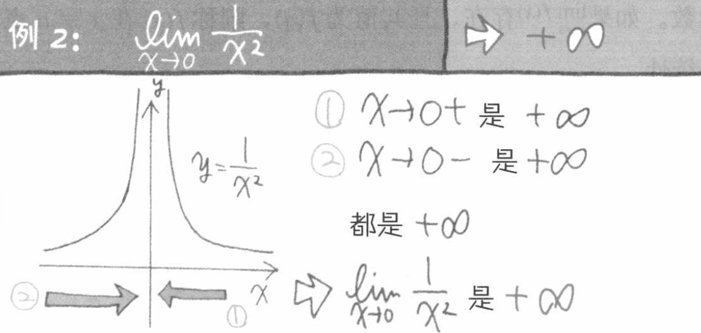

需要注意的是，当函数在某一点处同时趋于正无穷大和负无穷大时，该点的极限不存

 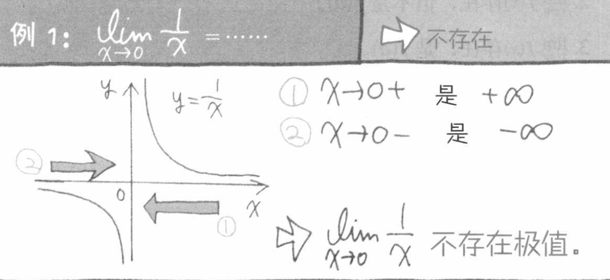

## 函数的连续性与间断点

连续性:

设函数 f(x) 在点 $x_{0}$的某一个邻域内有定义，如果 x 趋近于 $x_{0}$ 时，f(x)的值趋近于 $f(x_{0})$，则称函数 f(x) 在点$x_{0}$连续。或者说，当x的增量趋于0时，函数y对于的增量也趋于0，则函数在该点连续。在区间内的每一点都连续的函数，叫做该区间上的连续函数。

从几何意义理解，连续函数的图像是一条连续不间断的曲线。

基本初等函数在其定义域内都是连续的。包括：三角函数、指数函数、幂函数、对数函数等。

间断性：

符合下列3种情形之一：

* 在 x=$x_{0}$ 处没有定义
* 有定义，但极限不存在
* 有定义，极限存在，但该点极限值不等于该点的函数值

则函数在该点不连续，该点称为间断点。

价值定理:

通俗的讲，设函数 f(x) 在闭区间 [a,b] 上连续，且在该区间的端点各自取值 f(a)=A, f(b)=B, 那么对于 A 和 B 之间的任意一个数 M，在开区间 (a,b) 内至少有一个点 c 使得 f(c)=M 。

# 导数

## 如何理解导数

导数的意义是，当一个变量（例如x）发生了微小的变化 dx 时，相应的另一个变量（例如y）的变化量 dy 与 dx 的比值，关键词是“微小的变化”。

从物理学角度而言，我们可以把 dx 看作是极短的一段时间， dy 是物体做直线运动经过的距离，导数 dy/dx 即某时间点上直线运动的瞬时变化率（距离/时间）。从几何学角度而言，导数就是曲线某点处的切线的斜率。下面我们从几何学的角度探讨下导数的由来。

**斜率就是：纵向差 / 横向差**

**几何学的定义**

几何学中，斜率（slope）代表的是一条线段的陡峭程度，即给定一个特定的 x 方向上的变动，y 会如何改变？

 

基于上述定义，我们可以很容易的计算两点之间的斜率，但如果我们想知道曲线上某个特定点处（切线）的斜率呢？导数就能帮助我们解答这个问题。

在深入例子之前，我们先来明确一下切线的定义。圆的切线指的是与曲线只有一个交点的直线，但对于广义上曲线，这个定义并不精确，因为与一条曲线只有一个交点的直线可能有两条（考虑x轴和y轴相对于二次函数抛物线）。因此，更精确的定义如下：

 

下面我们来看如何求曲线上某特定点处切线的斜率。考虑下图 $f(x)=x^2 +3 $ 的函数图像：

 

点 (1,4) 和点 (3,12) 之间的斜率计算很简单：

$$slope=\displaystyle \frac{y2−y1}{x2−x1} = \displaystyle \frac{12−4}{3−1} =4 $$

那么，如何计算特定点 (1,4) 处（切线）的斜率呢？自然我们会想到找到该点左右两边最近的两个点，计算这两点之间的斜率。导数的产生正来源于此，只不过我们可以用极限来替代找到两个点的过程。要求得已知曲线 f(x) 上某个特定点处切线的斜率，我们不妨在该曲线上任意位置（方便起见，假设在该点右侧好了）再取一个点，比如 (3,12)，当该点沿着曲线 f(x) 无限趋近于点 (1,4) 时，此时如果上式的极限存在，则此极限就是该点处切线的斜率。

$$slope=\displaystyle \frac{y2−y1}{x2−x1}$$

## 导数的计算

我们以函数 $f(x)=x^2$ 为例看下导数的计算过程。计算某点切线的斜率和计算两点之间的斜率一样，只不过现在计算的是给定点和与它无限接近的另一个点之间的斜率。我们用 h 来表示这个无穷小的距离。

1. 给定函数

   $f(x)=x^2$

2. 对 x 增加一个无穷小的量 h(h=Δx)

   $f(x + h) = (x+h)^2 $

3. 套用斜率计算公式

   $ \frac {f(x + h) − f(x)}{h}$

4. 化简

   $\frac{x2+2xh+h2−x2}{h}\frac{2xh+h2}{h} = 2x+h$

5. 将 h 设为 0 (因为 h 的极限是 0)

   $2x+0=2x$

所以我们看到，对于二次函数 $f(x)=x^2$, 在曲线上任何位置的斜率都等于 $2x$

## 导数的定义

从上节的例子中，我们总结下在特定点处切线的斜率计算公式（即如下极限）
$$
\lim\limits_{h \to 0} \frac {f(x + h) − f(x)}{h}
$$
由此，可以得到函数的导数概念：

设函数 $y=f(x)$ 在点 $x_{0}$ 的某个邻域内有定义，当自变量 x 在  $x_{0}$ 处取得增量 ℎ (点 x+ℎ 仍在该邻域内)时，相应的函数取得增量 $f(x_{0} + h) - f(x_{0})$ ；如果这两者之比（即上述斜率计算公式）在 ℎ 无限趋近于 0 时的极限存在（即左极限与右极限都存在且相等），则称函数 $y=f(x)$  在点 $x_{0}$ 处可导，并称这个极限为函数 $y=f(x)$ 在 $x_{0}$ 处的导数，记为 $y=f'(x_{0})$

对于函数 $y=f(x)$, 如果它在某开区间内每点都可导，则称函数在开区间内可导，这样对于该区间内任意一个 x 都对应了一个确定的导数值，这样就构成了一个新的函数，称为原函数  $y=f(x)$ 的导函数 $y=f'(x_{0})$。导函数也有其他几个等同的写法，如下:

从上述的例子我们可以看出，导数可以理解为曲线上某一点处切线的斜率。如果我们把曲线函数看成时间-路程的函数，那么某点处的导数也可以理解为该时间点处的瞬时速度；更精确的说，是 **该时间点附近的变化率的最佳近似值** 。

上述是拉格朗日的表示方式，下面是 莱布尼茨的表示方式：

$\frac{dy}{dx}$		$\frac{df(x)}{dx}$		$\frac{d}{dx}f(x)$

这些都表示：对y 关于 x求导。读法是先读分子，再读分母

## 求导法则与求导公式

导数的几个基本法则，和几个基本初等函数的求导公式。

## 复合函数的求导法则: 链式法则 Chain Rule

对于两个函数组合起来的复合函数，其导数等于里层函数值代入外层函数的导数，乘以里层函数的导数。

更正式的定义： 如果 u=g(x) 在 x 处可导，而 y=f(u) 在点 u=g(x) 处可导，则复合函数 y=f[g(x)] 在点 x 处可导，其导数为 f’(g(x))*g’(x)

假设我们有一个复合函数如下：

​		$f(x)=A(B(C(x)))$

​		$A(x)=sin(x)$

​		$B(x)=x^2$

​		$C(x)=4x$

它们各自对于的导数是：

​		$A'(x)=cos(x)$

​		$B'(x)=2x$

​		$C'(x)=4$

计算该复合函数的导数：

​		
$$
f′(x)=A′((4x)2)⋅B′(4x)⋅C′(x)
$$

$$
\begin{align}
  f′(x) & = cos((4x)2)⋅2(4x)⋅4 \\
       & = cos(16x2)⋅8x⋅4  \\
      & = cos(16x2)32x \\
\end{align}
$$
下图是链式法则在特定函数上的应用：

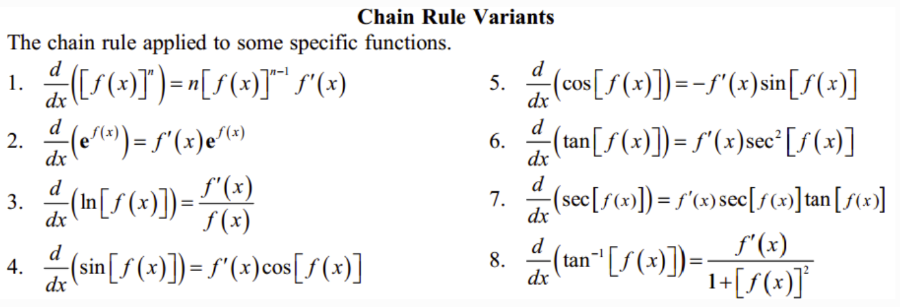

## 高阶导数

f’(x) 是函数 f(x) 的一阶导数，对它再求导，即导数的导数叫做对 f(x) 的二阶导数，记作 f''(x)，相应的还可以有更高阶的导数。高阶导数的写法如下图：

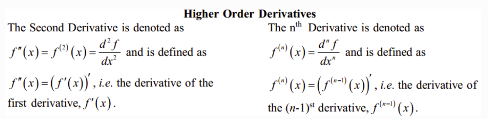

从几何意义上理解，一阶导数是曲线上某点切线的斜率，二阶导数是斜率的变化率，三阶导数的变化率的变化率…以此类推，阶数越高，对该点及其附近的情况描述的越精细。

## 平面曲线的切线与法线

在微积分中，切线是指与曲线相切于某一点的直线。它可以通过计算曲线在该点处的导数得到，这个导数代表了曲线在该点的斜率。

在微积分中，法线的概念是指**垂直于曲线的直线**。对于一个给定的曲线C，在曲线C上某一点P的切线是过点P与曲线C相切的直线，而法线则是过点P与切线垂直的直线。法线的斜率与切线的斜率乘积为-1。

过曲线上某点(x0,y0) 的切线和法线方程可以写为：

切线方程：$y-y_{0}=f'(x_{0})(x-x_{0})$

法线方程：$y-y_{0} = -\frac{1}{f'(x_{0})}(x-x_{0}),f'(x_{0})\not= 0 $

## 几个重要的中值定理

### 罗尔定理

定理内容：如果 R 上的函数 f(x) 满足以下条件： 

（1）在闭区间 [a,b] 上连续 

（2）在开区间 (a,b) 内可导 

（3）f(a)=f(b) 则至少存在一个 ξ∈(a,b)，使得 f’(ξ)=0

 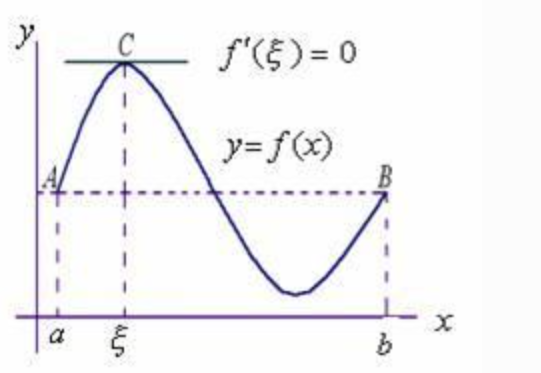

几何意义：若连续曲线 y=f(x) 在区间 [a,b] 上所对应的弧段 AB，除端点外处处具有不垂直于 x 轴的切线，且在弧的两个端点 A,B 处的纵坐标相等，则在弧 AB 上至少有一点 C，使曲线在C点处的切线平行于 x 轴。

### 拉格朗日中值定理

拉格朗日中值定理是罗尔中值定理的推广，它反映了可导函数在闭区间上的整体的平均变化率与区间内某点的局部变化率的关系。

定理内容：如果函数 f(x) 满足： （1）在闭区间 [a,b] 上连续 （2）在开区间 (a,b) 上可导 那么在 (a,b) 内至少有一点 c，使得 (f(b)-f(a))/(b-a) = f’(c)

 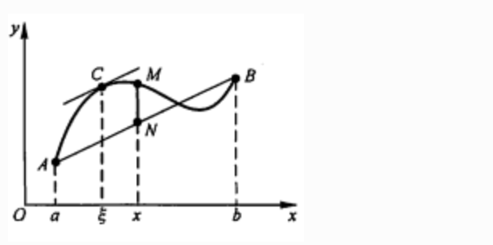

几何意义：若连续曲线 y=f(x) 的弧 AB 上除了端点外处处具有不垂直于x轴的切线，那么曲线上至少有一点 C，使得曲线在 C 处的切线平行于弦 AB。

物理意义：对于直线运动，在任意一个运动过程中至少存在一个位置（或一个时刻）的瞬时速度等于这个过程中的平均速度。

### 柯西中值定理

定理内容：如果函数 f(x) 及 F(x) 满足：

1）在闭区间 [a,b] 上连续 （2）在开区间 (a,b) 上可导 （3）对任一 x 属于 (a,b)，F’(x)不等于0

那么在 (a,b) 内至少有一点 ξ，使如下等式成立
$$
\frac{f(b)-f(a)}{F(b)-F(a)} = \frac{f'(ξ)}{F'(ξ)}
$$

## 微分 Differentiation

### 微分的定义

微分和导数的概念紧密相关。

导数是指函数在某点处的 **瞬时变化率** （或者说该点切线的斜率），即 y 的增量与 x 的增量的比值的极限。

微分是指函数在某点处的 **变化量** ，其定义是，如果函数在某点处的增量 △y 可以分解为 A△x 与 o(△x) 两部分的和（o(△x) 是关于△x的高阶无穷小），则前者（线性主部）称为在该点相对于自变量增量 △x 的微分，记为 dy，当 △x 非常小时，△y 的值可以由这个微分来近似替代，而忽略 o(△x) 部分。这个 A 就等于该点处的导数 f’(x)。在f’(x)!=0的条件下，我们可以用微分 dy = f’(x)dx 来替代真正的增量 △y。

从几何意义来看，导数的值是曲线该点处切线的斜率，而微分的值 dy 是沿着切线方向向上纵坐标的增量，△y 的值是沿着曲线方向上纵坐标的增量，当 △x 非常小时，就可以用切线上的增量代替曲线上的增量,在数学上也称为非线性函数的局部线性化（在局部用切线段近似替代曲线段）。

 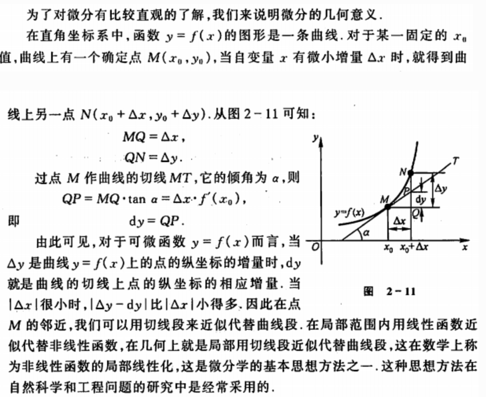

对一元函数而言, 可导必可微, 可微必可导。

## 积分 Integration

微积分中的积分分为两种，一种是定积分，一种是不定积分。
定积分是求函数在区间[a,b]中图形的面积。
不定积分是求函数f(x)的原函数。

1. **定积分**：定积分是对面积的一种数学描述。如果有一个函数 f(x)，我们想要找到这个函数在区间 [a, b] 下的图形与 x 轴围成的面积，我们可以使用定积分来计算。定积分的表示形式为 ∫_a_^b^ f(x) dx。
2. **不定积分**：不定积分是导数的逆运算。如果有一个函数 F(x)，其导数为 f(x)，那么我们说 F(x) 是 f(x) 的不定积分。不定积分的表示形式为 ∫f(x) dx = F(x) + C，其中 C 是常数。

在实际应用中，积分被广泛用于求解面积、体积、质心、物理问题等。

 

导数的逆运算是积分，积分的逆运算是导数.

导数和积分的逆运算公式：$f(x) = \frac{d}{dx} \int_{0}^{x}f(t)dt$

### 积分的几何意义

函数 f(x) 的积分就对应了函数 f(x) 图像与垂线 x=a, x=b 以及x轴围成的区域面积，如下图：

 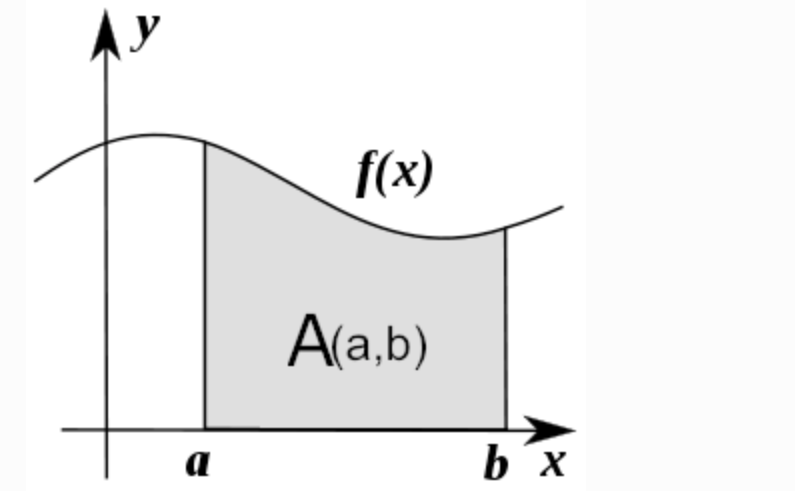

a,b 两点称作积分的极限，符号 ∫ 源于拉丁字母 summa（求和的意思），积分表示的就是函数 f(x) 在a,b 这两个极限下的值的总和。

积分函数 F(c) 表示的是定义了积分上限的面积计算的函数：
$$
F(c) = \int_{0}^{c}f(x)dx
$$
其中，c定义了积分的上限，0是积分下限。我们记得导函数 f’(x) 表示了函数每点处的斜率，类似的，积分函数 F(c) 表示了在任意的极限下，函数图像下方的面积。要计算任意两点 a,b 之间的图像面积，我们可以通过计算 F(c) 的变化来获得：
$$
A(a,b) = \int_{a}^{b} f(x)dx = F(b) - F(a)
$$
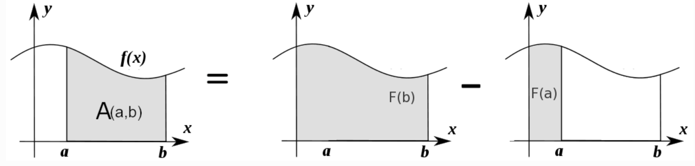

### 积分的计算

那么如何计算这份面积呢？我们可以把函数图像下方的区域分割成很多微小的矩形，将矩形面积的和累加起来。例如下图是函数 $f(x) = x^2$ 在 x=1 与 x=3 围成的区域，我们以间距 ℎ=0.5 将这块区域切成4个矩形：

 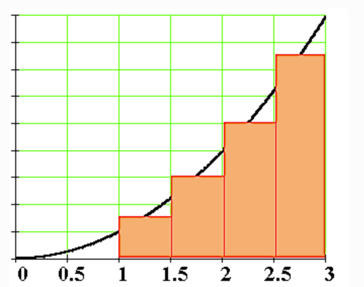

如果将矩形切分的越细，我们就能得到越近似的估计。

要找到给定函数 f(x) 的积分函数 F(x)，实际上就是找到一个函数 F(x) ，其导数为 f(x)。 F(x) 也叫做 f(x) 的反导数。
$$
F'(x) = f(x)
$$
例如，假设我们要寻找函数 $f(x) =x ^2$ 的积分函数 F(x)，就是要找到这样一个函数使得：
$$
F'(x) = x^2
$$
通过导数公式的逆向推导，我们能得到这里的 F(x)为：
$$
F(x) = \int x^2 dx =  \frac{1}{3}x^3 + C
$$
根据是否给出 a,b 这两处极限，我们把积分分为定积分与不定积分，具体定义如下：

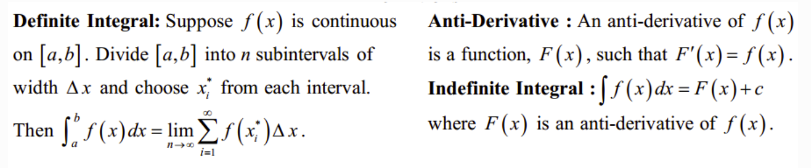

可知，定积分是一个具体的数值（函数曲线与 x=a, x=b 以及x轴围成的区域面积）,而不定积分是个函数表达式。

### 常用积分公式

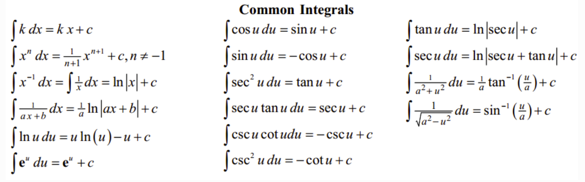

### 微积分基本定理

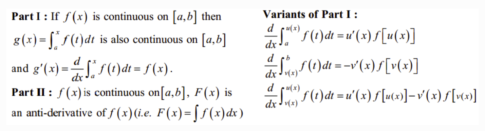

第一基本定理表明了一个连续函数一定能找到对应的积分形式的表达。 第二基本定理即牛顿-莱布尼茨公式，表明了定积分的值可以用其反导数（原函数）计算获得。

# 导数的应用

## 函数的驻点

如果满足: f’(c)=0 ,则称 x=c 是函数 f(x) 的驻点。

（有些教材也将不可导的点归为驻点）

在驻点处，函数的一阶导数为0，此处的切线平行于 x 轴。

## 函数单调性的判定

设函数 f(x) 在区间 I 上连续且可导：

> - 如果在区间 I 内 f’(x)>0，则该区间内函数是单调增加的
> - 如果在区间 I 内 f’(x)<0，则该区间内函数是单调减少的
> - 如果在区间 I 内 f’(x)=0，则该区间内函数是个常数

## 曲线的凹凸性

- （向上）凸的曲线：在曲线上任取两点，连接这两点的弦总是位于曲线的下方（下图的曲线 ACB）
- （向上）凹的曲线：在曲线上任取两点，连接这两点的弦总是位于曲线的上方（下图的曲线 ADB）

 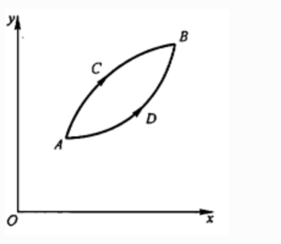

## 凹凸性的判定方法

设函数 f(x) 在区间 I 上连续且具有一阶和二阶导数：

> - 如果在区间 I 内 f’‘(x)>0，则该区间内函数是向上凹的
> - 如果在区间 I 内 f’‘(x)<0，则该区间内函数是向上凸的

如何理解：以二次函数 $f(x) = x ^2$ 为例，其一阶导数等于 2x，其涵义即函数任何一点上的切线斜率，在 y轴右侧 2x的值恒 >0，因此该函数在 y轴右侧的区间内是单调增加的，同理在 y轴左侧是单调递减的；其二阶导数等于2，其涵义即函数任何一点上的切线斜率的变化率，在整个函数定义域内二阶导数恒 >0，因此每一点处的切线斜率会越来越大，函数图像向上凹。

## 曲线的拐点

如果在 x=c 处函数的凹凸性改变了，那么该点也称为函数曲线的拐点。寻找拐点的方法很简单，先求出令 f’‘(x)=0 的点或二阶导数不存在的点，观察这些点的左右两侧二阶导数的符号，如果两边符号相反，则该点是拐点。

## 函数极值、最大值与最小值

### 基本概念

 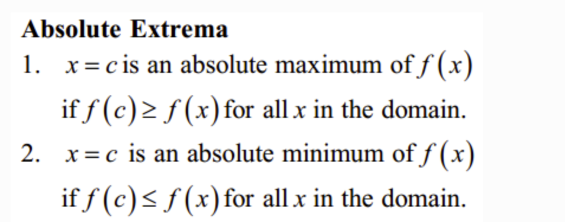

极值定义：若函数 f(x) 在 x0 的一个邻域D有定义，且对D中除 x0 的所有点，都有 f(x)<f(x0) ，则称 f(x0) 是函数 f(x) 的一个极大值。同理，若对D的所有点，都有 f(x)>f(x0) ，则称 f(x0) 是函数 f(x) 的一个极小值。

对应的，函数最值的定义如下：

最小值:设函数 y=f(x) 的定义域为 I ，如果存在实数M满足：①对于任意实数 x∈ I ，都有 f(x)≥M ，②存在 x0∈I 。使得 f(x0)=M ，那么，我们称实数 M 是函数 y=f(x) 的最小值。

最大值:设函数 y=f(x) 的定义域为 I ，如果存在实数M满足：①对于任意实数 x∈I ，都有 f(x)≤M ，②存在 x0∈I 。使得 f(x0)=M ，那么，我们称实数 M 是函数 y=f(x) 的最大值。

 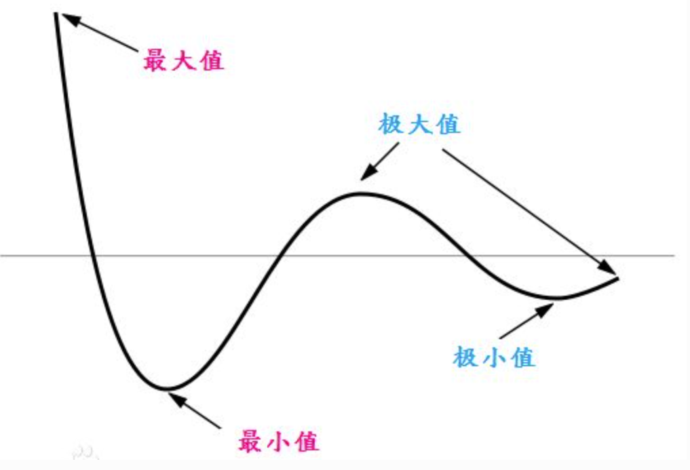

鞍点（saddle point）：目标函数在此点上的梯度（一阶导数）值为 0， 但从该点出发的一个方向是函数的极大值点，而在另一个方向是函数的极小值点。

### 费马引理

函数的每一个极值都是驻点，函数的导数在该点为零，或者是不可导的点。

### 如何寻找函数极值点

基于费马引理，我们可以通过求驻点（或不可导点）来找到函数极值点，再结合二阶导数来区分是极大还是极小值。步骤如下：

1. 求导数 f’(x)
2. 求函数的所有驻点（f’(x)=0 的点）和不可导点
3. 观察 f’(x) 的符号在每个驻点和不可导点的左右邻近的情形，确定是否是极值点

**如果 f(x) 在 x0 处具有二阶导数且 f’(x0)=0, f’‘(x0)!=0，则：**

1. 当 f’‘(x0)<0 时，函数在该点取得极大值（因为函数在该段区间是向上凸的）
2. 当 f’‘(x0)>0 时，函数在该点取得极小值（因为函数在该段区间是向上凹的）

# 泰勒公式

假设有人问你，如何计算 cos(2) 的值？是不是觉得很困难？

有些函数，例如 f(x) = cos(x)，进行函数值的计算很困难，那么有没有办法把这类函数替换成其他的近似函数，从而利用有限次的加减乘除的简单算术运算，便能求得其函数值？泰勒公式就是由此而来： **用一个多项式函数来近似任意的其他函数** 。至于为什么是用多项式函数来近似而不是其他什么函数，是因为多项式函数在数学上非常“友好”，方便计算，方便求导，方便积分。

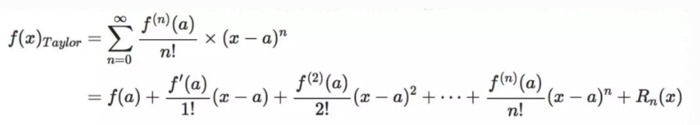

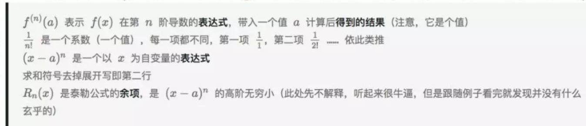

泰勒公式的形式看似复杂，但只要理解了其本质，自己也能分分钟写出来。关于如何理解泰勒公式，知乎上排名第一的答案已经写的非常精彩了 https://www.zhihu.com/question/25627482 ，这里就不再详细展开，只把最核心的思想总结如下：

物理学上，如果想仿造一段曲线，那么首先应该保证曲线的起始点一样，其次保证起始点处位移随时间的变化率一样（速度相同），再次应该保证前两者相等的同时关于时间的二阶变化率一样（加速度相同）……如果随时间每一阶变化率（每一阶导数）都一样，那这两根曲线肯定是完全等价的。

泰勒公式的产生与上述思想完全一致：如果我们要模仿任意一个原函数 f(x)，我们只需要构造这样一个多项式函数 g(x)，保证这两个函数在某一点的初始值相等，1阶导数相等，2阶导数相等，……n阶导数相等，就可以做到一个很好的近似。