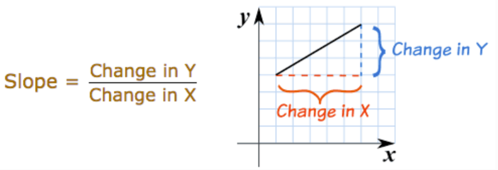
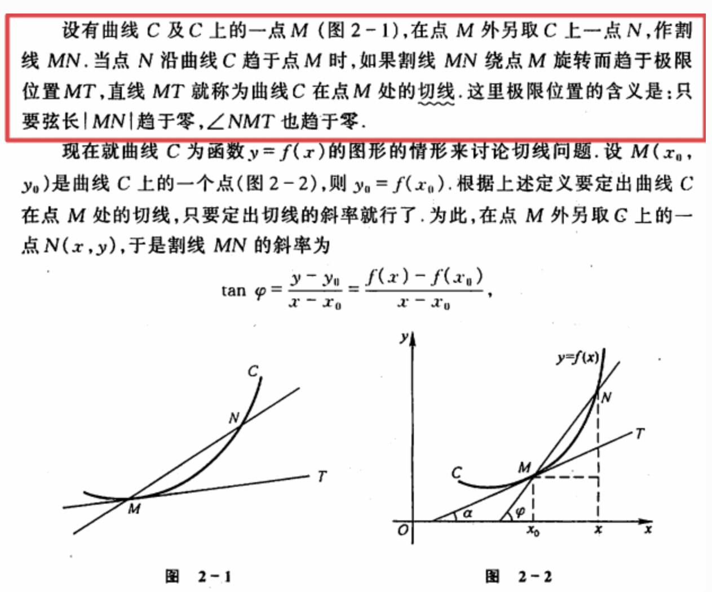
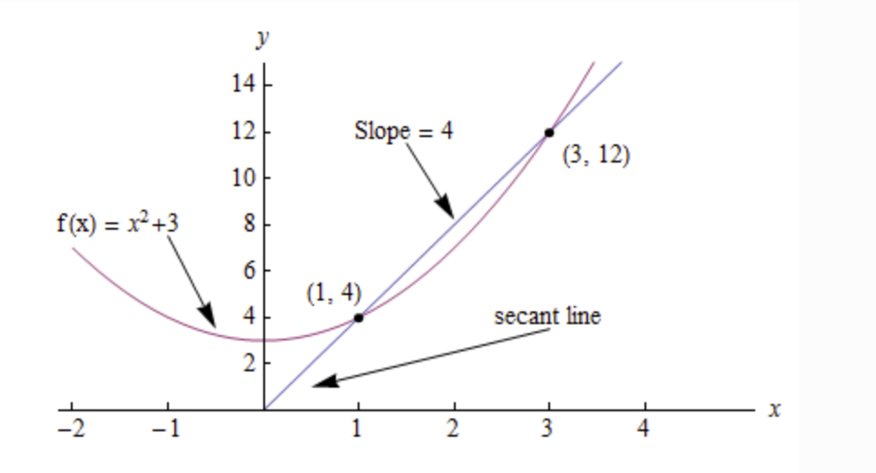
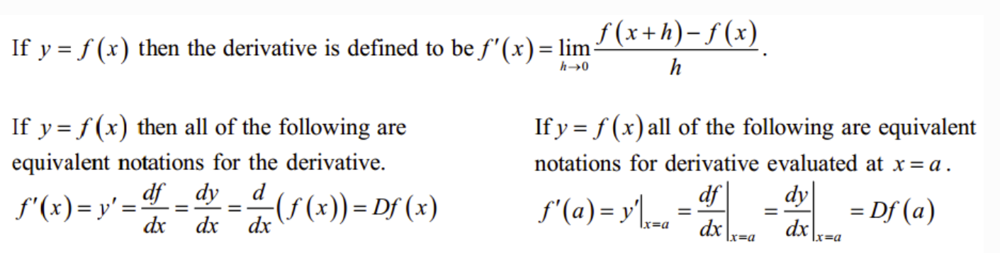
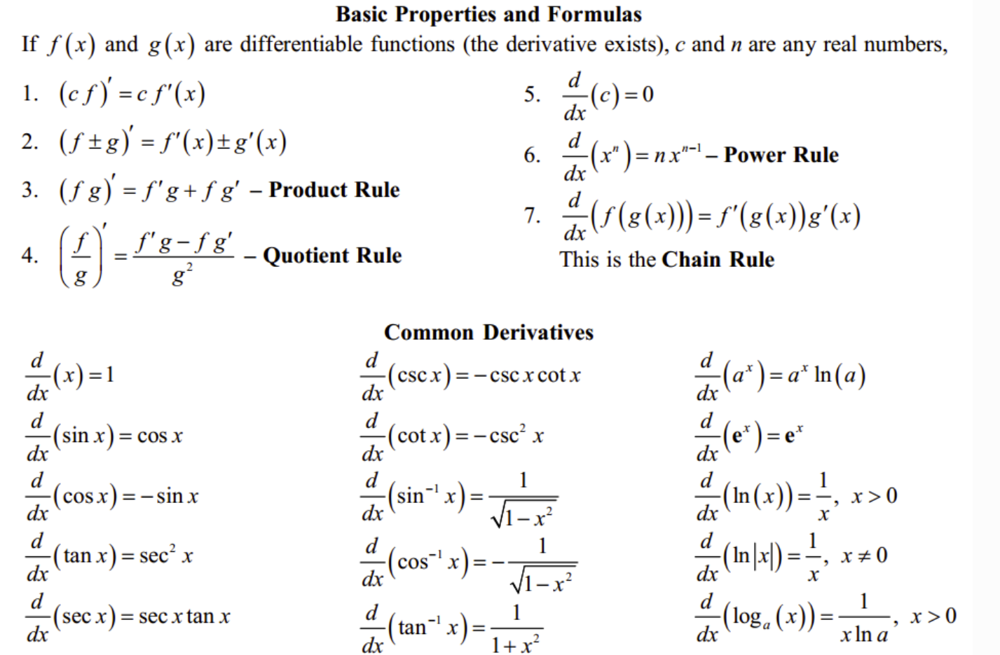

# 简介

微积分（Calculus）是高等数学中研究函数的微分（Differentiation）、积分（Integration）以及有关概念和应用的数学分支。它建立在实数、函数和极限的基础之上，是一种数学思想，‘无限细分’就是微分，‘无限求和’就是积分。微积分最重要的思想就是用"微元"与"无限逼近"，将事物始终变化不好研究的问题，通过微元分割成一小块一小块，那就可以认为是常量处理，最终加起来就行。

微积分是对无穷小量的研究。无穷小量，简单说就是大小无限趋向于 00 的量。微积分是微分和积分的总称，‘无限细分’就是微分，‘无限求和’就是积分。

# 函数和极限

## 映射和函数

**映射** X，Y是两个非空集合，如果存在一个法则f，使得对X中每个元素x，按法则f，在Y中有唯一的元素y与之对应，那么称f为从X到Y的映射，记作f：X→Y。其中y称为元素x（在映射f下）的像，并记作f(x)，即y=f(x)，而元素x称为元素y（在映射f下）的一个原像；集合X称为映射f的定义域，记作Df，即Df=X；X中所有元素的像所组成的集合称为映射f的值域，记作Rf或f(x)，即Rf=f(x)={f(x)|x∈X}。

**函数** 函数描述了一组输入与输出之间的映射关系，对于每个输入，总有唯一的确定的输出与之对应。输入也称为自变量，输出称为因变量；自变量的有效取值范围记为定义域，因变量的全体元素构成的集合称为值域。

**微分主要研究两个无穷小量的比值** ， **而积分学主要研究无限多的无穷小量之和** 。

符号定义： d+var 表示某个变量的极小的一点变化。

d 和 ∫ 是可以互相抵消的，因为求导和求积分互为逆运算，这就好比平方和平方根可以抵消一样。

微分学中的符号“dx”、“dy”等，是由莱布尼茨首先使用。其中的 d 源自拉丁语中“差”（Differentia）的第一个字母。积分符号“∫”亦由莱布尼茨所创，它是拉丁语“总和”（Summa）的第一个字母 s 的伸长（和 Σ 有相同的意义）。

## 极限的定义

极限定义是指：如果一个函数f(x)在x趋近于某个值a时，函数的取值越来越接近某个确定的常数L，那么我们称L是f(x)在x趋近于a时的极限，记作：lim(x→a) f(x) = L 或者 f(x)→L (x→a)。这里的a可以是实数，也可以是正无穷或负无穷。

微积分中，极限是一个非常基础的概念，它用于描述函数在某个点附近的行为。极限的定义如下：

设函数 f(x)在点$$x_{0}$$的某个邻域内有定义，记为$(x_{0} − δ, x_{0} + δ)$，其中  是 δ 一个正数。如果对于任意给定的正数 ε，都存在正数 δ ，使得当x满足  $0<∣x − x_{0}∣< δ $时，都有$∣f(x)−L∣< ϵ $成立，那么就称 L 是函数 f(x), 当x趋近于$x_{0}$时的极限，记为：
$$
\lim\limits_{x \to a} f(x) = L
$$
其中，*ϵ* 表示误差的允许范围，*δ* 表示自变量x*与*$x_{0}$的距离小于这个值时，函数值f*(*x)与极限 L的差的绝对值都小于误差 ϵ。这个定义中表达了一个思想，即当自变量趋近于$x_{0}$时，函数值趋近于 L。

## 左极限与右极限

和函数极限的定义相同，唯一区别是左极限只考虑 x 从左侧趋近于 a，右极限只考虑 x 从右侧趋近于 a。如果函数在某处存在极限，则其充分必要条件是函数在该处的左极限与右极限各自存在且相等。

## 极限的运算法则

我们就要使用极限的运算法则，也就是 limit laws

1. 加法法则：如果两个函数的极限都存在，那么它们的和的极限等于两个函数的极限之和。
2. 减法法则：如果两个函数的极限都存在，那么它们的差的极限等于两个函数的极限之差。
3. 乘法法则：如果两个函数的极限都存在，那么它们的积的极限等于两个函数的极限的积。
4. 除法法则：如果limf(x)=A，limg(x)=B，且B不等于0，那么lim[f(x)/g(x)] = limf(x) / limg(x) = A / B。

## 在正负无穷大处的极限

对于正无穷大，如果函数在某一点处趋于正无穷大，那么该点的极限为正无穷大。
对于负无穷大，如果函数在某一点处趋于负无穷大，那么该点的极限为负无穷大。
需要注意的是，当函数在某一点处同时趋于正无穷大和负无穷大时，该点的极限不存

## 函数的连续性与间断点

连续性:

设函数 f(x) 在点 $x_{0}$的某一个邻域内有定义，如果 x 趋近于 $x_{0}$ 时，f(x)的值趋近于 $f(x_{0})$，则称函数 f(x) 在点$x_{0}$连续。或者说，当x的增量趋于0时，函数y对于的增量也趋于0，则函数在该点连续。在区间内的每一点都连续的函数，叫做该区间上的连续函数。

从几何意义理解，连续函数的图像是一条连续不间断的曲线。

基本初等函数在其定义域内都是连续的。包括：三角函数、指数函数、幂函数、对数函数等。

间断性：

符合下列3种情形之一：

* 在 x=$x_{0}$ 处没有定义
* 有定义，但极限不存在
* 有定义，极限存在，但该点极限值不等于该点的函数值

则函数在该点不连续，该点称为间断点。

价值定理:

通俗的讲，设函数 f(x) 在闭区间 [a,b] 上连续，且在该区间的端点各自取值 f(a)=A, f(b)=B, 那么对于 A 和 B 之间的任意一个数 M，在开区间 (a,b) 内至少有一个点 c 使得 f(c)=M 。

# 导数

## 如何理解导数

导数的意义是，当一个变量（例如x）发生了微小的变化 dx 时，相应的另一个变量（例如y）的变化量 dy 与 dx 的比值，关键词是“微小的变化”。

从物理学角度而言，我们可以把 dx 看作是极短的一段时间， dy 是物体做直线运动经过的距离，导数 dy/dx 即某时间点上直线运动的瞬时变化率（距离/时间）。从几何学角度而言，导数就是曲线某点处的切线的斜率。下面我们从几何学的角度探讨下导数的由来。

**几何学的定义**

几何学中，斜率（slope）代表的是一条线段的陡峭程度，即给定一个特定的 x 方向上的变动，y 会如何改变？

 

基于上述定义，我们可以很容易的计算两点之间的斜率，但如果我们想知道曲线上某个特定点处（切线）的斜率呢？导数就能帮助我们解答这个问题。

在深入例子之前，我们先来明确一下切线的定义。圆的切线指的是与曲线只有一个交点的直线，但对于广义上曲线，这个定义并不精确，因为与一条曲线只有一个交点的直线可能有两条（考虑x轴和y轴相对于二次函数抛物线）。因此，更精确的定义如下：

 

下面我们来看如何求曲线上某特定点处切线的斜率。考虑下图 $f(x)=x^2 +3 $ 的函数图像：

 

点 (1,4) 和点 (3,12) 之间的斜率计算很简单：

$$slope=\displaystyle \frac{y2−y1}{x2−x1} = \displaystyle \frac{12−4}{3−1} =4 $$

那么，如何计算特定点 (1,4) 处（切线）的斜率呢？自然我们会想到找到该点左右两边最近的两个点，计算这两点之间的斜率。导数的产生正来源于此，只不过我们可以用极限来替代找到两个点的过程。要求得已知曲线 f(x) 上某个特定点处切线的斜率，我们不妨在该曲线上任意位置（方便起见，假设在该点右侧好了）再取一个点，比如 (3,12)，当该点沿着曲线 f(x) 无限趋近于点 (1,4) 时，此时如果上式的极限存在，则此极限就是该点处切线的斜率。

$$slope=\displaystyle \frac{y2−y1}{x2−x1}$$

## 导数的计算

我们以函数 $f(x)=x^2$ 为例看下导数的计算过程。计算某点切线的斜率和计算两点之间的斜率一样，只不过现在计算的是给定点和与它无限接近的另一个点之间的斜率。我们用 h 来表示这个无穷小的距离。

1. 给定函数

   $f(x)=x^2$

2. 对 x 增加一个无穷小的量 h(h=Δx)

   $f(x + h) = (x+h)^2 $

3. 套用斜率计算公式

   $ \frac {f(x + h) − f(x)}{h}$

4. 化简

   $\frac{x2+2xh+h2−x2}{h}\frac{2xh+h2}{h} = 2x+h$

5. 将 h 设为 0 (因为 h 的极限是 0)

   $2x+0=2x$

所以我们看到，对于二次函数 $f(x)=x^2$, 在曲线上任何位置的斜率都等于 $2x$

## 导数的定义

从上节的例子中，我们总结下在特定点处切线的斜率计算公式（即如下极限）
$$
\lim\limits_{h \to 0} \frac {f(x + h) − f(x)}{h}
$$
由此，可以得到函数的导数概念：

设函数 $y=f(x)$ 在点 $x_{0}$ 的某个邻域内有定义，当自变量 x 在  $x_{0}$ 处取得增量 ℎ (点 x+ℎ 仍在该邻域内)时，相应的函数取得增量 $f(x_{0} + h) - f(x_{0})$ ；如果这两者之比（即上述斜率计算公式）在 ℎ 无限趋近于 0 时的极限存在（即左极限与右极限都存在且相等），则称函数 $y=f(x)$  在点 $x_{0}$ 处可导，并称这个极限为函数 $y=f(x)$ 在 $x_{0}$ 处的导数，记为 $y=f'(x_{0})$

对于函数 $y=f(x)$, 如果它在某开区间内每点都可导，则称函数在开区间内可导，这样对于该区间内任意一个 x 都对应了一个确定的导数值，这样就构成了一个新的函数，称为原函数  $y=f(x)$ 的导函数 $y=f'(x_{0})$。导函数也有其他几个等同的写法，如下:

从上述的例子我们可以看出，导数可以理解为曲线上某一点处切线的斜率。如果我们把曲线函数看成时间-路程的函数，那么某点处的导数也可以理解为该时间点处的瞬时速度；更精确的说，是 **该时间点附近的变化率的最佳近似值** 。

## 求导法则与求导公式

导数的几个基本法则，和几个基本初等函数的求导公式。

## 复合函数的求导法则: 链式法则 Chain Rule

## 高阶导数

## 平面曲线的切线与法线

## 几个重要的中值定理

## 微分 Differentiation

## 积分 Integration

# 导数的应用

# 泰勒公式

