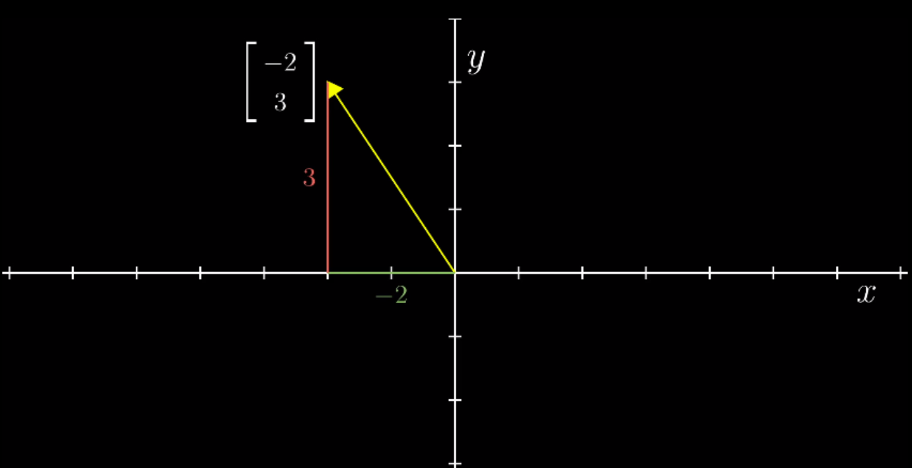
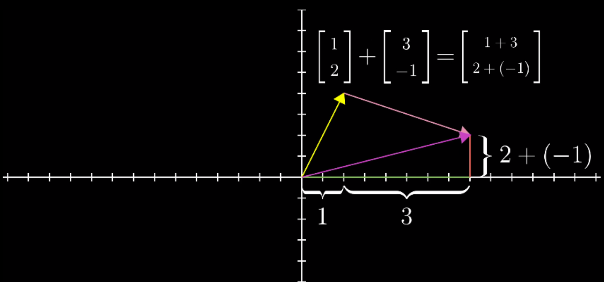
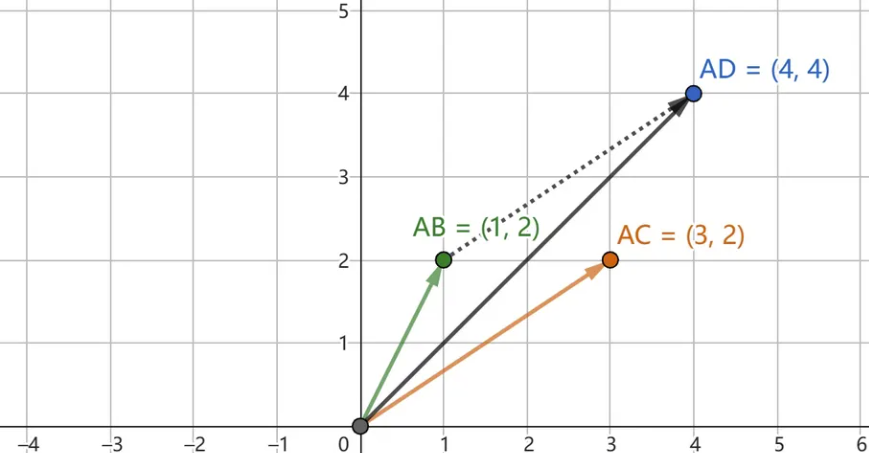
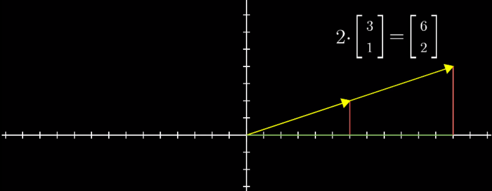
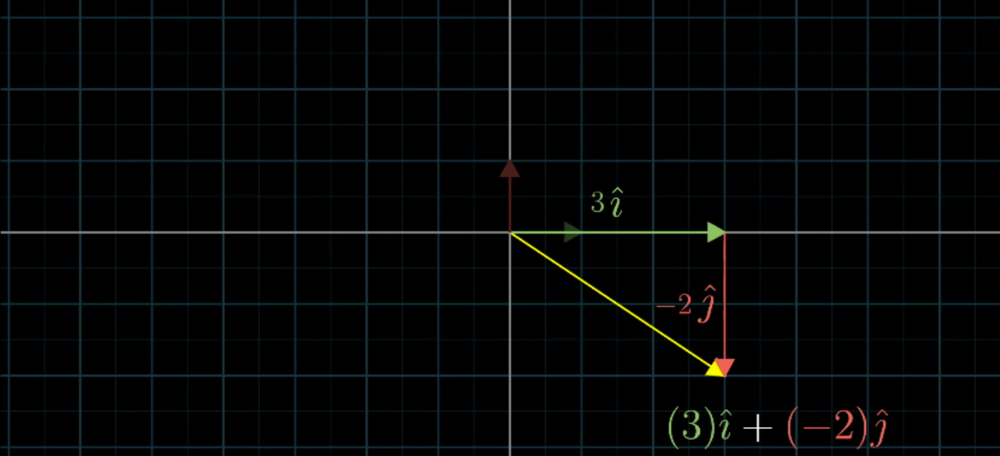
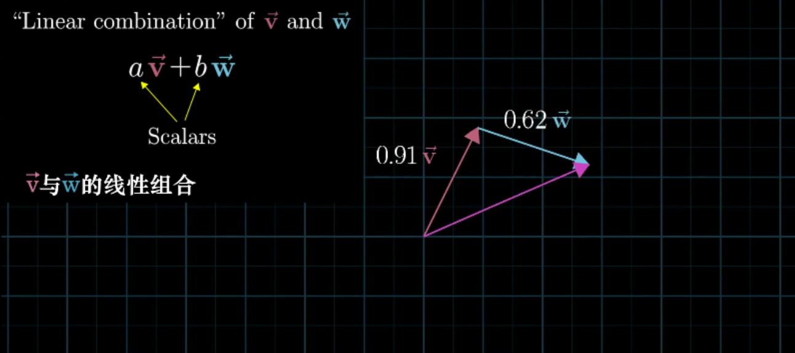
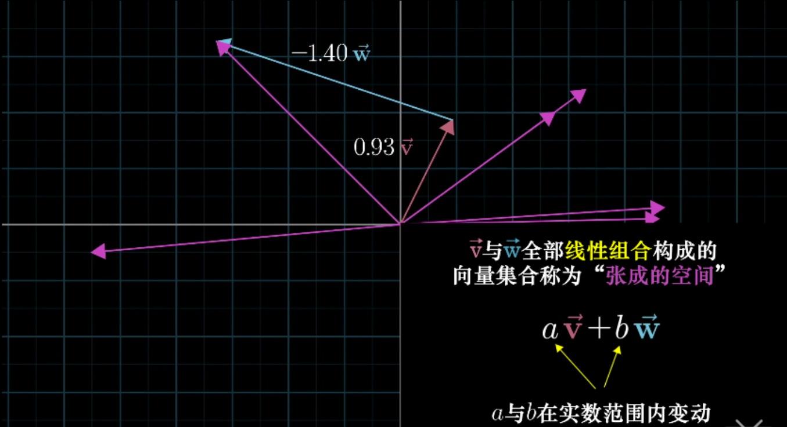

# 概念汇总

- 向量：抽象意义上，向量是可以对其进行加法和数乘运算的任意对象。计算机专业中，向量是一列数组。
- 标量：一个单独的数字，用来对向量进行缩放。比如乘以2相当于将这个向量拉长为原来的两倍。
- 张量：向量和矩阵的另一种说法。通俗一点理解的话，我们可以将标量视为零阶张量，向量（矢量）视为一阶张量，那么矩阵就是二阶张量，图像是三阶张量（高度、宽度、色彩通道）
- 线性组合：将向量进行缩放再相加的操作，如3i+2j
- 张成空间：一组向量的全部线性组合所构成的向量集合
- 线性相关：向量组中至少有一个向量都可以用向量组中其他向量的线性组合来表示出来。
- 线性无关：向量组中的（任意）一个向量都无法用向量组中其他向量的线性组合表示出来。
- 基：如果向量空间中的一组向量满足：互相线性无关，张成 V，则它们是向量空间 V 的一组基。该空间的任意向量都能表达为基向量的线性组合。
- 线性变换：向量的运动，变换后保持加法和数乘两种运算。
- 矩阵：一个二维数组。本质是对运动的描述。
- 单位矩阵：任意向量与单位矩阵相乘，等于什么都没做。保持n维向量不变的矩阵叫做单位矩阵，其主对角线元素全是1，其余全是0.
- 矩阵的逆：与原矩阵相乘得到单位矩阵的矩阵。不是所有的矩阵都有逆矩阵。存在逆矩阵的矩阵也称为非奇异矩阵。
- 行列式：用来衡量矩阵参与矩阵乘法后空间扩大或者缩小了多少倍。如果行列式是0,那么空间至少沿着某一维完全收缩了,使其失去了所有的体积。
- 秩：经过线性变换后空间的维数，即该矩阵的线性无关的列（行）的最大数目。
- 范数：衡量向量“大小”的单位。常用范数有 L1 和 L2 范数（欧氏距离）。
- 对角矩阵：只在主对角线上含有非零元素,其他位置都是零。
- 单位向量：指模等于1（具有 单位范数）的向量。由于是非零向量，单位向量具有确定的方向。单位向量有无数个。
- 对称矩阵：转置和自己相等的矩阵。
- 正交矩阵：是指行向量和列向量是分别标准正交的方阵。
- 特征分解：使用最广的矩阵分解之一，即我们将矩阵分解成一组特征向量和特征值。一个变换（或者说矩阵）的特征向量就是这样一种向量，它经过这种特定的变换后保持方向不变，只是进行长度上的伸缩而已。

# 向量

## 向量是什么

向量是指具有大小（magnitude）和方向的量，可以形象化地表示为带箭头的线段

在数学中，向量常用粗体字母表示，例如a、b、u、v等。

计算机专业中的向量：有序列表。

以二维平面直角坐标系为例，线性代数中，向量的坐标由一对数字构成。

 

## 向量的运算

向量的运算包括加法、减法、数乘以及数量积等。

### 加法

向量的加法满足平行四边形法则和三角形法则

1. 平行四边形法则：在平面上任取一点O，作向量OA、OB，则向量OB、OC可以用OA进行加法运算，即向量OB+向量OC=向量OA。
2. 三角形法则：在平面上任取两点A、B，作向量AB、AC，则向量AC叫做向量AB与向量AC的和，即向量AB+向量AC=向量AC

先沿 x 轴正方向移动 1 + 3 个单位，再沿 y 轴正方向移动 2 + (-1) 个单位，最终的结果就是两个向量相加的结果

 

基本定义：
$$
\vec{AB} + \vec{AC} = \vec{AD}
$$

### 减法

向量的减法：如果a、b是互为相反的向量，那么a=-b，b=-a，a+b=0。向量的减法满足三角形法则和反向减法

基本定义： 
$$
\vec{AB} - \vec{CD} = \vec{AB} + (- \vec{CD})
$$
如果:
$$
\vec{AB} = (6,6), \vec{CD} = (1,3),  \vec{EF} = (-2,0)
$$
则：
$$
\vec{AB} - \vec{CD} - \vec{EF}= (6-1-(-2), 6-3-0) = (7, 3)
$$

### 数乘向量

实数λ和向量a的乘积是一个向量，记作λa，且∣λa∣=∣λ∣·∣a∣。当λ＞0时，λa与a同方向；当λ＜0时，λa与a反方向；当λ=0时，λa=0，方向任意。

 

### 向量的数量积

向量a·向量b=向量a的长度乘向量b的长度乘以cosα(α为向量a和向量b共起点的夹角)。

基本定义:
$$
a·b = |a| |b| cos(θ)
$$
其中 |a| 和 |b| 分别是向量 a 和 b 的模，θ 是它们之间的夹角。

可以用来计算两个向量的方向相似性，因为当两个向量的夹角为 0 度时（即它们平行或重合），它们的数量积最大，为它们的模的乘积；当它们的夹角为 180 度时（即它们反向），它们的数量积最小，为负的它们的模的乘积。

# 线性组合、张成空间、基

## 运算封闭

在线性代数中，运算封闭指的是对于一个集合中任意两个元素进行运算，所得到的结果仍然属于该集合。换句话说，一个集合对于某种运算是封闭的。

例如，在向量空间中，向量的加法、数乘等线性运算的结果仍属于向量空间，即向量的任意线性组合仍属于向量空间。

## 线性组合

以二维平面直角坐标系为例，i, j 分别是沿xy坐标轴方向的单位向量(1,0) 与 (0,1)。那么，坐标平面上的任意一个向量，都可以看作是 i 和 j （称为基向量）的缩放再相加的结果。基向量缩放的倍数对应向量的各个分量，即向量对应的坐标。例如，向量 (3,-2) 就可以看成是 3倍i 与 -2倍j 相加的结果。

 

**一组基向量就对应一个坐标系，选择不同的基向量就构造出了不同的坐标系。** 同一个向量，在不同的坐标系下（即采用不同的基向量），其坐标值也要相应地发生变化。

这一“将向量进行缩放再相加”的操作，即 **线性组合** 。

 

## 张成空间

指所有可以表示为给定向量线性组合的向量的集合。

向量 v, w 的 全部线性组合所构成的向量集合称为向量 v, w 所 **张成的空间** 。张成的空间，实际上就是通过加法和数乘这两种运算

## 线性相关和线性无关

将线性组合的想法扩展到 3 维空间中。想象 3 个 3 维向量，它们所张成的空间会是什么样的呢？这取决于我们选择的 3 个向量。

> - 1. 通常情况下，我们会得到整个 3 维空间
> - 1. 当选择的 3 个向量共面时，它们所张成的空间是一个过原点的平面
> - 1. 当 3 个向量共线时，它们所张成的空间是一条过原点的直线
> - 1. 当 3 个向量都是零向量时，它们所张成的空间只包含零向量

显然，在考虑向量所张成的空间时，有些向量是多余的。例如，情况 b ，确定一个平面只需要 2 个向量，而我们却用了 3 个向量，这意味着，有 1 个向量是多余的；情况 c，确定一条直线只需要 1 个向量就够了，而我们用了 3 个向量，有 2 个向量是多余的。数学上，我们用线性相关来描述这样的现象。

当我们说几个向量所构成的向量组 **线性相关** 时，意思是向量组中至少有一个向量都可以用向量组中其他向量的线性组合来表示出来。换句话讲，这个向量已经落在其他向量所张成的空间中，它对整个向量组张成的空间是没有贡献的，把它从向量组中拿掉，并不会影响向量组所张成的空间。从几何角度举个例子，如果二维平面中两个向量线性相关，则其中一个向量可以写成另一个向量的倍数形式（两向量共线）。

**线性无关** 指的是，向量组中的（任意）一个向量都无法用向量组中其他向量的线性组合表示出来。换句话说，向量组中的每一个向量都为向量组所张成的空间贡献了一个维度，每一个向量都缺一不可，少了任何一个向量，都会改变向量组所张成的空间。

关于线性相关与线性无关，以下是一些重要性质：

> - 一组向量组要么是线性相关，要么是线性无关，没有第三种情况。
> - 如果一组向量中有至少一个零向量，或有两个相同的向量，那它们肯定线性相关。

## 基

在线性代数中，基（也称为基底）是描述、刻画向量空间的基本工具。向量空间的基是它的一个特殊的子集，基的元素称为基向量。向量空间中任意一个元素，都可以唯一地表示成基向量的线性组合。如果基中元素个数有限，就称向量空间为有限维向量空间，将元素的个数称作向量空间的维数。

一系列向量 v1,v2...vd 具有两个特性，向量的个数足够但又不会太多，这是“**基**”的基本含义。因此空间的“**基**”是指一个向量组。而向量组里的这些向量具有两种性质：

1. 它们是线性无关的；
2. 它们生成（span）整个空间（张成 V）

基含有的向量的数量叫做维数（即该向量空间的维数，记作 dim(V)）。

**基有很多组，但其中向量的个数都是一定的**。如果是空间 R^3 ，基向量的个数是 3 个，如果是空间 R^n ，那么基向量个数就是 n 个。

在三维空间中，它的一组常见的基是：
$$
\left[
 \begin{matrix}
   1 & 0 & 0 \\
   0 & 1 & 0 \\
   0 & 0 & 1
  \end{matrix}
  \right]
$$

# 矩阵、线性矩阵

# 行列式

# 矩阵的逆、秩、列空间、零空间

# 非方阵

# 模、点积、正交矩阵

# 叉积

# 基变换

# 特征向量、特征值、特征分解、奇异值分解

# 抽象的向量空间

