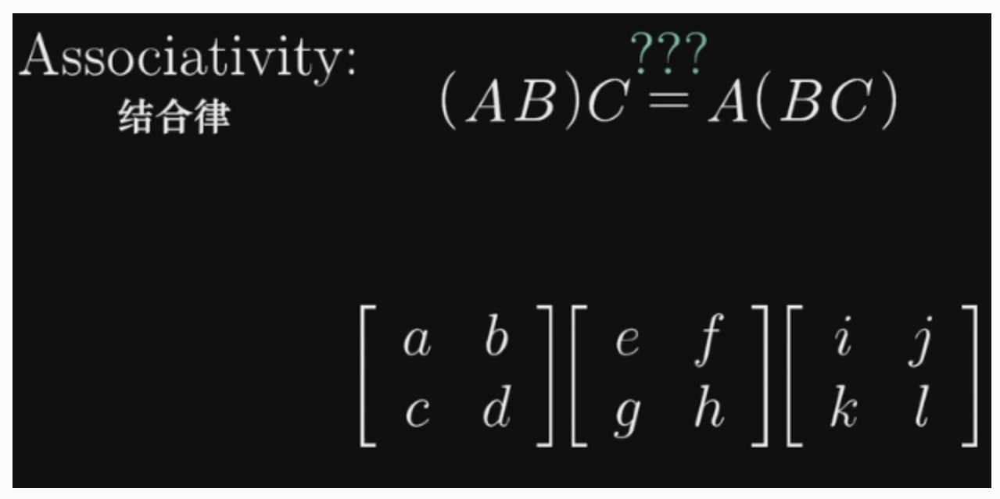

#  概念汇总

- 向量：抽象意义上，向量是可以对其进行加法和数乘运算的任意对象。计算机专业中，向量是一列数组。
- 标量：一个单独的数字，用来对向量进行缩放。比如乘以2相当于将这个向量拉长为原来的两倍。
- 张量：向量和矩阵的另一种说法。通俗一点理解的话，我们可以将标量视为零阶张量，向量（矢量）视为一阶张量，那么矩阵就是二阶张量，图像是三阶张量（高度、宽度、色彩通道）
- 线性组合：将向量进行缩放再相加的操作，如3i+2j
- 张成空间：一组向量的全部线性组合所构成的向量集合
- 线性相关：向量组中至少有一个向量都可以用向量组中其他向量的线性组合来表示出来。
- 线性无关：向量组中的（任意）一个向量都无法用向量组中其他向量的线性组合表示出来。
- 基：如果向量空间中的一组向量满足：互相线性无关，张成 V，则它们是向量空间 V 的一组基。该空间的任意向量都能表达为基向量的线性组合。
- 线性变换：向量的运动，变换后保持加法和数乘两种运算。
- 矩阵：一个二维数组。本质是对运动的描述。
- 单位矩阵：任意向量与单位矩阵相乘，等于什么都没做。保持n维向量不变的矩阵叫做单位矩阵，其主对角线元素全是1，其余全是0.
- 矩阵的逆：与原矩阵相乘得到单位矩阵的矩阵。不是所有的矩阵都有逆矩阵。存在逆矩阵的矩阵也称为非奇异矩阵。
- 行列式：用来衡量矩阵参与矩阵乘法后空间扩大或者缩小了多少倍。如果行列式是0,那么空间至少沿着某一维完全收缩了,使其失去了所有的体积。
- 秩：经过线性变换后空间的维数，即该矩阵的线性无关的列（行）的最大数目。
- 范数：衡量向量“大小”的单位。常用范数有 L1 和 L2 范数（欧氏距离）。
- 对角矩阵：只在主对角线上含有非零元素,其他位置都是零。
- 单位向量：指模等于1（具有 单位范数）的向量。由于是非零向量，单位向量具有确定的方向。单位向量有无数个。
- 对称矩阵：转置和自己相等的矩阵。
- 正交矩阵：是指行向量和列向量是分别标准正交的方阵。
- 特征分解：使用最广的矩阵分解之一，即我们将矩阵分解成一组特征向量和特征值。一个变换（或者说矩阵）的特征向量就是这样一种向量，它经过这种特定的变换后保持方向不变，只是进行长度上的伸缩而已。

# 向量

## 向量是什么

向量是指具有大小（magnitude）和方向的量，可以形象化地表示为带箭头的线段

在数学中，向量常用粗体字母表示，例如a、b、u、v等。

计算机专业中的向量：有序列表。

以二维平面直角坐标系为例，线性代数中，向量的坐标由一对数字构成。

 

## 向量的运算

向量的运算包括加法、减法、数乘以及数量积等。

### 加法

向量的加法满足平行四边形法则和三角形法则

1. 平行四边形法则：在平面上任取一点O，作向量OA、OB，则向量OB、OC可以用OA进行加法运算，即向量OB+向量OC=向量OA。
2. 三角形法则：在平面上任取两点A、B，作向量AB、AC，则向量AC叫做向量AB与向量AC的和，即向量AB+向量AC=向量AC

先沿 x 轴正方向移动 1 + 3 个单位，再沿 y 轴正方向移动 2 + (-1) 个单位，最终的结果就是两个向量相加的结果

 

基本定义：
$$
\vec{AB} + \vec{AC} = \vec{AD}
$$

### 减法

向量的减法：如果a、b是互为相反的向量，那么a=-b，b=-a，a+b=0。向量的减法满足三角形法则和反向减法

基本定义： 
$$
\vec{AB} - \vec{CD} = \vec{AB} + (- \vec{CD})
$$
如果:
$$
\vec{AB} = (6,6), \vec{CD} = (1,3),  \vec{EF} = (-2,0)
$$
则：
$$
\vec{AB} - \vec{CD} - \vec{EF}= (6-1-(-2), 6-3-0) = (7, 3)
$$

### 数乘向量

实数λ和向量a的乘积是一个向量，记作λa，且∣λa∣=∣λ∣·∣a∣。当λ＞0时，λa与a同方向；当λ＜0时，λa与a反方向；当λ=0时，λa=0，方向任意。

 

### 向量的数量积

向量a·向量b=向量a的长度乘向量b的长度乘以cosα(α为向量a和向量b共起点的夹角)。

基本定义:
$$
a·b = |a| |b| cos(θ)
$$
其中 |a| 和 |b| 分别是向量 a 和 b 的模，θ 是它们之间的夹角。

可以用来计算两个向量的方向相似性，因为当两个向量的夹角为 0 度时（即它们平行或重合），它们的数量积最大，为它们的模的乘积；当它们的夹角为 180 度时（即它们反向），它们的数量积最小，为负的它们的模的乘积。

# 线性组合、张成空间、基

## 运算封闭

在线性代数中，运算封闭指的是对于一个集合中任意两个元素进行运算，所得到的结果仍然属于该集合。换句话说，一个集合对于某种运算是封闭的。

例如，在向量空间中，向量的加法、数乘等线性运算的结果仍属于向量空间，即向量的任意线性组合仍属于向量空间。

## 线性组合

以二维平面直角坐标系为例，i, j 分别是沿xy坐标轴方向的单位向量(1,0) 与 (0,1)。那么，坐标平面上的任意一个向量，都可以看作是 i 和 j （称为基向量）的缩放再相加的结果。基向量缩放的倍数对应向量的各个分量，即向量对应的坐标。例如，向量 (3,-2) 就可以看成是 3倍i 与 -2倍j 相加的结果。

 

**一组基向量就对应一个坐标系，选择不同的基向量就构造出了不同的坐标系。** 同一个向量，在不同的坐标系下（即采用不同的基向量），其坐标值也要相应地发生变化。

这一“将向量进行缩放再相加”的操作，即 **线性组合** 。

 

## 张成空间

指所有可以表示为给定向量线性组合的向量的集合。

向量 v, w 的 全部线性组合所构成的向量集合称为向量 v, w 所 **张成的空间** 。张成的空间，实际上就是通过加法和数乘这两种运算

## 线性相关和线性无关

将线性组合的想法扩展到 3 维空间中。想象 3 个 3 维向量，它们所张成的空间会是什么样的呢？这取决于我们选择的 3 个向量。

> - 1. 通常情况下，我们会得到整个 3 维空间
> - 1. 当选择的 3 个向量共面时，它们所张成的空间是一个过原点的平面
> - 1. 当 3 个向量共线时，它们所张成的空间是一条过原点的直线
> - 1. 当 3 个向量都是零向量时，它们所张成的空间只包含零向量

显然，在考虑向量所张成的空间时，有些向量是多余的。例如，情况 b ，确定一个平面只需要 2 个向量，而我们却用了 3 个向量，这意味着，有 1 个向量是多余的；情况 c，确定一条直线只需要 1 个向量就够了，而我们用了 3 个向量，有 2 个向量是多余的。数学上，我们用线性相关来描述这样的现象。

当我们说几个向量所构成的向量组 **线性相关** 时，意思是向量组中至少有一个向量都可以用向量组中其他向量的线性组合来表示出来。换句话讲，这个向量已经落在其他向量所张成的空间中，它对整个向量组张成的空间是没有贡献的，把它从向量组中拿掉，并不会影响向量组所张成的空间。从几何角度举个例子，如果二维平面中两个向量线性相关，则其中一个向量可以写成另一个向量的倍数形式（两向量共线）。

**线性无关** 指的是，向量组中的（任意）一个向量都无法用向量组中其他向量的线性组合表示出来。换句话说，向量组中的每一个向量都为向量组所张成的空间贡献了一个维度，每一个向量都缺一不可，少了任何一个向量，都会改变向量组所张成的空间。

关于线性相关与线性无关，以下是一些重要性质：

> - 一组向量组要么是线性相关，要么是线性无关，没有第三种情况。
> - 如果一组向量中有至少一个零向量，或有两个相同的向量，那它们肯定线性相关。

## 基

在线性代数中，基（也称为基底）是描述、刻画向量空间的基本工具。向量空间的基是它的一个特殊的子集，基的元素称为基向量。向量空间中任意一个元素，都可以唯一地表示成基向量的线性组合。如果基中元素个数有限，就称向量空间为有限维向量空间，将元素的个数称作向量空间的维数。

一系列向量 v1,v2...vd 具有两个特性，向量的个数足够但又不会太多，这是“**基**”的基本含义。因此空间的“**基**”是指一个向量组。而向量组里的这些向量具有两种性质：

1. 它们是线性无关的；
2. 它们生成（span）整个空间（张成 V）

基含有的向量的数量叫做维数（即该向量空间的维数，记作 dim(V)）。

**基有很多组，但其中向量的个数都是一定的**。如果是空间 R^3 ，基向量的个数是 3 个，如果是空间 R^n ，那么基向量个数就是 n 个。

在三维空间中，它的一组常见的基是：
$$
\left[
 \begin{matrix}
   1 & 0 & 0 \\
   0 & 1 & 0 \\
   0 & 0 & 1
  \end{matrix}
  \right]
$$

# 矩阵、线性变换

## 线性变换

首先来理解线性变换。变换，本质就是函数。在微积分中，我们了解了函数描述了一种映射关系，输入内容，输出唯一与其对应的结果。在线性代数中，我们输入一个向量，输出另一个向量。

之所以用“变换”这个术语，其实暗示了我们能够以某种方式可视化 输入—-输出 关系，暗示我们要从运动的角度去理解这一过程。变换让向量从一个地方（对应输入向量），运动到了另一个地方（对应输出向量）。

如果用空间中的点来表示向量，则可以把变换可视化为下图这样：

 

经过变换后，所有点运动到了新的位置：

 

如果用等间距的平行网格来表示向量，则可以把变换可视化为下图这样：

 

经过变换后，网格变成了这样：

 

那么线性变换是什么意思呢？如果一个变换同时具有以下 2 条性质，则它是一个线性变换。

- 变换前后，所有的直线仍然是直线
- 变换前后，原点保持不变

 

放在二维直角坐标系这一特定场景下，具体的体现就是施加线性变换后，整个坐标系的原点不变，并使网络线保持平行且等距分布。

 

那么，我们要如何用数学语言描述一个线性变换呢？答案很简单，我们只需要知道变化前后的两个基向量i 和 j 的位置。

以平面直接坐标系为例，假定我们有一个向量 v = [-1,2] ,由上一节可知，我们可以将它看成是 2 个基向量 i, j 的线性组合 v = -1i + 2j。

 

在某个线性变换的作用下，i, j 以及 v 都运动到了新的位置。

 

线性变换前后网络线保持平行且等距分布，这一性质有一个重要的推论：线性变换后的 v 仍然是变换后的 i 和 j 的线性组合，并且线性组合的系数和变换前一样（仍然是 -1 和 2）。

 

本例子中，变换后的基向量 i 和 j 分别是 [1,-2] 和 [3,0]。由此，我们可以轻松计算出变换后的v 的坐标是 [5,2]。

 

事实上，我们只要知道线性变换之后的基向量 i, j 的位置（坐标），就可以计算出任意一个向量经过同样的线性变换之后的位置（坐标）。

 

这意味着，对于一个线性变换，我们只需要跟踪基向量在变换前后的变化，就可以掌握整个空间（即全部向量）的变化。我们将线性变换后的基向量坐标按列组合起来，可以拼接成一个矩阵。线性变换的全部信息便都包含在这个矩阵当中了。

对于二维空间的线性变换，用一个 2×2 的矩阵就可以完全确定。这个矩阵的 2 列 表示 2 个转换后的基向量的坐标，如下图所示。

 

那么，任何向量经过该线性变换之后，其新坐标的计算方法都是这样。记住，所有的变换都只是简单的“对基向量缩放再相加”。

 

通过这种方式，是否可以更轻松的理解矩阵与向量的乘法？我们可以把矩阵的每一列看作变换后的基向量，它描述了一种特定的线性变换，而矩阵与向量的相乘，就是将这个线性变换作用于给定向量。

简而言之，选定基之后， **向量刻画对象，矩阵刻画对象的运动，用矩阵与向量的乘法施加运动；矩阵的本质是运动的描述。** 一旦理解了这点，线性代数之后的各个主题，包括矩阵乘法、基变换、特征值等都会非常直观易懂。

## 矩阵与基本计算

### 矩阵定义

矩阵：m * n 个数字排成 m * n 列的二维数组就是矩阵，一般用大写英文字母表示。若 m=n，即行数与列数相同，则称矩阵是n阶方阵或n阶矩阵。

 

### 矩阵的加法和数乘

矩阵加法，即将两个形状相同的矩阵的每一个对应位置的元素加起来。

 

矩阵数乘，即将一个矩阵每个元素乘以一个标量k。每个元素在数乘后变成原来的k倍。

### 矩阵乘法

矩阵加法和数乘都很好理解，让很多人头疼的矩阵乘法。 线性变换中我们提到，矩阵表示了一种线性变换。有些时候我们会进行多次线性变换，比如对向量先旋转再剪切，但无论经过多少次，最后的总体作用还是一个线性变换，这样的变换可以看做是由多个独立变换组合成的复合变换。

那么如何描述这类复合变换呢？一样道理。麻烦的方法是，我们把多个线性变换拆开分别看，例如下图，对向量先施加一个旋转变换，再施加一个剪切变换，注意矩阵是往左侧不断叠加的：

 

表示的就是对给定的向量先进行旋转，再进行剪切。但无论中间过程是什么，最后的结果都应该和复合变换的结果完全相同。复合矩阵反应的是旋转+剪切的总体效应。从这个角度来说，新的这个矩阵（复合矩阵）可以看做最初两个矩阵的积。

 

关键点到了。很多人对矩阵的乘法计算只知道死记硬背，但一旦理解了矩阵相乘内在的几何意义（即两个线性变换的相继作用），那么矩阵相乘就是手到擒来的事。

首先，需要记住一点，矩阵的相乘应该从右往左读，即先应用靠右边的变换，再依次向左。以下图的为例，假设我们的原始基向量是 i 和 j，经过矩阵 M1 和 M2 的作用后会变成怎样的新基向量呢？

可以看到，j 经过 M1 的作用后变成了 [-2,0]， [-2,0]再经过 M2 的转换变成了 [0,-2]，因此新的基向量 j 就是 [0,-2]，也就是复合矩阵的第二列。和矩阵乘以向量的机制完全一样。

 

推广到任意矩阵，就得到了我们在教科书中常见的矩阵乘法公式：

 

或者更广义的：

 

如此，把矩阵乘法理解为 **连续的几次线性变换** ，我们也能很容易理解，矩阵 A*B 的结果和矩阵 B*A 的结果是不一样的，因为操作顺序的不同，产生的影响也不同。比如，先对 i 和 j 基向量先往x轴方向拉伸一倍，再顺时针旋转90度，与先旋转90度再拉伸，结果肯定不一样。

同样，我们也能轻易的理解矩阵乘法的结合律为什么合理了。你当然可以通过数学的方法证明等式左右两边的计算结果一致，但当你明白矩阵乘法实际的意义是相继的进行线性变换后，那么答案简直不言自明—— (AB)C 与 A(BC) 做的完全就是同一件事：先进行C变换，再进行B变换，最后进行A变换，根本不需要证明什么。

 

需要注意的是，矩阵的标准乘积（如上所述）不是矩阵中对应元素的乘积，但那样的矩阵操作也是存在的，称为元素对应乘积（element-wise product）或 Hadamard 乘积。

### 单位矩阵

单位矩阵：对角线为1，其余位置都为0 的矩阵，通常记作 I。任意向量与单位矩阵相乘，都不会改变，得到自身。

把矩阵理解为施加的线性变换，矩阵的每一列就是线性变换后的新的基向量坐标组合起来，那么单位矩阵对应的变换就是——什么都没做，因为新的基向量和原始的基向量一模一样。如此，便可以轻松的理解单位矩阵的各种性质，例如 A * I = A = I * A。

 

### 矩阵的性质

在了解了矩阵的加法、数乘、乘法、单位矩阵后，我们便可以认识一些矩阵的基本性质，包括结合律、分配律和中性元素。

 

# 行列式

之前通过网格线可视化线性变换的图片中我们可以看到，线性变换中有些将空间向外拉伸，有些将空间向内挤压，有件事对理解这些变换很有用，就是测量线性变换具体对空间产生了多少拉伸或压缩，换句话说，就是测量一个给定区域面积扩大或减小的比例。

以下图为例，假设我们的新基向量是[3,0] 和 [0,2]，经过变换后，原先 1 * 1 的单位正方形区域的面积变成了 3*2 = 6 即原来的6倍。

 

实际上，我们只需要观察这个单位正方形变换后的面积变化比例，就等于知道了其他任意区域的面积变化比例，因为对于其他任意的方块来说都会有相同的变化，这是由线性变换产生网格线保持平行且等距分布这一特性推断出的。而这个变化的比例，就是我们常说的行列式。

如果说一个线性变换的行列式是3，那就是说它将一个区域的面积变化为原先的3倍。

  

如果一个线性变换的行列式为0，则说明它将原来的二维平面压缩到了一条线（甚至一个点）上，此时所有区域的面积都为0。换句话说，探究一个矩阵的行列式是否为0，就能了解这个矩阵对应的线性变换是否将空间压缩到了更低维度（例如从二维降维到一维空间）。

 

行列式还可能是负值。从几何意义上如何理解将面积变化为原来的负数倍呢？如果将二维空间想象成一张白纸，那么这个变换相当于将纸张翻转到了另一面。这类变换改变了空间的定向。因此，负值表示空间翻转了，但行列式的绝对值仍然表示区域面积的缩放比例。

放到三维空间中，行列式的意义依然相同，告诉我们单位体积（即1*1*1的立方体）在变换后的缩放比例。当行列式为0时，这个立方体降维成了一个平面或一条直线，甚至一个点。

## 行列式的计算

二维矩阵的行列式计算公式很简单，但下图可以帮我们理解为什么是这样。 ad - bc 的结果就是黄色平行四边形的面积，也就是相对于单位正方形变化的比例。

 

然而就我个人而言，这些计算完全可以由电脑完成，死记硬背行列式的计算公式、甚至三阶、四阶行列式的公式并无太大意义，理解背后的意义和原因才更重要。这也是很多人觉得学习线性代数痛苦的原因，国内的大部分课本只会让你沉浸于各种奇怪的计算数学符号中，却根本无法让你知道为什么会是这样。比如下面这个定理：

 

两个矩阵相乘的行列式，等于矩阵各自行列式的乘积。

如果用数值的方法证明，大概可以写5张A4纸。但如果你明白了行列式的本质，那又是不言自明：左边的等式代表先进行 M2 矩阵代表的线性变换再执行 M1 所代表的线性变换之后，面积或者体积所变化的比例。右边的式子是两个线性变换使面积或体积变化的比例的乘积。因为两边线性变换之后的结果是一样的（执行顺序一样），所以比例肯定也是一样的

# 矩阵的逆、秩、列空间、零空间

## 逆矩阵

前面章节中，我们通过线性变换理解矩阵与向量的运算，这一章我们仍然用线性变换来理解逆矩阵、列空间与零空间这三大概念。Again，个人以为理解这些概念的意义比会计算重要的多，因此计算方法，例如高斯消元法、行阶梯形等不会在这里介绍。

我们都知道，矩阵的一大用途的帮助我们解方程组，比如，我们可以将一个方程组写为以下线性方程组的形式：

 

这里，矩阵代表了某个线性变换，所以从几何意义上理解，求解该方程组的未知量 x,y,z 等同于寻找一个向量 x，使得它在经过 A 的变换后与向量 v 重合。

我们来看一个二元方程组：

 

这个方程组 Ax = v 的解依赖于矩阵 A 所代表的变换，是将原始空间挤压到一个更低维空间，还是保持不变，即 A 的行列式是否是0.

如果行列式不为0，即空间的维度不变，那么只可能有一个向量在变换后与 v 重合，可以通过对 v 做逆变换来得到 x 向量。这里对 v 的逆变换就对应了另一个线性变换，也称为 A 的逆。例如，如果 A 变换是顺时针旋转90度，那么 A 的逆就是逆时针旋转90度。简单的说，如果先施加 A 变换，再施加 A 的逆，那么又回到原始状态。由此，我们给出逆矩阵的正式定义：

当我们通过计算机得到 A 的逆矩阵后，求解向量 x 也就迎刃而解了，在等式两边同左乘 A 的逆即可。其几何意义对应于对 v 进行逆向的变换，还原为 x。 值得注意的是，不是所有的矩阵都有逆矩阵。存在逆矩阵的矩阵也称为 **非奇异矩阵** ，不存在逆矩阵的矩阵称为 **奇异矩阵** 。

 

**如果行列式为0，矩阵 A 所代表的变换将空间压缩到了更低的维度上，此时 A 没有相应的逆变换** ，直观的理解就是我们没有办法将一个低维空间的东西变换到高维空间（比如把一条直线还原到一个平面），因为高维的空间包含更多的信息，压缩成低维后那些信息都已经丢失了，不可能恢复那些丢失的信息。

行列式为0时，方程式的解可能也存在，就要看变换后的向量 v 是否在变换后的空间内，如果不在，就无解，如果在，就有无数解。

在很多教科书上，你会读到这样一段解释： **方程组 Ax = v 有解当且仅当 v 是 A 的各列的线性组合** 。细心体会一下，这与我们上一段说的其实是一回事。

除了用行列式为0来描述矩阵变换后的结果，我们还可以更精确的描述变换后空间的维数，这里就引入了一个新的概念：秩。

## 矩阵的秩

**秩** 就代表了变换后空间的维数。如果变换后所有的向量都落在一条直线上，那么这个变换的秩为1；如果变换后所有的向量都落在一个二维空间上，那么这个变换的秩为2。

对于一个 2*2 的矩阵来说，它的秩最大只能为2，因为它的2个基向量最多张成二维空间。对于 3*3 的矩阵，它变换后的结果可能为一个一维、二维或三维空间。

更正式的定义：一个矩阵 A 的列秩是 A 的线性无关的列的极大数目。类似地，行秩是 A 的线性无关的行的极大数目。矩阵的列秩和行秩总是相等的，因此它们可以简单地称作矩阵 A 的秩。

## 列空间

对向量 x 施加线性变换，变换矩阵的各列可以看作基向量变换后的坐标，变换矩阵的各列张成的空间就是 **列空间** 。所以矩阵的秩也可以理解为，列空间的维数。秩最大的情况就是与矩阵的列数相等，称为满秩。

值得注意的是，零向量，即原点一定包含在任何列空间里，因为线性变换必须保持原点位置不变。对于满秩变换来说，原点是唯一变换前后不变的向量，但对于非满秩变换来说，可能有一系列的向量在变换后变成了零向量。为什么呢？

## 零空间

想象一下，如果一个线性变换将2D空间压缩到一条直线上，那么沿着某个特定方向直线上的所有点都会被压缩到原点（想象把一张纸压成一条线）。同样的，如果将一个3D空间压缩到一个平面上，也会有一整条直线上的向量变换后落在原点（想象把一个立方体压成一张纸），如果将一个3D空间压缩到一条直线上，那就会有一整个平面上的向量变换后落在原点。

变换后落在原点的向量的集合，称为矩阵的 **零空间** 或者核(kernel)。

 

如上图所示，假设 V → W 是一个线性变换， **象** （Image）指的就是所有V中的向量所能映射到的W中的所有向量， **核** （Kernel）指的就是V中映射为W中零向量的元素整体。根据定义，零空间就是线性齐次方程组 Ax = 0 的所有解的集合。

最后，总结一下，变换矩阵是满秩，等价于矩阵各列向量线性无关，等价于矩阵的行列式不为0，等价于 Ax=0 仅有唯一解零向量，等价于矩阵存在逆矩阵。

# 非方阵

之前我们讨论的矩阵都是方阵，例如用 2*2 的矩阵表示二维向量到二维向量的变换。那么如何理解非方阵呢？很简单，仍然是线性变换，但是是从某个维度转换为另一个维度的坐标。

以一个 3*2 的矩阵为例，它的几何意义是将输入的二维空间映射到三围空间上。 矩阵有2列表示输入空间有2个基向量（因此是二维输入空间），有3行表示每一个基向量在变换后用3个独立的坐标来描述。

# 模、点积、正交矩阵

## 向量的模

## 向量点积

## 正定矩阵

## 夹角与正交性

# 叉积

# 基变换

# 特征向量、特征值、特征分解、奇异值分解

## 特征向量与特征值

## 矩阵的对角化与特征分解

## 奇异值分解

# 抽象的向量空间

## 向量空间的公理

## 向量子空间

## 仿射子空间

