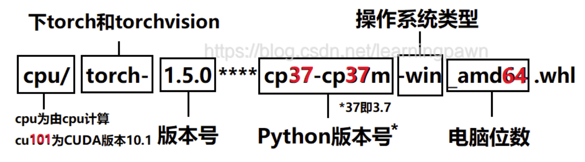
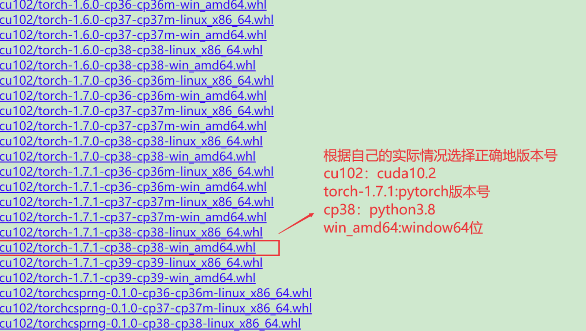

# win

## install python

1.确认自己电脑是64位的还是32位

2.确认自己电脑的GPU的CUDA版本

​	cuda 12.1

3.确认安装的python版本

​		python-3.10.4-amd64.exe

```shell
# 如果升级pip，碰到版本的问题
# 解决ModuleNotFoundError: No module named 'pip' 错误
1）python -m ensurepip
2）python -m pip install --upgrade pip
```


4.pytorch官方安装

​		https://pytorch.org/get-started/locallly/


torch 离线包

https://download.pytorch.org/whl/torch/

按照下面规则，计算自己的安装命令

 



安装本地包

```shell
pip install torch-2.1.0+cu121-cp310-cp310-win_amd64.whl
```

验证，查看是否有torch

```shell
pip3 list 
```


# ubuntu

1.确认自己电脑是64位的还是32位

2.确认自己电脑的GPU的CUDA版本

​	cuda 12.1

3.确认安装的python版本

4.pytorch官方安装

​		https://pytorch.org/get-started/locallly/

这里安装离线包

```shell
pip install torch-2.1.0+cu121-cp310-cp310-linux_X86_64.whl
```

