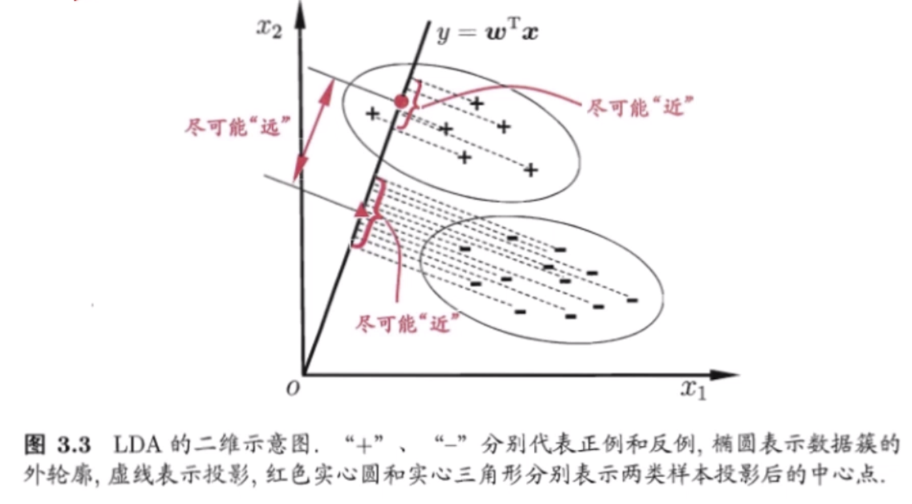
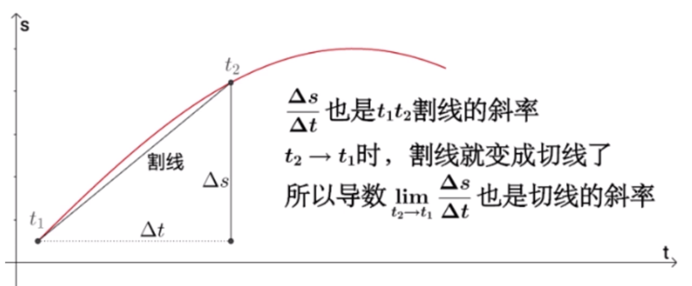
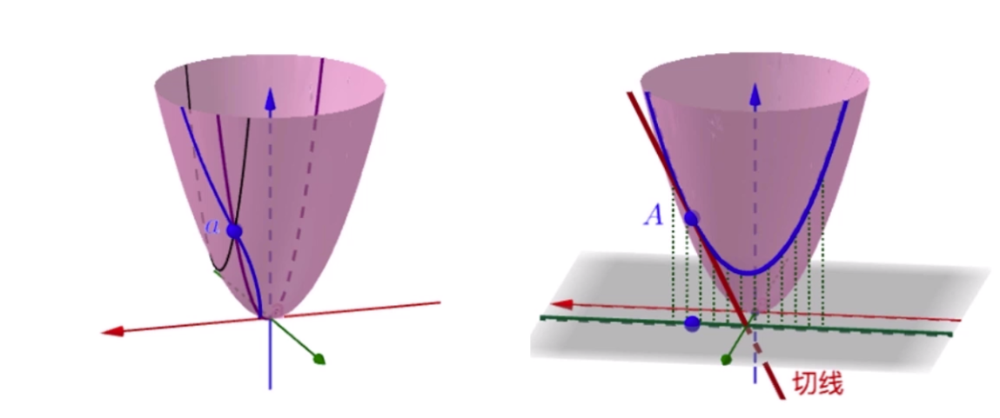
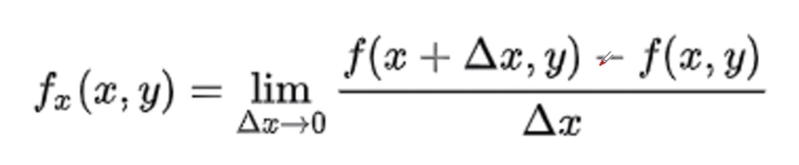
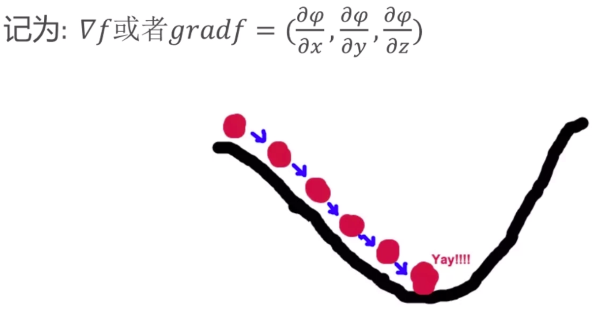
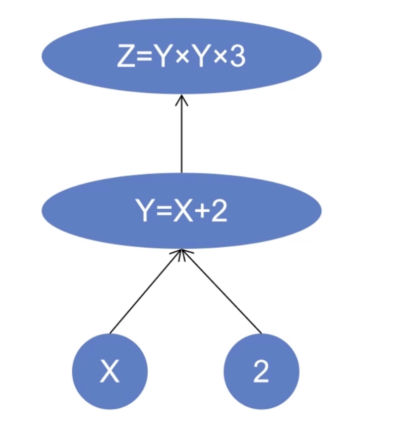

# tensor（张量）

在 PyTorch 中，张量（Tensor）是一个 n 维数组，是经常用到的一个数据类型。我们可以这样理解：一维张量等同于向量，二维张量等同于矩阵。张量是一个数据容器，它包含的数据几乎总是数值数据，因此它是数字的容器。机器学习的数据存储在张量中。一般来说，当前所有机器学习系统都使用张量作为基本数据结构。


PyTorch 中最基础的运算单位是张量（Tensor），它支持各种张量运算，如加法、减法、点乘、矩阵乘法等。


* 标量是 0维的张量
* 向量是 1维的张量
* 矩阵是 2维的张量


tensor的类型

| 类型                      | torch                         | tensor               |
| ------------------------- | ----------------------------- | -------------------- |
| 32-bit floating point     | torch.float32 or torch.float  | torch.*.floatTensor  |
| 64-bit floating point     | torch.float64 or torch.double | torch.*.DoubleTensor |
| 16-bit floating point     | torch.float16 or torch.half   | torch.*.HalfTensor   |
| 8-bit integer（unsigned） | torch.uint8                   | torch.*.ByteTensor   |
| 8-bit integer（signed）   | torch.int8                    | torch.*.CharTensor   |
| 16-bit integer（signed）  | torch.int16 or torch.short    | torch.*.ShortTensor  |
| 32-bit integer（signed）  | torch.int32 or torch.int      | torch.*.IntTensor    |
| 64-bit integer（signed）  | torch.int64 or torch.long     | torch.*.LongTensor   |
| Boolean                   | torch.bool                    | torch.*.BoolTensor   |


# tensor的创建

| 函数                               | 功能                      |
| ---------------------------------- | ------------------------- |
| Tensor(*size)                      | 基础构造函数              |
| Tensor(data)                       | 类似np.array              |
| ones(*size)                        | 全1Tensor                 |
| zeros(*size)                       | 全0Tensor                 |
| eye(*size)                         | 对角线为1，其他为0        |
| arange(s,e,step)                   | 从s到e，步长为step        |
| linspace(s,e,steps)                | 从s到e，均匀切分成steps份 |
| rand/randn(*size)                  | 均匀/标准分布             |
| normal(mean,std)/uniform_(from,to) | 正态分布/均匀分布         |
| randperm(m)                        | 随机排列                  |

`type_as`函数的作用是将输入张量的数据类型转换为与指定的张量相同的数据类型。它通常用于数据类型转换，以确保计算操作中涉及的张量具有相同的数据类型，从而避免数据类型不匹配的错误。


代码参考：pytorch-code/00_algorithm/00_tensor_create

0)

```python
import torch
a = torch.Tensor([[1, 2],[3, 4]])
print(a)
```

```
tensor([[1., 2.],
        [3., 4.]])
```

1)

```python
import torch

b = torch.Tensor(2, 2)
print(b)
```

```
tensor([[0., 0.],
        [0., 0.]])
```

2)

```python
import torch

a = torch.Tensor([[1, 2],[3, 4]])
d = torch.tensor(((1, 2), (3, 4)))
print(d.type())
print(d.type_as(a))
```

```
torch.LongTensor
tensor([[1., 2.],
        [3., 4.]])
```

3)

```python
import torch

a = torch.Tensor([[1, 2],[3, 4]])
d = torch.empty(2,3)
print(d.type())
print(d)
print(d.type_as(a))
```

```
torch.FloatTensor
tensor([[-2.7814e+19,  9.0384e-43,  0.0000e+00],
        [ 0.0000e+00,  0.0000e+00,  0.0000e+00]])
tensor([[-2.7814e+19,  9.0384e-43,  0.0000e+00],
        [ 0.0000e+00,  0.0000e+00,  0.0000e+00]])
```

4)

```python
import torch

a = torch.Tensor([[1, 2],[3, 4]])
d = torch.zeros(2,3)
print(d.type())
print(d)
print(d.type_as(a))
```

```
torch.FloatTensor
tensor([[0., 0., 0.],
        [0., 0., 0.]])
tensor([[0., 0., 0.],
        [0., 0., 0.]])
```

5)

```python
import torch

a = torch.Tensor([[1, 2],[3, 4]])
d = torch.zeros(2,3)
d = torch.zeros_like(d)
print(d.type())
print(d.type_as(a))
```

```
torch.FloatTensor
tensor([[0., 0., 0.],
        [0., 0., 0.]])
```

6)

```python
import torch

a = torch.Tensor([[1, 2],[3, 4]])
d = torch.eye(2, 2)
print(d.type())
print(d.type_as(a))
```

```
torch.FloatTensor
tensor([[1., 0.],
        [0., 1.]])
```

7)

```python
import torch

a = torch.Tensor([[1, 2],[3, 4]])
d = torch.ones(2, 2)
print(d.type())
print(d.type_as(a))
```

```
torch.FloatTensor
tensor([[1., 1.],
        [1., 1.]])
```

8)

```python
import torch

a = torch.Tensor([[1, 2],[3, 4]])
d = torch.ones(2, 2)
d = torch.ones_like(d)
print(d.type())
print(d.type_as(a))
```

```
torch.FloatTensor
tensor([[1., 1.],
        [1., 1.]])
```

9)

```python
import torch

a = torch.Tensor([[1, 2],[3, 4]])
d = torch.rand(2, 3)
print(d.type())
print(d.type_as(a))
```

```
torch.FloatTensor
tensor([[0.5807, 0.6620, 0.8287],
        [0.1298, 0.7195, 0.0849]])
```

10)

```python
import torch

a = torch.Tensor([[1, 2],[3, 4]])
d = torch.arange(2, 10, 2)
print(d.type())
print(d.type_as(a))
```

```
torch.LongTensor
tensor([2., 4., 6., 8.])
```

11)

```python
import torch

a = torch.Tensor([[1, 2],[3, 4]])
d = torch.linspace(10, 2, 3)
print(d.type())
print(d.type_as(a))
```

```
torch.FloatTensor
tensor([10.,  6.,  2.])
```

12）

```python
import torch

b = torch.Tensor(2, 2)
dd = torch.normal(mean=0, std=1, size=(2, 3), out=b) # torch.normal() 是 PyTorch 中的一个函数，它用于从正态分布中生成随机数。该函数需要两个参数：mean（平均值）和stddev（标准差）。这两个参数分别决定了随机数分布的均值和方差。
print(b)
print(dd)
```

```
tensor([[ 1.4357,  0.9427, -0.8694],
        [ 1.0122, -0.7856, -2.4967]])
tensor([[ 1.4357,  0.9427, -0.8694],
        [ 1.0122, -0.7856, -2.4967]])
```

13)

```python
import torch

a = torch.Tensor([[1, 2],[3, 4]])
d = torch.normal(mean=torch.rand(5), std=torch.rand(5))
print(d.type())
print(d.type_as(a))

```

```
torch.FloatTensor
tensor([0.2504, 1.7975, 0.3099, 0.3428, 0.2408])
```

14)

```python
import torch

a = torch.Tensor([[1, 2],[3, 4]])
d = torch.Tensor(2, 2).uniform_(-1, 1)
print(d.type())
print(d.type_as(a))
```

```
torch.FloatTensor
tensor([[ 0.7297,  0.5313],
        [-0.9879, -0.1133]])
```

15)

```python
import torch

a = torch.Tensor([[1, 2],[3, 4]])
d = torch.randperm(10)
print(d.type())
print(d.type_as(a))

```

```
torch.LongTensor
tensor([5., 4., 7., 9., 3., 6., 0., 1., 2., 8.])
```


# tensor的属性

1. **dtype**：这是torch一个类，torch提供了12种数据类型类，例如torch.float32、torch.float64、torch.int32等。dtype属性标识了torch.Tensor的数据类型。

2. **shape**：这是一个描述张量形状的元组，表示张量的维度。例如，一个2x3的张量，其shape属性为(2, 3)。

3. **device**：这是torch中一个类，说明Tensor存储的位置。Tensor默认存在cpu中。每个设备名称都是特定的设备编号，如'cpu'或'cuda:X'（其中X是函数torch.cuda.current_device()的返回值）。

4. **layout**：这是torch中一个类，标识了torch.Tensor在内存中的布局模式。现在支持的内存布局模式有torch.strided和torch.sparse_coo。前者表示跨步存储代表了密集张量的存储布局方式，后者表示稀疏矩阵存储方式。

   * 稀疏的张量, torch.sparse_coo_tensor

   * coo类型表示了非0元素的坐标形式

     ```python
     indices = torch.tensor([[0,1,1], [2,0,2]])
     values = torch.tensor([3,4,5], dtype=torch.float32)
     x = torch.sparse_coo_tensor(i, v, [2,4])
     ```

   * 稀疏张量的作用: 主要优点在于它 `只存储非零元素的位置和值，而不需要为零元素分配存储空间`。这样，对于包含大量零值元素的数据，稀疏张量可以大大减少内存占用。此外，稀疏张量的计算操作也只针对非零元素进行，从而提高了计算效率。

1)

```python
import torch

# 创建一个张量
x = torch.tensor([1, 2, 3, 4, 5])

# 获取张量的属性
print(x.shape)  # 输出：torch.Size([5])
print(x.dtype)  # 输出：torch.int32
print(x.device)  # 输出：cpu
print(x.is_sparse)  # 输出：False

# 修改张量的属性
x = x.to(device='cuda')  # 将张量移动到GPU上
print(x.device)  # 输出：cuda:0

x = x.float()  # 将张量的数据类型转换为float32
print(x.dtype)  # 输出：torch.float32
```


2)

创建一个tensor,存储的设备是 cuda，默认是cpu

```python
import torch

dev = torch.device("cuda")
a = torch.tensor([2, 2],
                 dtype=torch.float32,
                 device=dev)
print(a)
```

```
tensor([2., 2.], device='cuda:0')
```


3) 稀疏张量

```python
import torch

dev = torch.device("cuda")
i = torch.tensor([[0, 1, 2], [0, 1, 2]])
v = torch.tensor([1, 2, 3])
a = torch.sparse_coo_tensor(i, v, (4, 4),
                            dtype=torch.float32,
                            device=dev).to_dense()
print(a)
```

```
tensor([[1., 0., 0., 0.],
        [0., 2., 0., 0.],
        [0., 0., 3., 0.],
        [0., 0., 0., 0.]], device='cuda:0')
```

```
i = torch.tensor([[0, 1, 2], [0, 1, 2]])
v = torch.tensor([1, 2, 3])

0,0位置是1，1,1位置是2，2,2位置是3.其他位置为0
```


# tensor的运算-第一篇

## 加、减、乘、除

1)

```python
import torch

a = torch.rand(2, 3)
b = torch.rand(2, 3)

print(a)
print(b)

print(a + b)
print(a.add(b))
print(torch.add(a, b))
print(a)
print(a.add_(b)) # 会改变a的值
print(a)
```

```
tensor([[0.7404, 0.2294, 0.0230],
        [0.1949, 0.7921, 0.4263]])
tensor([[0.0151, 0.2326, 0.2904],
        [0.5671, 0.3967, 0.1229]])
tensor([[0.7555, 0.4620, 0.3134],
        [0.7620, 1.1889, 0.5491]])
tensor([[0.7555, 0.4620, 0.3134],
        [0.7620, 1.1889, 0.5491]])
tensor([[0.7555, 0.4620, 0.3134],
        [0.7620, 1.1889, 0.5491]])
tensor([[0.7404, 0.2294, 0.0230],
        [0.1949, 0.7921, 0.4263]])
tensor([[0.7555, 0.4620, 0.3134],
        [0.7620, 1.1889, 0.5491]])
tensor([[0.7555, 0.4620, 0.3134],
        [0.7620, 1.1889, 0.5491]])
```

2)

```python
import torch

a = torch.rand(2, 3)
b = torch.rand(2, 3)

print(a - b)
print(torch.sub(a, b))
print(a.sub(b))
print(a.sub_(b))# 会改变a的值
print(a)
```

```
tensor([[-0.3934, -0.4480,  0.2788],
        [ 0.4463,  0.8735, -0.1023]])
tensor([[-0.3934, -0.4480,  0.2788],
        [ 0.4463,  0.8735, -0.1023]])
tensor([[-0.3934, -0.4480,  0.2788],
        [ 0.4463,  0.8735, -0.1023]])
tensor([[-0.3934, -0.4480,  0.2788],
        [ 0.4463,  0.8735, -0.1023]])
tensor([[-0.3934, -0.4480,  0.2788],
        [ 0.4463,  0.8735, -0.1023]])
```

3)

```python
import torch

a = torch.rand(2, 3)
b = torch.rand(2, 3)

print(a * b)
print(torch.mul(a, b))
print(a.mul(b))
print(a)
print(a.mul_(b))# 会改变a的值
print(a)
```

```
tensor([[0.1993, 0.5821, 0.3495],
        [0.0148, 0.2121, 0.4087]])
tensor([[0.1993, 0.5821, 0.3495],
        [0.0148, 0.2121, 0.4087]])
tensor([[0.1993, 0.5821, 0.3495],
        [0.0148, 0.2121, 0.4087]])
tensor([[0.4729, 0.9037, 0.6787],
        [0.0254, 0.2241, 0.5721]])
tensor([[0.1993, 0.5821, 0.3495],
        [0.0148, 0.2121, 0.4087]])
tensor([[0.1993, 0.5821, 0.3495],
        [0.0148, 0.2121, 0.4087]])
```

4)

```python
import torch

a = torch.rand(2, 3)
b = torch.rand(2, 3)

print(a/b)
print(torch.div(a, b))
print(a.div(b))
print(a.div_(b))# 会改变a的值
print(a)
```

```
tensor([[0.2049, 4.3814, 2.3036],
        [6.2603, 0.7257, 0.7875]])
tensor([[0.2049, 4.3814, 2.3036],
        [6.2603, 0.7257, 0.7875]])
tensor([[0.2049, 4.3814, 2.3036],
        [6.2603, 0.7257, 0.7875]])
tensor([[0.2049, 4.3814, 2.3036],
        [6.2603, 0.7257, 0.7875]])
tensor([[0.2049, 4.3814, 2.3036],
        [6.2603, 0.7257, 0.7875]])
```


## 求整、余数

| 函数        | 作用                                                         |
| ----------- | ------------------------------------------------------------ |
| floor()     | 向下取整数                                                   |
| ceil()      | 向上取整数                                                   |
| round()     | 四舍五入                                                     |
| trunc()     | 裁剪，只取整数部分                                           |
| frac()      | 只取小数部分                                                 |
| %           | 取余数                                                       |
| fmod()      | 浮点数的模运算。Python 中的 `x % y` 运算，但使用 `torch.fmod` 可以保证运算结果是浮点数。 |
| remainder() | 求余数，等同于 Python 中的 `input % divisor` 运算            |


```python
import torch

a = torch.rand(2, 2)
a = a * 10
print(a)

print(torch.floor(a))
print(torch.ceil(a))
print(torch.round(a))
print(torch.trunc(a))
print(torch.frac(a))
print(a % 2)
b = torch.tensor([[2, 3], [4, 5]],
                 dtype=torch.float)
print(torch.fmod(a, b))
print(torch.remainder(a, b))
```


## in-place的概念和广播机制

`in-place` 操作是指在不占用额外空间的情况下，直接在原始张量上进行操作，并返回修改后的结果。这种操作在需要高效内存使用和避免创建中间张量的计算过程中非常有用。

PyTorch 的广播机制是指在不满足广播条件时自动进行广播操作。广播机制允许在不同形状的张量之间执行元素级操作，而无需显式地重塑或复制它们。

广播机制遵循以下规则：

1. 如果两个张量的维度不同，PyTorch 会尝试通过复制或填充操作使它们具有相同的形状。具体来说，如果某个维度的大小在两个张量中不同，PyTorch 会尝试将较小维度的张量扩展为较大维度的张量。
2. 广播操作是从后向前（从右向左）进行的，也就是说，首先广播最右侧的维度，然后是下一个最右侧的维度，以此类推。
3. 如果某个维度的大小在两个张量中相等，则可以直接进行元素级操作；如果某个维度的大小在其中一个张量为 1，则另一个张量在该维度上进行复制操作。
4. 如果两个张量的维度都不相等，且都不等于 1，则无法进行广播操作。

```python
import torch

a = torch.rand(2, 2)
b = torch.rand(1, 2)
# a, 2*1
# b, 1*2
# c, 2*2
# 2*4*2*3
c = a + b
print(a)
print(b)
print(c)
print(c.shape)
```


## 比较运算-排序-topk-kthvalue

比较运算

| 函数                             | 作用                                                 |
| -------------------------------- | ---------------------------------------------------- |
| torch.eq(input, other, out=None) | 按成员进行等式操作，相同返回True                     |
| torch.equal(tensor1,tensor2)     | 如果tensor1和tensor2有相同的size和elements，则为true |
| torch.ge(input, other, out=None) | input >= other                                       |
| torch.gt(input, other, out=None) | input > other                                        |
| torch.le(input, other, out=None) | input <= other                                       |
| torch.lt(input, other, out=None) | input < other                                        |
| torch.ne(input, other, out=None) | input != other                                       |

1)

```python
import torch

a = torch.rand(2, 3)
b = torch.rand(2, 3)

print(a)
print(b)

print(torch.eq(a, b))
```


2)

```python
import torch

a = torch.rand(2, 3)
b = torch.rand(2, 3)
print(a)
print(b)
print(torch.equal(a, b)) # False
```


3)

```python
import torch

a = torch.rand(2, 3)
b = torch.rand(2, 3)
print(a)
print(b)
print(torch.ge(a, b))
```

4)

```python
import torch

a = torch.rand(2, 3)
b = torch.rand(2, 3)
print(a)
print(b)
print(torch.ge(a, b))
```

5)

```python
import torch

a = torch.rand(2, 3)
b = torch.rand(2, 3)
print(a)
print(b)
print(torch.le(a, b))
```


6)

```python
import torch

a = torch.rand(2, 3)
b = torch.rand(2, 3)
print(a)
print(b)
print(torch.lt(a, b))
```

7)

```python
import torch

a = torch.rand(2, 3)
b = torch.rand(2, 3)
print(a)
print(b)
print(torch.ne(a, b))
```


排序

| 函数                                                         | 作用                                  |
| ------------------------------------------------------------ | ------------------------------------- |
| torch.sort(input, dim=None,descending=False,out=None)        | 对目标input进行排序                   |
| torch.topk(input, k,dim=None,largest=True,sorted=True,out=None) | 沿着指定维度返回最大K个数值及其索引值 |
| torch.kthvalue(input, k, dim=None,out=None)                  | 沿着指定维度返回第K个最小值及其索引值 |

1)

```python
import torch

a = torch.tensor([[1, 4, 4, 3, 5],
                  [2, 3, 1, 3, 5]])
print(a.shape)
print(torch.sort(a, dim=1,
                 descending=False))
```

```
torch.Size([2, 5])
torch.return_types.sort(
values=tensor([[1, 3, 4, 4, 5],
        [1, 2, 3, 3, 5]]),
indices=tensor([[0, 3, 1, 2, 4],
        [2, 0, 1, 3, 4]]))
```

2)

```python
import torch

a = torch.tensor([[2, 4, 3, 1, 5],
                  [2, 3, 5, 1, 4]])
print(a.shape)

print(torch.topk(a, k=2, dim=1, largest=False))
```

```
torch.Size([2, 5])
torch.return_types.topk(
values=tensor([[1, 2],
        [1, 2]]),
indices=tensor([[3, 0],
        [3, 0]]))
```

3)

```python
import torch

a = torch.tensor([[2, 4, 3, 1, 5],
                  [2, 3, 5, 1, 4]])
print(torch.kthvalue(a, k=2, dim=0))
print(torch.kthvalue(a, k=2, dim=1))
```

```
torch.return_types.kthvalue(
values=tensor([2, 4, 5, 1, 5]),
indices=tensor([1, 0, 1, 1, 0]))

torch.return_types.kthvalue(
values=tensor([2, 2]),
indices=tensor([0, 0]))
```


finite/inf/nan

| 函数                   | 作用                                                         |
| ---------------------- | ------------------------------------------------------------ |
| torch.isfinite(tensor) | 判断是否有界,会返回一个与输入张量形状相同的布尔类型的张量<br />检查张量中的元素是否都是有限的数值（即不是无穷大也不是NaN）`torch.isfinite(x)`，其中每个元素表示相应的输入元素是否是有限的数值。函数在神经网络训练中很有用，因为它可以帮助你检测到何时出现过载（无穷大）或无效值（NaN）。如果出现过载或无效值，通常意味着你的模型中的某些权重或激活函数有问题，或者你的损失函数需要调整。通过使用`torch.isfinite()`，你可以更容易地发现这些问题并进行修复。 |
| torch.isinf(tensor)    | 判断是否无穷,会返回一个与输入张量形状相同的布尔类型的张量    |
| torch.isnan(tensor)    | 判断是否为空,会返回一个与输入张量形状相同的布尔类型的张量    |

1)

```python
import torch

a = torch.rand(2, 3)
print(a)
print(a/0)
print(torch.isfinite(a))
print(torch.isfinite(a/0))
```

2)

```python
import torch

a = torch.rand(2, 3)
print(torch.isinf(a/0))
```

3)

```python
import torch

a = torch.rand(2, 3)
print(torch.isnan(a))
```


## 三角函数

三角函数入门知识

 

三角函数和反三角函数可以用于神经网络中的各种操作，例如卷积、池化、激活函数等。例如，可以使用 sin 和 cos 函数实现一些周期性的激活函数，或者使用 tan 函数实现一些非线性的激活函数。

正弦
$$
\sin(A) = a/c
$$
余弦
$$
\cos(A) = b/c
$$
正切
$$
\tan(A) = a/b
$$
pytorch中的三角函数集合

| 函数                               | 作用                                                         |
| ---------------------------------- | ------------------------------------------------------------ |
| torch.acos(input,out=None)         | 反余弦函数，它期望输入在[-1，1]范围内，并以弧度形式给出输出。如果输入不在[-1，1]范围内，则返回nan。输入类型为张量，如果输入包含多个元素，则将计算按元素的反余弦值。 |
| torch.asin(input,out=None)         | 反正弦函数。该函数接收一个张量作为输入，并返回一个相同大小的张量，其元素为输入张量中每个元素的反正弦值。 |
| torch.atan(input,out=None)         | 以弧度形式给出输出。输入类型为张量，如果输入包含多个元素，则将计算按元素的反正切值。 |
| torch.atan2(input,input2,out=None) | 两个输入张量（input1和input2）的反正切函数。返回一个新张量，包含两个输入张量input1和input2的反正切函数。 |
| torch.cos(input,out=None)          | 余弦函数，它期望输入为弧度形式，并且输出范围为[-1,1]。如果输入不在[-1,1]范围内，则返回nan。用于深度神经网络和自然语言处理，将输入张量中的每一个元素应用余弦函数cos，并将结果返回到输出张量里。如果未指定输出，那么会自动创建一个新的张量。 |
| torch.cosh(input,out=None)         | 双曲余弦函数，它期望输入为弧度形式。如果输入包含多个元素，那么将计算每个元素的双曲余弦值。返回的是与输入张量相同类型的张量。双曲余弦函数是双曲函数的一种，它在某些物理和工程应用中，如电路设计和声波传播，具有重要应用。 |
| torch.sin(input,out=None)          | 正弦函数，它期望输入为弧度形式，并且输出范围为[-1,1]。如果输入不在[-1,1]范围内，则返回nan。用于深度神经网络和自然语言处理，将输入张量中的每一个元素应用正弦函数sin，并将结果返回到输出张量里。如果未指定输出，那么会自动创建一个新的张量。 |
| torch.sinh(input,out=None)         | 双曲正弦函数，它期望输入为弧度形式。如果输入包含多个元素，那么将计算每个元素的双曲正弦值。返回的是与输入张量相同类型的张量。 |
| torch.tan(input,out=None)          | 正切函数，它期望输入为弧度形式，并且输出范围在[-∞,∞]之间。如果输入不在这个范围内，则返回nan。输入类型为张量，如果输入包含多个元素，那么将计算每个元素的正切值。返回的是与输入张量相同类型的张量。在数学和物理中有着广泛的应用，例如在三角学、信号处理和物理学中。在深度学习和神经网络中，正切函数也常被用作激活函数。 |
| torch.tanh(input,out=None)         | 双曲正切函数，其输出范围为(-1，1)。双曲正切函数将接近零的输入映射到接近零的输出，这在一定程度上解决了“vanishing gradients”问题。然而，与S形函数不同，网络获得“stuck”的机会较低，但双曲正切函数仍然受到“vanishing gradients”的影响。在深度神经网络和自然语言处理中，`torch.tanh`常被用作激活函数。此外，在生成对抗网络（GAN）中，`torch.tanh`常被用作生成器网络的输出激活函数，它可以将生成的像素值映射到合理的范围内。 |
|                                    |                                                              |


```python
import torch

a = torch.zeros(2, 3)
b = torch.cos(a)
print(a)
print(b)
```

```
tensor([[0., 0., 0.],
        [0., 0., 0.]])
tensor([[1., 1., 1.],
        [1., 1., 1.]])
```


## other:绝对值-倒数-符号...

| 函数                      | 作用                                                         |
| ------------------------- | ------------------------------------------------------------ |
| torch.abs(input,out=None) | 绝对值,返回一个非负数                                        |
| torch.erf()               | 误差函数（error function）或高斯误差函数（Gaussian error function）。这个函数在神经网络训练中经常被使用，特别是在处理高斯分布数据的时候。 |
| torch.sigmoid()           | 实现了Sigmoid激活函数。Sigmoid函数可以将输入值映射到0到1之间，常用于将神经网络的输出结果转换为概率。 |
| torch.neg()               | 对输入张量的元素进行逐元素的负数运算。具体来说，`torch.neg()`函数接受一个输入张量，然后返回一个与输入张量形状相同的张量，其元素值是对应输入元素的负数值。例如，在神经网络中，可以使用`torch.neg()`来对模型的输出结果进行取反，以实现一些特定的需求。 |
| torch.reciprocal()        | 逐元素的倒数运算。                                           |
| torch.rsqrt()             | 逐元素的平方根倒数运算                                       |
| torch.sign()              | 逐元素的符号运算.不会改变输入张量的值，只是返回一个新的张量，其元素是输入张量的元素的符号。对于大于0的输入值，返回1；对于小于0的输入值，返回-1；对于等于0的输入值，返回0。 |
| torch.lerp()              | 线性插值（linear interpolation）运算,该函数接受三个参数：`x`, `y`, 和 `weight`，其中`x`和`y`是进行插值运算的两个输入张量，而`weight`是用于插值计算的权重。 |
| torch.addcdiv()           | 元素级的加法和除法运算,函数接受四个参数：`x`, `y`, `c`, 和 `d`，其中`x`和`y`是进行运算的两个输入张量，而`c`和`d`是用于运算的标量。 |
| torch.addcmul()           | 元素级的加法、乘法和点乘运算。该函数接受四个参数：`x`, `y`, `c`, 和 `d`，其中`x`和`y`是进行运算的两个输入张量，而`c`和`d`是用于运算的标量。 |
| torch.cumprod()           | 元素累积乘积                                                 |
| torch.cumsum()            | 元素累积和                                                   |

1）

```python
import torch

# 创建一个随机的 tensor
x = torch.randn(3, 3)
print("x = ")
print(x)

# 使用 torch.abs 计算绝对值
y = torch.abs(x)
print("y = ")
print(y)
```


## 幂

```python
import torch  
  
# 创建一个张量  
x = torch.tensor([1.0, 2.0, 3.0, 4.0, 5.0])  
  
# 使用 torch.pow() 进行幂运算  
result = torch.pow(x, 2)  
  
print("Input Tensor: ")  
print(x)  
print("Result: ")  
print(result)
```


## 开方

```python
import torch  
  
# 创建一个张量  
x = torch.tensor([1.0, 4.0, 9.0, 16.0, 25.0])  
  
# 使用 torch.sqrt() 进行开方运算  
result = torch.sqrt(x)  
  
print("Input Tensor: ")  
print(x)  
print("Result: ")  
print(result)
```


## 对数

对数是对求幂的逆运算，正如除法是乘法的逆运算，反之亦然。

```python
import torch  
  
# 创建一个张量  
x = torch.tensor([1.0, 2.0, 4.0, 8.0, 16.0])  
  
# 使用 torch.log() 进行对数运算  
result = torch.log(x)  
  
print("Input Tensor: ")  
print(x)  
print("Result: ")  
print(result)
```


## 点乘

张量的点乘（element-wise multiplication）是指逐元素相乘的操作。它接受两个或多个张量作为输入，并按元素方式将它们相乘。点乘操作使用 `torch.mul()` 函数或 `*` 运算符进行计算。

```python
import torch  
  
# 创建两个张量  
tensor1 = torch.tensor([1, 2, 3])  
tensor2 = torch.tensor([4, 5, 6])  
  
# 使用点乘操作将它们相乘  
result = tensor1.mul(tensor2)  
  
print(result)
```

输出

```python
tensor([ 4, 10, 18])
```

在上面的示例中，`tensor1` 和 `tensor2` 是两个一维张量。使用 `mul()` 函数和 `*` 运算符可以对它们执行点乘操作。结果是一个新的一维张量，其中每个元素都是 `tensor1` 和 `tensor2` 中对应元素的乘积。

## 矩阵乘法

```python
import torch

# 创建两个矩阵
A = torch.tensor([1, 2])
B = torch.tensor([5, 6])

# 执行矩阵乘法
C = torch.matmul(A, B)

print(C)
```

```
tensor(17)
```


# tensor的运算-第二篇


## 统计学方法

| 函数             | 作用                                                         |
| ---------------- | ------------------------------------------------------------ |
| torch.mean()     | 返回平均值                                                   |
| torch.sum()      | 返回总和                                                     |
| torch.prod()     | 计算所有元素的积                                             |
| torch.max()      | 返回最大值                                                   |
| torch.min()      | 返回最小值                                                   |
| torch.argmax()   | 返回最大值排序的索引值                                       |
| torch.argmin()   | 返回最小值排序的索引值                                       |
| torch.std()      | 返回标准差                                                   |
| torch.var()      | 返回方差                                                     |
| torch.median()   | 返回中间值                                                   |
| torch.mode()     | 返回众数值                                                   |
| torch.histc()    | 计算input的直方图,在机器学习中，我们可以通过绘制直方图来可视化训练数据集的目标值分布 |
| torch.bincount() | 返回每个值得频数                                             |

```python
import torch  
  
# 创建一个张量  
x = torch.tensor([1.0, 2.0, 3.0, 4.0, 5.0])  
  
# 使用 torch.mean() 计算均值  
mean_value = torch.mean(x)  
  
print("输入张量：")  
print(x)  
print("均值：")  
print(mean_value)
```

```
input:
tensor([1., 2., 3., 4., 5.])
out:
tensor(3.)
```

更多参考：pytorch-code/01_algorithm/01_statistic


## 分布函数

torch.distributions 包含可参数化的概率分布和采样函数


1. `torch.distributions.bernoulli.Bernoulli(probs=None, logits=None, validate_args=None, dtype=None, device=None, requires_grad=False)`: Bernoulli分布，参数为成功概率。
2. `torch.distributions.beta.Beta(concentration1, concentration0, validate_args=None, allow_nan_stats=True, name='Beta')`: Beta分布。
3. `torch.distributions.binomial.Binomial(total_count, probs, logits=None, validate_args=None, exclusion_count=0, dtype=None, device=None, _sample_n=None)`: 二项分布。
4. `torch.distributions.cauchy.Cauchy(median, scale, validate_args=None, name='Cauchy')`: Cauchy分布。
5. `torch.distributions.categorical.Categorical(probs, logits=None, dtype=None, device=None, validate_args=None)`: 分类分布。
6. `torch.distributions.dirichlet.Dirichlet(concentration, validate_args=None, allow_nan_stats=True, name='Dirichlet')`: Dirichlet分布。
7. `torch.distributions.exponential.Exponential(rate, logits=None, validate_args=None, dtype=None, device=None)`: 指数分布。
8. `torch.distributions.fishersnedecor.FisherSnedecor(df1, df2, logits=None, validate_args=None, name='FisherSnedecor')`: Fisher-Snedecor分布。
9. `torch.distributions.gamma.Gamma(concentration, rate, logits=None, validate_args=None, allow_nan_stats=True, name='Gamma')`: Gamma分布。
10. `torch.distributions.geometric.Geometric(probs, logits=None, validate_args=None, dtype=None, device=None)`: 几何分布。
11. `torch.distributions.gumbel.Gumbel(loc, scale, logits=None, validate_args=None, name='Gumbel')`: Gumbel分布。
12. `torch.distributions.hypergeometric.Hypergeometric(nbinomial, nhyper, n正面, n反面, validate_args)`: 超几何分布。
13. `torch.distributions.laplace.Laplace(loc, scale, validate_args=None, name='Laplace')`: Laplace分布。
14. `torch.distributions.lognormal.LogNormal(mean=0., std, validate_args=None)`: 对数正态分布。
15. `torch.distributions.multinomial.Multinomial(total_count, probs, validate_args)`: 多项分布。
16. `torch.distributions.negativebinomial.NegativeBinomial(total_count, probs)`: 负二项分布。
17. `torch.distributions.normal.Normal(mean=0., std)`: 正态分布。
18. `torch.distributions.pareto.Pareto(scale=1., alpha)`: 帕累托分布。
19. `torch.distributions.poisson.Poisson(rate)`: 泊松分布。
20. `torch.distributions.rayleigh.Rayleigh(scale)`: 瑞利分布。
21. `torch.distributions.studentT.StudentT(df)`: t分布。
22. `torch.distributions.uniform.Uniform(low=-1., high=1.)`: 均匀分布。

```python
import torch
import torch.distributions as D

# 设置正态分布的均值和标准差
mean = 0.0
std = 1.0

# 创建正态分布对象
dist = D.Normal(mean, std)

# 生成正态分布的随机样本
sample = dist.sample((5,))
print("Sample:", sample)

# 计算正态分布的概率密度函数值
log_prob = dist.log_prob(sample)
prob = torch.exp(log_prob)
print("Log Probability:", log_prob)
print("Probability:", prob)
```


## 随机抽样

定义随机种子

​	torch.manual_seed(seed)

定义随机数满足的分布

​	torch.normal()

随机种子，保证后续的随机和第一次一致

```python
import torch

torch.manual_seed(1)

mean = torch.rand(1, 2)
std  = torch.rand(1, 2)

print(torch.normal(mean, std)) # mean=std
```


## 线性代数运算

### 线性代数

要研究向量、向量空间(或称线性空间)、线性变换(特别是矩阵表示的线性映射)等概念。在机器学习中，数据经常以向量形式表示，特别是在深度学习领域，大量的网络结构，如卷积神经网络、循环神经网络都需要使用到线性代数的知识。

### 范数

1. Lp范数：若 ，则 的p范数 。
2. L2范数：又称欧几里得范数，它表示从原点到向量 终点的欧几里得距离。我们可以简化地将 表示为 。
3. L1范数：L1范数对0和非0元素的差异非常敏感。
4. 最大范数：即 范数。
5. Frobenius范数：可以用于衡量矩阵的大小。

此外，向量点乘也可以使用L2范数来计算。特殊矩阵和向量方面，对角矩阵和单位矩阵是线性代数中常见的矩阵类型。对角矩阵是指除了主对角线上存在非0元素外，其他位置都是0的矩阵。单位矩阵是一个特殊的对角矩阵，其对角线上的元素都是1，其他位置都是0。单位向量是指长度为1的向量，即其范数为1的向量。


## 矩阵分解-PCA

### 常见的矩阵分解

* LU分解：将矩阵A分解成L（下三角）矩阵和U（上三角）矩阵的乘积
* QR分解：将原矩阵分解成一个正交矩阵Q和一个上三角矩阵R的乘积
* EVD分解：特征值分解
* SVD分解：奇异值分解


### 特征值分解

* 将矩阵分解由其特征值和特征向量表示的矩阵之积的方法
* 特征值 VS特征向量

具体来说，如果矩阵A的特征值为λ和对应的特征向量为v，那么矩阵A可以分解为λI-A=E(v)，其中I是单位矩阵，E(v)是v的展开式。这个分解方法可以通过求解特征多项式得到所有的特征值和对应的特征向量，从而得到矩阵A的特征值分解。


### PCA与特征值分解

PCA（Principal Component Analysis，主成分分析）和特征值分解都是常用的数据分析方法

* PCA：将n维特征映射到k维上，这k维是全新的正交特征也被称为主成分，是在原有n维特征的基础上重新构造出来的k维特征
* PCA算法的优化目标就是：
  * 降为后同一维度的方差最大
  * 不同维度之间的相关性为0
  * 协方差矩阵

```python
import torch

# 生成随机数据
x = torch.randn(100, 5)

# 计算均值并进行中心化
mean = torch.mean(x, dim=0)
x = x-mean

# 计算数据的协方差矩阵
cov = torch.mm(x.t(), x) / (x.size(0)-1)

# 使用svd分解，计算主成分
u,s,v = torch.svd(cov)

# 将数据投影到前两个主成分上
x_pca = torch.mm(x,u[:, :2])

print("Projected data shape:", x_pca.shape)
print("--------------")
print(x_pca)
```

首先生成了一个100行5列的随机数据矩阵。

然后，我们计算了数据的协方差矩阵

使用`torch.eig`函数计算了协方差矩阵

并取前两个主成分。

最后，我们将原始数据投影到主成分上，得到降维后的数据。


## 矩阵分解-SVD分解-LDA

### 奇异值分解

奇异值分解（Singular Value Decomposition，简称SVD）是线性代数中一种重要的矩阵分解，是特征分解在任意矩阵上的推广。在信号处理、统计学等领域有重要应用。

奇异值分解公式：

$A=U \sum V^T$


- 左奇异向量（left singular vector) : U 的列， span col A
- 右奇异向量（right singular vector）: V 的列， span row A (注意这里是V而不是 $V^T$ ）
- 奇异值(singular value): Σ 的对角线，满足 σ1≥σ2⋯≥0

SVD = 方阵 x 对角阵 x 方阵， 一个方阵中包含了A的列向量的信息，另一个方阵中包含了A的行向量的信息。

```python
import torch

# 创建一个 4x4 的随机矩阵
A = torch.randn(4, 4)

# 使用 PyTorch 的 svd 函数进行奇异值分解
U, S, V = torch.svd(A)

print("U:")
print(U)

print("S:")
print(S)

print("V:")
print(V)
```

创建了一个4x4的随机矩阵A。然后，我们使用PyTorch的`svd`函数对A进行奇异值分解，得到三个矩阵U、S和V。U和V是正交矩阵，S是对角矩阵，其对角线上的元素是A的奇异值。


### LDA 与 奇异值分解

LDA（Linear Discriminant Analysis，线性判别分析）

LDA是一种监督学习方法，用于降维和特征提取。它的目标是找到一个投影矩阵，将高维数据投影到低维空间，同时保留尽可能多的类别信息。LDA的主要思想是通过最大化类别间差异、最小化类别内差异，将高维数据投影到最佳判别方向上。

 


### EVD分解 与 SVD分解

特征值分解是矩阵分解的一种方法，矩阵分解也称为矩阵因子分解，即将原始矩阵表示成新的**结构简单**或者具有**特殊性质**的两个或多个矩阵的乘积，类似于代数中的因子分解。

特征值分解的实质是求解给定矩阵的特征值和 特征向盘，提取出矩阵最重要的特征，其中特征值分解公式

$A = Q \sum Q^{-1}$

其中Q为特征向量矩阵, $\sum $是特征值对角阵


## 张量裁剪

* 对tensor中的元素进行范围过滤
* 常用于梯度裁剪，即在发生梯度离散或者梯度爆炸时对梯度的处理

```python
import torch

a = torch.rand(2, 2) * 10

print(a)
a = a.clamp(2, 5)

print(a)
```

将元素限制在2~5之间


## 张量的索引与数据筛选

| 方法                                           | 作用                                             |
| ---------------------------------------------- | ------------------------------------------------ |
| torch.where(condition,x, y)                    | 按照条件从x和y中选出满足条件的元素组成新的tensor |
| torch.gather(input, dim,index, out=None)       | 在指定维度上按照索引赋值输出tensor               |
| torch.index select(input, dim,index, out=None) | 按照指定索输出tensor                             |
| torch.masked select(input, mask, out=None)     | 按照mask输出tensor，输出为向量                   |
| torch.take(input,indices)                      | 将输入看成1D-tensor，按照索引得到输出tensor      |
| torch.nonzero(input, out=None)                 | 输出非0元素的坐标                                |


## 张量组合与拼接

| 方法                                    | 作用                               |
| --------------------------------------- | ---------------------------------- |
| torch.cat(seq,dim=0,out=None)           | 按照已经存在的维度进行拼接         |
| torch.stack(seq,dim=0,out=None)         | 按照新的维度进行拼接               |
| torch.gather(input, dim,index,out=None) | 在指定维度上按照索引赋值输出tensor |


## 张量切片

| 方法                                              | 作用                                                      |
| ------------------------------------------------- | --------------------------------------------------------- |
| torch.chunk(tensor chunks, dim=0)                 | 按照某个维度平均分块 (最后一个可能小于平均值)             |
| torch.split(tensor split size or sections, dim=0) | 按照某个维度依照第二个参数给出的list或者int进行分割tensor |


## 张量变形

| 方法                                     | 作用                               |
| ---------------------------------------- | ---------------------------------- |
| torch.reshape(input, shape)              | 将一个给定的张量重塑为一个新的形状 |
| torch.t(input)                           | 只针对2D tensor转置                |
| torch.transpose(input, dim0,dim1)        | 交换两个维度                       |
| torch.squeeze(input, dim=None, out=None) | 去除那些维度大小为1的维度          |
| torch.unbind(tensor, dim=0)              | 去除某个维度                       |
| torch.unsqueeze(input, dim,out=None)     | 在指定位置添加维度                 |
| torch.flip(input,dims)                   | 按照给定维度翻转张量               |
| torch.rot90(input,k,dims)                | 按照指定维度和旋转次数进行张量旋转 |


## 张量填充

`torch.full` 是 PyTorch 中的一个函数，用于创建一个填充了特定值的张量。该函数接受三个参数：

1. 张量的形状（shape）：一个元组，指定张量的各个维度的大小。
2. 填充值（fill_value）：张量中要填充的值。
3. 数据类型（dtype，可选）：张量的数据类型。如果未指定，将从填充值推断数据类型。

```python
import torch  
  
# 创建一个形状为 (2, 3) 的张量，所有元素都填充为 5  
x = torch.full((2, 3), 5)  
print(x)
```


## 傅里叶变换

傅里叶变换是一种线性积分变换，可以将满足一定条件的某个函数表示成三角函数（正弦和/或余弦函数）或者它们的积分的线性组合。在不同的研究领域，傅里叶变换具有多种不同的变体形式，如连续傅里叶变换和离散傅里叶变换。

傅里叶变换在信号处理、图像处理、热力学等领域有着广泛的应用。例如，在信号处理中，傅里叶变换可以将时间域的信号转换为频域的信号，使得我们可以通过分析信号在频域上的特征来了解信号的频率分布和特性。

```python
import torch
import torch.fft

# 创建一个信号张量
x = torch.tensor([1, 2, 3, 4, 5, 6])

# 对信号张量进行傅里叶变换
y = torch.fft.fft(x)

# 打印傅里叶变换结果
print(y)
```


## 简单编程技巧

### 模型保存和加载

- torch.saves(state, dir)保存/序列化
- torch.load(dir) 加载模型

模型搭建的时候经常会用到的方法，我们需要保存模型训练的参数，也就是当前图的状态，然后利用我们训练出来的参数进行后续的逻辑运算，也就是推理（inference）的过程。


### 并行化

* torch.get_num_threads():

  获得用于并行化CPU操作的OpenMP线程数

* torch.set_num_threads(int)

  设定用于并行化CPU操作的OpenMP线程数


### 分布式

* python在默认情况下只使用一个GPU，在多个GPU的情况下就需要使用pytorch提供的DataParallel
* 单机多卡
* 多机多卡

### 运行在gpu上

一般情况下，在进行数据处理的时候会放在CPU上，在进行模型训练的时候会放在GPU上

```python
import torch

if torch.cuda.is_available():
    device = torch.device("cuda")
    x = torch.ones(5, device=device)
    y= torch.ones_like(x, device=device) # 直接创建一个在GPU上的张量
    x = x.to(device) # 等价于 .to("cuda")
    z = x + y
    print(z)
    print(z.to("cpu", torch.double)) # to()还可以同时更改数据类型
```


### tensor的相关配置

| 方法                                                         | 总结                               |
| ------------------------------------------------------------ | ---------------------------------- |
| torch.is_tensor()                                            | 如果是pytorch的tensor类型返回true  |
| torch.is_storage()                                           | 如果是pytorch的storage类型返回ture |
| torch.set_flush_denormal(mode)                               | 防止一些不正常的元素产生           |
| torch.set_default_dtype(d)                                   | 对torch.tensor( 设置默认的浮点类型 |
| torch.set_printoptions(precision=None, threshold=None,edgeitems=None, linewidth=None, profile=None) | 设置printing的打印参数             |


### Tensor与numpy的相互转换

- torch.from_numpy(ndarry) 利用一个numpy的数据对pytorch中的一个Tensor进行初始化
- a.numpy 将tensor转换成numpy的变化


### 案例小结

在深度学习中，比较常见的就是读取一张图片，然后将它转换成一个张量，在进行后续的一个推理

在打印图片的时候加上cv2.waitKey(0)，对话框才会被弹出来

利用之前介绍的slip函数对图片进行翻转

把图片处理的放到GPU上来进行运算，对于GPU上的数据是没有办法直接获取转换成numpy格式的数据的，所以还得转换回来

```python
import torch
import cv2

data = cv2.imread("test.png")

print(data)


cv2.imshow("test1", data)

out = torch.from_numpy(data)

out = out.to(torch.device("cuda"))

print(out.is_cuda)

out = torch.flip(out, dims=[0])

out = out.to(torch.device("cpu"))

print(out.is_cuda)

data = out.numpy()

cv2.imshow("test2", data)

cv2.waitKey(0)
```


## 导数

### 什么是导数

- 导数（一元函数）是变化率、是切线的斜率、是瞬时速度

   


### 什么是方向导数

- 函数在A点的无线个切线的斜率的定义。每一个切线都代表一个变化的方向。
- 通常描述为超平面或者曲面

一般为二元函数和三元函数的方向导数。方向导数可分为沿直线方向和沿曲线方向的方向导数。

 

### 什么是偏导数

- 多元函数降维的时候的变化，比如：二元函数固定y，只让x单独变化，从而看成是关于x的一元函数的变化来研究

   

### 什么是梯度

- 函数在A点无数个变化方向中**变化最快**的那个方向

  

- 每一个谷底对应的点都是极值点，我们在求最优解的时候，经常会陷入一个**局部最优**的问题，就是我们并没有找到真正的最低点，找到了一个局部来说相对较低的一个点，这种就是一个**局部最优解**，也就极小值中的某一个值

那么我们在去找最大或者最小值的时候，如何快速的使我们的解快速的去收敛呢？

- 这个时候我们通常会**沿着梯度下降的方向去寻找最优解**，所谓梯度，就是指在当前的点上回存在无数个方向，而变化最快的方向就定义为梯度
- 所谓梯度下降法就是沿着梯度下降最快的方向去寻找最优解的方法，而梯度在计算的时候通常会采用**偏导数**的方式，
- 其中对于当前的函数，存在三个方向，这三个方向就对应这三个变量，在每个变量上变化最快的方向就是导数的方向，所以分别对x，y，z求导，如果有更多的变量，再对更多的变量依次求导，将这些偏导数放到一起，就构成了我们在寻找最优解的时候变化最快的方向，也就是所谓的梯度


## 梯度

### 梯度与机器学习中的最优解

**梯度**是在解决机器学习中经常用到的概念，**梯度下降法**也是在解决机器学习问题中经常会用到的手段。

梯度描述了函数曲线中某一点下降最快的方向，那么在机器学习中，我们就希望**沿着这些下降最快的方向去进行迭代和收敛找到算法的最优解**

在机器学习中，每一个算法的建立，都有相应的理论基础和优化函数，作为这个方法的优化目标，在机器学习中，对这些方法进行分类的话，可以分成：

- 有监督学习：
  - 拿到的样本不仅包括了样本的**属性**，还有所谓的**标签**，标签就是想要预测的结果，
  - 对于有监督学习就是，根据有标签的数据来解决构建出来的优化函数，它的参数使得最终我们可以用这组参数以及我们构建出来的优化函数来根据输入样本x来预测出最终的标签y
  - 常见的算法**LDA、SVM、deep learning**
- 无监督学习：
  - 我们在学习的时候是没有标签y的，只有样本x，常见的算法就是**聚类、PCA**
- 半监督学习
  - 弱标签（标签是不准确的）
  - 伪标签（有可能有错误的标签或者是通过聚类获取的标签）
  - 一部分有标签，一部分没有标签
  - **介于有监督和无监督之间**
  - 在大数据的环境下，去获取有标签的数据成本是非常高的，如果通过一些半监督的手段，将大数据利用起来，如果能够达到一个比较好的效果，那么不管是在学术界还是在工业界，贡献都是非常大的

优化的目标：

- 找到参数w，经过f（w，x）预测出的结果，使得它和标签y尽可能的接近，
- 我们很难保证它是百分百接近的，因为我们在采集样本的时候，本身就会有一些偏差，
- 或者它最本质的特征有可能是拿不到，那么我们就很难保证预测出来的y和真实的y百分百一致。
- 这种**一致性**在数学上就描述为**loss**。
- loss = |f（w，x）-y|
- 最优解的位置就是loss最低的位置
- 我们沿着下降最快的方向不停的调整我们的点，最后就能够最快的找到loss的最低点。这个点就是导数为0的点。**如果这个函数是没有办法求导的，那么我们就可以用到梯度下降**。


### Variable is Tensor

- 每个tensor通过requires_grad来设置是否计算梯度
  - 默认是False，True是计算
  - 用来冻结某些层的参数

### 如何计算梯度

- 链式法则：两个函数组合起来的复合函数，导数等于里面函数带入外函数值的导数乘以里面函数之导数

例子：y=2x，z=y*y，求dz/dx

解:
$z=y^2=(2x)^2=4x^2$
$\frac{dz}{dx} = 8x$


## autograd中的几个重要概念

### 叶子张量

 

X就是叶子张量，在这个图里，也是叶子节点，只有是叶子节点才有梯度值


### grad VS grad_fn

- grad： 该Tensor的**梯度值**，每次在计算**backward**时都需要将前一时刻的梯度**归零**，否则梯度值会一致累加
- grad_fn: 叶子节点通常为**None**，只有**结果节点**的grad_fn才有效，用于**指示梯度函数是哪种类型**。

### backward函数

torch.autograd.backward(tensors,grd_tensors=None,retain_graph=None,create_graph=False)

- tensor: 用于计算梯度的tensor，torch.autograd.backward(z) == z.backward()
- grad_tensors:在计算矩阵的梯度时会用到。它其实也是一个tensor，shape一般需要和前面的tensor保持一致。
- retain_graph: 通常在调用一次backward后，pytorch会自动把**计算图销毁**，所以要想对某个变量重读调用backward，则需要将该参数设置为True
- create_graph：如果时True，那么就创建一个专门的graph of the derivative，这可以方便计算高阶微分

### torch.autograd.grad()函数

def grad(outputs, inputs, grad_outputs=None,retain_graph=None,create_graph=False, only_inputs=True, allow_unused=False)

- 计算和返回output关于input的梯度的和。
- outputs：函数的因变量，即需要求导的那个函数
- inputs：函数的自变量，可以定义多个tensor
- grad_outputs、retain_graph、create_graph：同backward
- only_inputs：只计算input的梯度
- allow_unused(bool,可选)：如果为False，当计算输出出错时，（因此他们的梯度永远是0）指明不使用的inputs

### torch.autograd包的其他函数

* torch.autograd.enable_grad: 启动梯度计算的上下文管理器
* torch.autograd.no_grad: 禁止梯度计算的上下文管理器
* torch.autograd.set_grad_enabled(mode): 设置是否进行梯度计算的上下文管理器


### **function**

torch.autograd.Function

- 每一个原始的自动求导运算实际上是两个在Tensor上运行的函数
  - forward函数计算从输入Tensors获得的输出Tensors
  - backward函数接受输出Tensors对于某个标量值的梯度，并且计算输入Tensors相当于该相同标量值的梯度
  - 有些函数没有导数，我们就可以自己去定义forward和backward，进而完成对这种运算的求解梯度的过程
  - 最后，利用apply方法执行相应的运算
    - 定义在Function类的父类_FunctionBase中定义的一个方法

案例：

```python
import torch

class line(torch.autograd.Function):
    @staticmethod
    def forward(ctx, w, x, b):
        #y = w*x +b
        ctx.save_for_backward(w, x, b)
        return w * x + b

    @staticmethod
    def backward(ctx, grad_out):
        w, x, b = ctx.saved_tensors

        grad_w = grad_out * x
        grad_x = grad_out * w
        grad_b = grad_out

        return grad_w, grad_x, grad_b


w = torch.rand(2, 2, requires_grad=True)
x = torch.rand(2, 2, requires_grad=True)
b = torch.rand(2, 2, requires_grad=True)

out = line.apply(w, x, b)
out.backward(torch.ones(2, 2))

print(w, x, b)
print(w.grad, x.grad, b.grad)
```


对于这个class继承Function函数，在这个类中重写forward和backward来完成line的自定义函数的前向推理和反向传播


## torch.nn库

- torch.nn是专门为神经网络设计的模块化接口
- nn构建于autograd之上，可以用来定义和运行神经网络。
- 在nn库中封装了非常多的基础的模块，这些模块都是构建于autograd之上，也就是说在这些模块中，自动完成了前向运算和反向传播。

| 方法                | 作用                                                         |
| ------------------- | ------------------------------------------------------------ |
| nn.Parameter        | 作为nn.Module中的可训练参数使用.                             |
| nn.Linear&nn.conv2d | `nn.Linear` 是 1D 的线性层，它主要用于处理一维数据，如文本或时间序列数据<br />`nn.Conv2d` 是 2D 卷积层，主要用于处理图像数据。`nn.Conv2d` 也有两个重要的参数：输入特征图维度（`in_channels`）和输出特征图维度（`out_channels`）。 |
| nn.functional       | nn与nn.functional 两个是差不多的，不过一个包装好的类，一个是可以直接调用的函数 |
| nn.Module           | 基本构建块，用于创建神经网络模型                             |
| nn.Sequential       | 常用的模型容器，可以将一系列的神经网络层（如线性层、激活函数、池化层等）组合成一个神经网络模型 |


**nn.Module**

nn.Module 是 PyTorch 中的一个基本构建块，用于创建神经网络模型。它提供了一种组织和管理模型组件的方法，使你能够轻松地构建复杂的神经网络。

nn.Module 的主要作用包括：

1. 管理模型参数：nn.Module 中定义的每个参数都有一个 grad 属性，用于保存参数的梯度值。在训练过程中，PyTorch 会自动计算参数的梯度，并将其保存在 grad 属性中。
2. 提供前向传播方法：nn.Module 中定义的 forward 方法用于定义数据在模型中的流动方式。在调用模型时，可以通过调用 forward 方法来进行前向传播。
3. 提供后向传播方法：nn.Module 中定义的 backward 方法用于计算梯度。在调用 backward 方法时，PyTorch 会根据反向传播算法自动计算参数的梯度，并将其保存在 grad 属性中。
4. 提供模型参数的访问方法：nn.Module 中定义的 parameters 和 named_parameters 方法可以分别返回模型中的参数列表和参数名称及其对应的参数。

**nn.Sequential**

- nn.Sequential是通过**一个序列的方式来完成对一个网络结构的定义**，通过将几个卷积层串联起来，将它作为序列罗列到nn.Sequential这个方法中，就能定义一个model。
- 也可以采用**OrderedDict**采用字典的结构给定义的卷积一个key，我们可以通过key来定向的访问想要访问的相关的卷积层

**nn.ModuleList**

- 在ModuleList中首先继承**nn.Module**，然后定义一个init的初始化的函数，在init函数中通过nn.ModuleList来搭建我们的模型，接下来完成forward的前向推理

**nn.ModuleDict**

- 和nn.ModuleList类似，只是传入的方式是**字典的方式**来进行搭建，前向计算的方式就是对推理层完成相应的运算

**Parameters VS buffers**

- 一种反向传播

  需要被optimizer更新

  的，称之为parameter

  - self.register_parameter("param", param)
  - self.param = nn.Parameter(torch.randn(1))

- 一种反向传播

  不需要被optimizer更新

  的，称之为buffers

  - self.register_buffer('my_buffer', torch.randn(1))

**state_dict() & load_state_dict**

- 对模型的保存
  - torch.save(obj=model.state_dict(),f="models/net.pth")
- 对模型的加载
  - model.load_state_dict(torch.load("model/net.pth"))


## Visdom介绍

Facebook专门为Pytorch开发的一款可视化工具

[fossasia/visdom: A flexible tool for creating, organizing, and sharing visualizations of live, rich data. Supports Torch and Numpy. (github.com)](https://github.com/fossasia/visdom)


支持数值（折线图，直方图等）、图像、文本以及视频等（通过**可视化可以直观看到数据的变化**）

支持**Pytorch、Torch、和numpy**

用户可以通过编程的方式组织可视化空间或者通过用户接口为数据打造仪表板，检查实验结果和调试代码

- env：环境 & pane：窗格

- 安装
  - pip install visdom
- 启动服务
  - python -m visdom.server


## tensorboardX介绍

- scalar,image,figure,histogram,audio,text,graph,onnx_graph,embedding,pr_curve and videosummaries等不同的可视化展示方式

- 安装
  - pip install tensorboardX


## torchvision介绍

torchvision是独立于pytorch的关于图像操作的一些方便的工具库

[pytorch/vision: Datasets, Transforms and Models specific to Computer Vision (github.com)](https://github.com/pytorch/vision)


torchvision主要包括以下几个包

- vision.datasets： 几个常用视觉数据集，可以下载和加载
- vision.models： 已经训练好的模型，例如：AlexNet，VGG，ResNet
- vision.transforms： 常用的图像操作，例如，随机切割，旋转，数据类型转换，图像到tensor，numpy到tensor，tensor到图像
- vision.utils、vision.io、vision.ops

