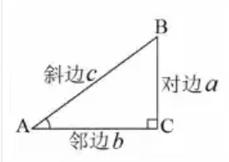

# tensor（张量）

在 PyTorch 中，张量（Tensor）是一个 n 维数组，是经常用到的一个数据类型。我们可以这样理解：一维张量等同于向量，二维张量等同于矩阵。张量是一个数据容器，它包含的数据几乎总是数值数据，因此它是数字的容器。机器学习的数据存储在张量中。一般来说，当前所有机器学习系统都使用张量作为基本数据结构。


PyTorch 中最基础的运算单位是张量（Tensor），它支持各种张量运算，如加法、减法、点乘、矩阵乘法等。


* 标量是 0维的张量
* 向量是 1维的张量
* 矩阵是 2维的张量


tensor的类型

| 类型                      | torch                         | tensor               |
| ------------------------- | ----------------------------- | -------------------- |
| 32-bit floating point     | torch.float32 or torch.float  | torch.*.floatTensor  |
| 64-bit floating point     | torch.float64 or torch.double | torch.*.DoubleTensor |
| 16-bit floating point     | torch.float16 or torch.half   | torch.*.HalfTensor   |
| 8-bit integer（unsigned） | torch.uint8                   | torch.*.ByteTensor   |
| 8-bit integer（signed）   | torch.int8                    | torch.*.CharTensor   |
| 16-bit integer（signed）  | torch.int16 or torch.short    | torch.*.ShortTensor  |
| 32-bit integer（signed）  | torch.int32 or torch.int      | torch.*.IntTensor    |
| 64-bit integer（signed）  | torch.int64 or torch.long     | torch.*.LongTensor   |
| Boolean                   | torch.bool                    | torch.*.BoolTensor   |


# tensor的创建

| 函数                               | 功能                      |
| ---------------------------------- | ------------------------- |
| Tensor(*size)                      | 基础构造函数              |
| Tensor(data)                       | 类似np.array              |
| ones(*size)                        | 全1Tensor                 |
| zeros(*size)                       | 全0Tensor                 |
| eye(*size)                         | 对角线为1，其他为0        |
| arange(s,e,step)                   | 从s到e，步长为step        |
| linspace(s,e,steps)                | 从s到e，均匀切分成steps份 |
| rand/randn(*size)                  | 均匀/标准分布             |
| normal(mean,std)/uniform_(from,to) | 正态分布/均匀分布         |
| randperm(m)                        | 随机排列                  |

`type_as`函数的作用是将输入张量的数据类型转换为与指定的张量相同的数据类型。它通常用于数据类型转换，以确保计算操作中涉及的张量具有相同的数据类型，从而避免数据类型不匹配的错误。


代码参考：pytorch-code/00_algorithm/00_tensor_create

0)

```python
import torch
a = torch.Tensor([[1, 2],[3, 4]])
print(a)
```

```
tensor([[1., 2.],
        [3., 4.]])
```

1)

```python
import torch

b = torch.Tensor(2, 2)
print(b)
```

```
tensor([[0., 0.],
        [0., 0.]])
```

2)

```python
import torch

a = torch.Tensor([[1, 2],[3, 4]])
d = torch.tensor(((1, 2), (3, 4)))
print(d.type())
print(d.type_as(a))
```

```
torch.LongTensor
tensor([[1., 2.],
        [3., 4.]])
```

3)

```python
import torch

a = torch.Tensor([[1, 2],[3, 4]])
d = torch.empty(2,3)
print(d.type())
print(d)
print(d.type_as(a))
```

```
torch.FloatTensor
tensor([[-2.7814e+19,  9.0384e-43,  0.0000e+00],
        [ 0.0000e+00,  0.0000e+00,  0.0000e+00]])
tensor([[-2.7814e+19,  9.0384e-43,  0.0000e+00],
        [ 0.0000e+00,  0.0000e+00,  0.0000e+00]])
```

4)

```python
import torch

a = torch.Tensor([[1, 2],[3, 4]])
d = torch.zeros(2,3)
print(d.type())
print(d)
print(d.type_as(a))
```

```
torch.FloatTensor
tensor([[0., 0., 0.],
        [0., 0., 0.]])
tensor([[0., 0., 0.],
        [0., 0., 0.]])
```

5)

```python
import torch

a = torch.Tensor([[1, 2],[3, 4]])
d = torch.zeros(2,3)
d = torch.zeros_like(d)
print(d.type())
print(d.type_as(a))
```

```
torch.FloatTensor
tensor([[0., 0., 0.],
        [0., 0., 0.]])
```

6)

```python
import torch

a = torch.Tensor([[1, 2],[3, 4]])
d = torch.eye(2, 2)
print(d.type())
print(d.type_as(a))
```

```
torch.FloatTensor
tensor([[1., 0.],
        [0., 1.]])
```

7)

```python
import torch

a = torch.Tensor([[1, 2],[3, 4]])
d = torch.ones(2, 2)
print(d.type())
print(d.type_as(a))
```

```
torch.FloatTensor
tensor([[1., 1.],
        [1., 1.]])
```

8)

```python
import torch

a = torch.Tensor([[1, 2],[3, 4]])
d = torch.ones(2, 2)
d = torch.ones_like(d)
print(d.type())
print(d.type_as(a))
```

```
torch.FloatTensor
tensor([[1., 1.],
        [1., 1.]])
```

9)

```python
import torch

a = torch.Tensor([[1, 2],[3, 4]])
d = torch.rand(2, 3)
print(d.type())
print(d.type_as(a))
```

```
torch.FloatTensor
tensor([[0.5807, 0.6620, 0.8287],
        [0.1298, 0.7195, 0.0849]])
```

10)

```python
import torch

a = torch.Tensor([[1, 2],[3, 4]])
d = torch.arange(2, 10, 2)
print(d.type())
print(d.type_as(a))
```

```
torch.LongTensor
tensor([2., 4., 6., 8.])
```

11)

```python
import torch

a = torch.Tensor([[1, 2],[3, 4]])
d = torch.linspace(10, 2, 3)
print(d.type())
print(d.type_as(a))
```

```
torch.FloatTensor
tensor([10.,  6.,  2.])
```

12）

```python
import torch

b = torch.Tensor(2, 2)
dd = torch.normal(mean=0, std=1, size=(2, 3), out=b) # torch.normal() 是 PyTorch 中的一个函数，它用于从正态分布中生成随机数。该函数需要两个参数：mean（平均值）和stddev（标准差）。这两个参数分别决定了随机数分布的均值和方差。
print(b)
print(dd)
```

```
tensor([[ 1.4357,  0.9427, -0.8694],
        [ 1.0122, -0.7856, -2.4967]])
tensor([[ 1.4357,  0.9427, -0.8694],
        [ 1.0122, -0.7856, -2.4967]])
```

13)

```python
import torch

a = torch.Tensor([[1, 2],[3, 4]])
d = torch.normal(mean=torch.rand(5), std=torch.rand(5))
print(d.type())
print(d.type_as(a))

```

```
torch.FloatTensor
tensor([0.2504, 1.7975, 0.3099, 0.3428, 0.2408])
```

14)

```python
import torch

a = torch.Tensor([[1, 2],[3, 4]])
d = torch.Tensor(2, 2).uniform_(-1, 1)
print(d.type())
print(d.type_as(a))
```

```
torch.FloatTensor
tensor([[ 0.7297,  0.5313],
        [-0.9879, -0.1133]])
```

15)

```python
import torch

a = torch.Tensor([[1, 2],[3, 4]])
d = torch.randperm(10)
print(d.type())
print(d.type_as(a))

```

```
torch.LongTensor
tensor([5., 4., 7., 9., 3., 6., 0., 1., 2., 8.])
```


# tensor的属性

1. **dtype**：这是torch一个类，torch提供了12种数据类型类，例如torch.float32、torch.float64、torch.int32等。dtype属性标识了torch.Tensor的数据类型。

2. **shape**：这是一个描述张量形状的元组，表示张量的维度。例如，一个2x3的张量，其shape属性为(2, 3)。

3. **device**：这是torch中一个类，说明Tensor存储的位置。Tensor默认存在cpu中。每个设备名称都是特定的设备编号，如'cpu'或'cuda:X'（其中X是函数torch.cuda.current_device()的返回值）。

4. **layout**：这是torch中一个类，标识了torch.Tensor在内存中的布局模式。现在支持的内存布局模式有torch.strided和torch.sparse_coo。前者表示跨步存储代表了密集张量的存储布局方式，后者表示稀疏矩阵存储方式。

   * 稀疏的张量, torch.sparse_coo_tensor

   * coo类型表示了非0元素的坐标形式

     ```python
     indices = torch.tensor([[0,1,1], [2,0,2]])
     values = torch.tensor([3,4,5], dtype=torch.float32)
     x = torch.sparse_coo_tensor(i, v, [2,4])
     ```

   * 稀疏张量的作用: 主要优点在于它 `只存储非零元素的位置和值，而不需要为零元素分配存储空间`。这样，对于包含大量零值元素的数据，稀疏张量可以大大减少内存占用。此外，稀疏张量的计算操作也只针对非零元素进行，从而提高了计算效率。

1)

```python
import torch

# 创建一个张量
x = torch.tensor([1, 2, 3, 4, 5])

# 获取张量的属性
print(x.shape)  # 输出：torch.Size([5])
print(x.dtype)  # 输出：torch.int32
print(x.device)  # 输出：cpu
print(x.is_sparse)  # 输出：False

# 修改张量的属性
x = x.to(device='cuda')  # 将张量移动到GPU上
print(x.device)  # 输出：cuda:0

x = x.float()  # 将张量的数据类型转换为float32
print(x.dtype)  # 输出：torch.float32
```


2)

创建一个tensor,存储的设备是 cuda，默认是cpu

```python
import torch

dev = torch.device("cuda")
a = torch.tensor([2, 2],
                 dtype=torch.float32,
                 device=dev)
print(a)
```

```
tensor([2., 2.], device='cuda:0')
```


3) 稀疏张量

```python
import torch

dev = torch.device("cuda")
i = torch.tensor([[0, 1, 2], [0, 1, 2]])
v = torch.tensor([1, 2, 3])
a = torch.sparse_coo_tensor(i, v, (4, 4),
                            dtype=torch.float32,
                            device=dev).to_dense()
print(a)
```

```
tensor([[1., 0., 0., 0.],
        [0., 2., 0., 0.],
        [0., 0., 3., 0.],
        [0., 0., 0., 0.]], device='cuda:0')
```

```
i = torch.tensor([[0, 1, 2], [0, 1, 2]])
v = torch.tensor([1, 2, 3])

0,0位置是1，1,1位置是2，2,2位置是3.其他位置为0
```


# tensor的运算-第一篇

## 加、减、乘、除

1)

```python
import torch

a = torch.rand(2, 3)
b = torch.rand(2, 3)

print(a)
print(b)

print(a + b)
print(a.add(b))
print(torch.add(a, b))
print(a)
print(a.add_(b)) # 会改变a的值
print(a)
```

```
tensor([[0.7404, 0.2294, 0.0230],
        [0.1949, 0.7921, 0.4263]])
tensor([[0.0151, 0.2326, 0.2904],
        [0.5671, 0.3967, 0.1229]])
tensor([[0.7555, 0.4620, 0.3134],
        [0.7620, 1.1889, 0.5491]])
tensor([[0.7555, 0.4620, 0.3134],
        [0.7620, 1.1889, 0.5491]])
tensor([[0.7555, 0.4620, 0.3134],
        [0.7620, 1.1889, 0.5491]])
tensor([[0.7404, 0.2294, 0.0230],
        [0.1949, 0.7921, 0.4263]])
tensor([[0.7555, 0.4620, 0.3134],
        [0.7620, 1.1889, 0.5491]])
tensor([[0.7555, 0.4620, 0.3134],
        [0.7620, 1.1889, 0.5491]])
```

2)

```python
import torch

a = torch.rand(2, 3)
b = torch.rand(2, 3)

print(a - b)
print(torch.sub(a, b))
print(a.sub(b))
print(a.sub_(b))# 会改变a的值
print(a)
```

```
tensor([[-0.3934, -0.4480,  0.2788],
        [ 0.4463,  0.8735, -0.1023]])
tensor([[-0.3934, -0.4480,  0.2788],
        [ 0.4463,  0.8735, -0.1023]])
tensor([[-0.3934, -0.4480,  0.2788],
        [ 0.4463,  0.8735, -0.1023]])
tensor([[-0.3934, -0.4480,  0.2788],
        [ 0.4463,  0.8735, -0.1023]])
tensor([[-0.3934, -0.4480,  0.2788],
        [ 0.4463,  0.8735, -0.1023]])
```

3)

```python
import torch

a = torch.rand(2, 3)
b = torch.rand(2, 3)

print(a * b)
print(torch.mul(a, b))
print(a.mul(b))
print(a)
print(a.mul_(b))# 会改变a的值
print(a)
```

```
tensor([[0.1993, 0.5821, 0.3495],
        [0.0148, 0.2121, 0.4087]])
tensor([[0.1993, 0.5821, 0.3495],
        [0.0148, 0.2121, 0.4087]])
tensor([[0.1993, 0.5821, 0.3495],
        [0.0148, 0.2121, 0.4087]])
tensor([[0.4729, 0.9037, 0.6787],
        [0.0254, 0.2241, 0.5721]])
tensor([[0.1993, 0.5821, 0.3495],
        [0.0148, 0.2121, 0.4087]])
tensor([[0.1993, 0.5821, 0.3495],
        [0.0148, 0.2121, 0.4087]])
```

4)

```python
import torch

a = torch.rand(2, 3)
b = torch.rand(2, 3)

print(a/b)
print(torch.div(a, b))
print(a.div(b))
print(a.div_(b))# 会改变a的值
print(a)
```

```
tensor([[0.2049, 4.3814, 2.3036],
        [6.2603, 0.7257, 0.7875]])
tensor([[0.2049, 4.3814, 2.3036],
        [6.2603, 0.7257, 0.7875]])
tensor([[0.2049, 4.3814, 2.3036],
        [6.2603, 0.7257, 0.7875]])
tensor([[0.2049, 4.3814, 2.3036],
        [6.2603, 0.7257, 0.7875]])
tensor([[0.2049, 4.3814, 2.3036],
        [6.2603, 0.7257, 0.7875]])
```


## 求整、余数

| 函数        | 作用                                                         |
| ----------- | ------------------------------------------------------------ |
| floor()     | 向下取整数                                                   |
| ceil()      | 向上取整数                                                   |
| round()     | 四舍五入                                                     |
| trunc()     | 裁剪，只取整数部分                                           |
| frac()      | 只取小数部分                                                 |
| %           | 取余数                                                       |
| fmod()      | 浮点数的模运算。Python 中的 `x % y` 运算，但使用 `torch.fmod` 可以保证运算结果是浮点数。 |
| remainder() | 求余数，等同于 Python 中的 `input % divisor` 运算            |


```python
import torch

a = torch.rand(2, 2)
a = a * 10
print(a)

print(torch.floor(a))
print(torch.ceil(a))
print(torch.round(a))
print(torch.trunc(a))
print(torch.frac(a))
print(a % 2)
b = torch.tensor([[2, 3], [4, 5]],
                 dtype=torch.float)
print(torch.fmod(a, b))
print(torch.remainder(a, b))
```


## in-place的概念和广播机制

`in-place` 操作是指在不占用额外空间的情况下，直接在原始张量上进行操作，并返回修改后的结果。这种操作在需要高效内存使用和避免创建中间张量的计算过程中非常有用。

PyTorch 的广播机制是指在不满足广播条件时自动进行广播操作。广播机制允许在不同形状的张量之间执行元素级操作，而无需显式地重塑或复制它们。

广播机制遵循以下规则：

1. 如果两个张量的维度不同，PyTorch 会尝试通过复制或填充操作使它们具有相同的形状。具体来说，如果某个维度的大小在两个张量中不同，PyTorch 会尝试将较小维度的张量扩展为较大维度的张量。
2. 广播操作是从后向前（从右向左）进行的，也就是说，首先广播最右侧的维度，然后是下一个最右侧的维度，以此类推。
3. 如果某个维度的大小在两个张量中相等，则可以直接进行元素级操作；如果某个维度的大小在其中一个张量为 1，则另一个张量在该维度上进行复制操作。
4. 如果两个张量的维度都不相等，且都不等于 1，则无法进行广播操作。

```python
import torch

a = torch.rand(2, 2)
b = torch.rand(1, 2)
# a, 2*1
# b, 1*2
# c, 2*2
# 2*4*2*3
c = a + b
print(a)
print(b)
print(c)
print(c.shape)
```


## 比较运算-排序-topk-kthvalue

比较运算

| 函数                             | 作用                                                 |
| -------------------------------- | ---------------------------------------------------- |
| torch.eq(input, other, out=None) | 按成员进行等式操作，相同返回True                     |
| torch.equal(tensor1,tensor2)     | 如果tensor1和tensor2有相同的size和elements，则为true |
| torch.ge(input, other, out=None) | input >= other                                       |
| torch.gt(input, other, out=None) | input > other                                        |
| torch.le(input, other, out=None) | input <= other                                       |
| torch.lt(input, other, out=None) | input < other                                        |
| torch.ne(input, other, out=None) | input != other                                       |

1)

```python
import torch

a = torch.rand(2, 3)
b = torch.rand(2, 3)

print(a)
print(b)

print(torch.eq(a, b))
```


2)

```python
import torch

a = torch.rand(2, 3)
b = torch.rand(2, 3)
print(a)
print(b)
print(torch.equal(a, b)) # False
```


3)

```python
import torch

a = torch.rand(2, 3)
b = torch.rand(2, 3)
print(a)
print(b)
print(torch.ge(a, b))
```

4)

```python
import torch

a = torch.rand(2, 3)
b = torch.rand(2, 3)
print(a)
print(b)
print(torch.ge(a, b))
```

5)

```python
import torch

a = torch.rand(2, 3)
b = torch.rand(2, 3)
print(a)
print(b)
print(torch.le(a, b))
```


6)

```python
import torch

a = torch.rand(2, 3)
b = torch.rand(2, 3)
print(a)
print(b)
print(torch.lt(a, b))
```

7)

```python
import torch

a = torch.rand(2, 3)
b = torch.rand(2, 3)
print(a)
print(b)
print(torch.ne(a, b))
```


排序

| 函数                                                         | 作用                                  |
| ------------------------------------------------------------ | ------------------------------------- |
| torch.sort(input, dim=None,descending=False,out=None)        | 对目标input进行排序                   |
| torch.topk(input, k,dim=None,largest=True,sorted=True,out=None) | 沿着指定维度返回最大K个数值及其索引值 |
| torch.kthvalue(input, k, dim=None,out=None)                  | 沿着指定维度返回第K个最小值及其索引值 |

1)

```python
import torch

a = torch.tensor([[1, 4, 4, 3, 5],
                  [2, 3, 1, 3, 5]])
print(a.shape)
print(torch.sort(a, dim=1,
                 descending=False))
```

```
torch.Size([2, 5])
torch.return_types.sort(
values=tensor([[1, 3, 4, 4, 5],
        [1, 2, 3, 3, 5]]),
indices=tensor([[0, 3, 1, 2, 4],
        [2, 0, 1, 3, 4]]))
```

2)

```python
import torch

a = torch.tensor([[2, 4, 3, 1, 5],
                  [2, 3, 5, 1, 4]])
print(a.shape)

print(torch.topk(a, k=2, dim=1, largest=False))
```

```
torch.Size([2, 5])
torch.return_types.topk(
values=tensor([[1, 2],
        [1, 2]]),
indices=tensor([[3, 0],
        [3, 0]]))
```

3)

```python
import torch

a = torch.tensor([[2, 4, 3, 1, 5],
                  [2, 3, 5, 1, 4]])
print(torch.kthvalue(a, k=2, dim=0))
print(torch.kthvalue(a, k=2, dim=1))
```

```
torch.return_types.kthvalue(
values=tensor([2, 4, 5, 1, 5]),
indices=tensor([1, 0, 1, 1, 0]))

torch.return_types.kthvalue(
values=tensor([2, 2]),
indices=tensor([0, 0]))
```


finite/inf/nan

| 函数                   | 作用                                                         |
| ---------------------- | ------------------------------------------------------------ |
| torch.isfinite(tensor) | 判断是否有界,会返回一个与输入张量形状相同的布尔类型的张量<br />检查张量中的元素是否都是有限的数值（即不是无穷大也不是NaN）`torch.isfinite(x)`，其中每个元素表示相应的输入元素是否是有限的数值。函数在神经网络训练中很有用，因为它可以帮助你检测到何时出现过载（无穷大）或无效值（NaN）。如果出现过载或无效值，通常意味着你的模型中的某些权重或激活函数有问题，或者你的损失函数需要调整。通过使用`torch.isfinite()`，你可以更容易地发现这些问题并进行修复。 |
| torch.isinf(tensor)    | 判断是否无穷,会返回一个与输入张量形状相同的布尔类型的张量    |
| torch.isnan(tensor)    | 判断是否为空,会返回一个与输入张量形状相同的布尔类型的张量    |

1)

```python
import torch

a = torch.rand(2, 3)
print(a)
print(a/0)
print(torch.isfinite(a))
print(torch.isfinite(a/0))
```

2)

```python
import torch

a = torch.rand(2, 3)
print(torch.isinf(a/0))
```

3)

```python
import torch

a = torch.rand(2, 3)
print(torch.isnan(a))
```


## 三角函数

三角函数入门知识

 

三角函数和反三角函数可以用于神经网络中的各种操作，例如卷积、池化、激活函数等。例如，可以使用 sin 和 cos 函数实现一些周期性的激活函数，或者使用 tan 函数实现一些非线性的激活函数。

正弦
$$
\sin(A) = a/c
$$
余弦
$$
\cos(A) = b/c
$$
正切
$$
\tan(A) = a/b
$$
pytorch中的三角函数集合

| 函数                               | 作用                                                         |
| ---------------------------------- | ------------------------------------------------------------ |
| torch.acos(input,out=None)         | 反余弦函数，它期望输入在[-1，1]范围内，并以弧度形式给出输出。如果输入不在[-1，1]范围内，则返回nan。输入类型为张量，如果输入包含多个元素，则将计算按元素的反余弦值。 |
| torch.asin(input,out=None)         | 反正弦函数。该函数接收一个张量作为输入，并返回一个相同大小的张量，其元素为输入张量中每个元素的反正弦值。 |
| torch.atan(input,out=None)         | 以弧度形式给出输出。输入类型为张量，如果输入包含多个元素，则将计算按元素的反正切值。 |
| torch.atan2(input,input2,out=None) | 两个输入张量（input1和input2）的反正切函数。返回一个新张量，包含两个输入张量input1和input2的反正切函数。 |
| torch.cos(input,out=None)          | 余弦函数，它期望输入为弧度形式，并且输出范围为[-1,1]。如果输入不在[-1,1]范围内，则返回nan。用于深度神经网络和自然语言处理，将输入张量中的每一个元素应用余弦函数cos，并将结果返回到输出张量里。如果未指定输出，那么会自动创建一个新的张量。 |
| torch.cosh(input,out=None)         | 双曲余弦函数，它期望输入为弧度形式。如果输入包含多个元素，那么将计算每个元素的双曲余弦值。返回的是与输入张量相同类型的张量。双曲余弦函数是双曲函数的一种，它在某些物理和工程应用中，如电路设计和声波传播，具有重要应用。 |
| torch.sin(input,out=None)          | 正弦函数，它期望输入为弧度形式，并且输出范围为[-1,1]。如果输入不在[-1,1]范围内，则返回nan。用于深度神经网络和自然语言处理，将输入张量中的每一个元素应用正弦函数sin，并将结果返回到输出张量里。如果未指定输出，那么会自动创建一个新的张量。 |
| torch.sinh(input,out=None)         | 双曲正弦函数，它期望输入为弧度形式。如果输入包含多个元素，那么将计算每个元素的双曲正弦值。返回的是与输入张量相同类型的张量。 |
| torch.tan(input,out=None)          | 正切函数，它期望输入为弧度形式，并且输出范围在[-∞,∞]之间。如果输入不在这个范围内，则返回nan。输入类型为张量，如果输入包含多个元素，那么将计算每个元素的正切值。返回的是与输入张量相同类型的张量。在数学和物理中有着广泛的应用，例如在三角学、信号处理和物理学中。在深度学习和神经网络中，正切函数也常被用作激活函数。 |
| torch.tanh(input,out=None)         | 双曲正切函数，其输出范围为(-1，1)。双曲正切函数将接近零的输入映射到接近零的输出，这在一定程度上解决了“vanishing gradients”问题。然而，与S形函数不同，网络获得“stuck”的机会较低，但双曲正切函数仍然受到“vanishing gradients”的影响。在深度神经网络和自然语言处理中，`torch.tanh`常被用作激活函数。此外，在生成对抗网络（GAN）中，`torch.tanh`常被用作生成器网络的输出激活函数，它可以将生成的像素值映射到合理的范围内。 |
|                                    |                                                              |


```python
import torch

a = torch.zeros(2, 3)
b = torch.cos(a)
print(a)
print(b)
```

```
tensor([[0., 0., 0.],
        [0., 0., 0.]])
tensor([[1., 1., 1.],
        [1., 1., 1.]])
```


## 绝对值-倒数-符号...

| 函数                      | 作用                                                         |
| ------------------------- | ------------------------------------------------------------ |
| torch.abs(input,out=None) | 绝对值,返回一个非负数                                        |
| torch.erf()               | 误差函数（error function）或高斯误差函数（Gaussian error function）。这个函数在神经网络训练中经常被使用，特别是在处理高斯分布数据的时候。 |
| torch.sigmoid()           | 实现了Sigmoid激活函数。Sigmoid函数可以将输入值映射到0到1之间，常用于将神经网络的输出结果转换为概率。 |
| torch.neg()               | 对输入张量的元素进行逐元素的负数运算。具体来说，`torch.neg()`函数接受一个输入张量，然后返回一个与输入张量形状相同的张量，其元素值是对应输入元素的负数值。例如，在神经网络中，可以使用`torch.neg()`来对模型的输出结果进行取反，以实现一些特定的需求。 |
| torch.reciprocal()        | 逐元素的倒数运算。                                           |
| torch.rsqrt()             | 逐元素的平方根倒数运算                                       |
| torch.sign()              | 逐元素的符号运算.不会改变输入张量的值，只是返回一个新的张量，其元素是输入张量的元素的符号。对于大于0的输入值，返回1；对于小于0的输入值，返回-1；对于等于0的输入值，返回0。 |
| torch.lerp()              |                                                              |
| torch.addcdiv()           |                                                              |
| torch.addcmul()           |                                                              |
| torch.cumprod()           |                                                              |
| torch.cumsum()            |                                                              |


## 幂


## 开方


## 对数


## 点乘

张量的点乘（element-wise multiplication）是指逐元素相乘的操作。它接受两个或多个张量作为输入，并按元素方式将它们相乘。点乘操作使用 `torch.mul()` 函数或 `*` 运算符进行计算。

```python
import torch  
  
# 创建两个张量  
tensor1 = torch.tensor([1, 2, 3])  
tensor2 = torch.tensor([4, 5, 6])  
  
# 使用点乘操作将它们相乘  
result = tensor1.mul(tensor2)  
  
print(result)
```

输出

```python
tensor([ 4, 10, 18])
```

在上面的示例中，`tensor1` 和 `tensor2` 是两个一维张量。使用 `mul()` 函数和 `*` 运算符可以对它们执行点乘操作。结果是一个新的一维张量，其中每个元素都是 `tensor1` 和 `tensor2` 中对应元素的乘积。

## 矩阵乘法

```python
import torch

# 创建两个矩阵
A = torch.tensor([1, 2])
B = torch.tensor([5, 6])

# 执行矩阵乘法
C = torch.matmul(A, B)

print(C)
```

```
tensor(17)
```


# tensor的运算-第二篇


## 统计学方法


## 分布函数


## 随机抽样


## 线性代数运算


## 矩阵分解-PCA


## 矩阵分解-SVD分解-LDA


## 张量裁剪


## 张量的索引与数据筛选


## 张量组合与拼接


## 张量切片


## 张量变形


## 张量填充


## 傅里叶变换


## 导数


## 梯度


